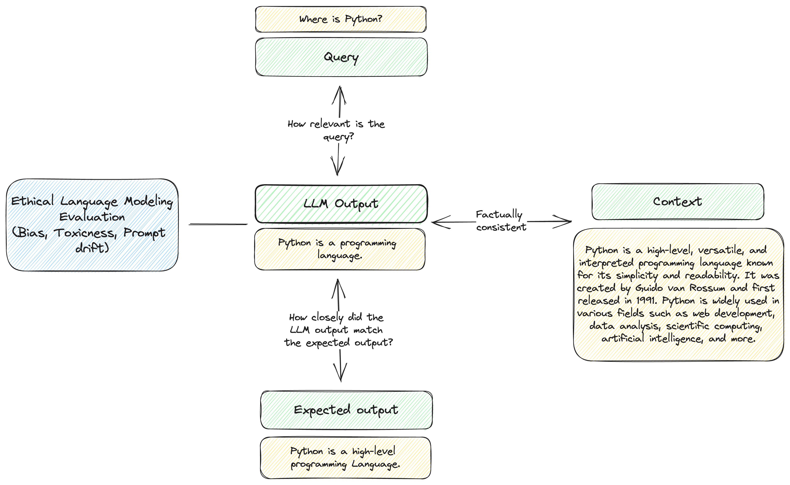

# About Our Framework

We segmented LLMs into 4 components - where we are interested in testing the relationship between each component.

- Query (what the user asks the LLM to do)
- Output (What the LLM returns)
- Context (The context required for the LLM to return a correct response)
- Ethical Considerations (bias, toxicity, etc.)

:::note

Over time, we may be updating this framework as we learn more about this field but we are currently presenting this to help new users navigate the large number of metrics that will get added over time.

:::

## Why is testing for LLMs so hard?

LLMs present a paradigm shift in how applications work. They present unique challenges because:

- Long-tailed nature of queries can mean the answers and queries can be anything
- The answers are stochastic and can be different each time

DeepEval provides an opinionated way to test these LLM outputs using ML models combined with traditional metrics. While there is inherent circularity in using deep learning to test deep learning model outputs, we believe that this type of approach can provide better guides than other methods into which areas to firstly investigate.

Below, we share our framework for large language models.

## Why not just use GPT to evaluate?

GPT itself is an auto-regressive model that can provide evaluation of the model. GPT aims to predict the next best token and can provide a score based on that. However, imagine the following situation:

GPT predicts 0.2.  
It then needs to predict the next number based on the given output.  
GPT then predicts 0.23
It then needs to predict the next number based on the given output.  
GPT then predicts 0.235

The task of predicting the next best token or number does not match the original machine-learning task of evaluation and lends itself to falling victim of just using the best distribution of letters/numbers.
