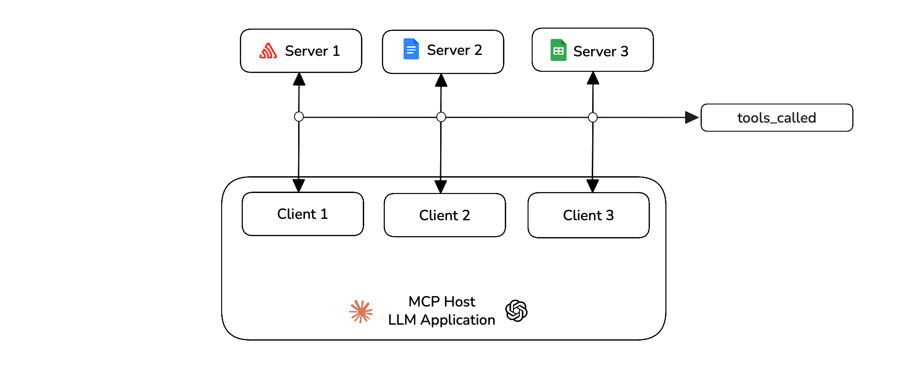

import { Timeline, TimelineItem } from "@site/src/components/Timeline";
import Tabs from "@theme/Tabs";
import TabItem from "@theme/TabItem";
import VideoDisplayer from "@site/src/components/VideoDisplayer";

Learn to evaluate model-context-protocol (MCP) based applications using `deepeval`, for both single-turn and multi-turn use cases.

## Overview

MCP evaluation is different from other evaluations because you can choose to create single-turn test cases or multi-turn test cases based on your application design and architecture.

**In this 5 min quickstart, you'll learn how to:**

- Track your MCP interactions
- Create test cases for your application
- Evaluate your MCP based application using MCP metrics

## Prerequisites

- Install `deepeval`
- A Confident AI API key (recommended). Sign up for one [here](https://app.confident-ai.com)

:::info
Confident AI allows you to view and share your testing reports. Set your API key in the CLI:

```bash
CONFIDENT_API_KEY="confident_us..."
```
:::

## Understanding MCP Evals

**Model Context Protocol (MCP)** is an open-source framework developed by **Anthropic** to standardize how AI systems, particularly large language models (LLMs), interact with external tools and data sources.
The MCP architecture is composed of three main components:

- **Host** — The AI application that coordinates and manages one or more MCP clients
- **Client** — Maintains a one-to-one connection with a server and retrieves context from it for the host to use
- **Server** — Paired with a single client, providing the context the client passes to the host


`deepeval` allows you to evaluate the MCP host on various criterion like its primitive usage, argument generation and task completion.

## Run Your First MCP Eval

In `deepeval`, MCP evaluations can be done using either single-turn or multi-turn test cases. In code, you'll have to track all MCP interactions and finally create a test case after the execution of your application.

<Timeline>
<TimelineItem title="Create an MCP server">

You can find an MCP server online from websites like [smithery.ai](https://smithery.ai) or create one yourself depending on your use case. You can learn more about it from the [official docs of MCP](https://modelcontextprotocol.io/quickstart/server).

You can connect your host to the servers and create the `MCPServer` object for all the MCP servers you're using.

```python title="main.py" {3,19-23}
import mcp
from mcp.client.streamable_http import streamablehttp_client
from deepeval.test_case import MCPServer

smithery_api_key = "YOUR_API_KEY"
smithery_profile = "YOUR_PROFILE"
url = f"https://server.smithery.ai/@smithery-ai/github/mcp?api_key={smithery_api_key}&profile={smithery_profile}"

mcp_servers = []
tools_called = []

async def main():
    async with streamablehttp_client(url) as (read_stream, write_stream, _):
        async with mcp.ClientSession(read_stream, write_stream) as session:
            await session.initialize()

            # Create an MCPServer object for all the primitives available in this server
            tools_result = await session.list_tools()
            mcp_servers.append(MCPServer(
                name="GitHub",
                transport="streamable-http",
                available_tools=tools_result.tools,
            ))
            # You can add resources and prompts if your server supports them

if __name__ == "__main__":
    import asyncio
    asyncio.run(main())
```

</TimelineItem>
<TimelineItem title="Track Your MCP Interactions">

In your MCP application's main file, you need to track all the MCP interactions during run time. This includes adding `tools_called`, `resources_called` and `prompts_called` whenever your host uses them.



```python title="main.py" {1,7}
from deepeval.test_case import MCPToolCall

async def main():
    ...
    # For all tool calls, create a MCPToolCall object and add it to list
    tool_result = await session.call_tool(tool_name, tool_args)
    tools_called.append(MCPToolCall(name=tool_name, args=tool_args, result=tool_result))
```

You can also track any [resources](https://www.deepeval.com/docs/evaluation-mcp#resources) or [prompts](https://www.deepeval.com/docs/evaluation-mcp#prompts) if you use them. You are now tracking all the MCP interactions during run time of your application.

</TimelineItem>
<TimelineItem title="Create a test case">

You can now create a test case for your MCP application using the above interactions.

```python
from deepeval.test_case import LLMTestCase

test_case = LLMTestCase(
    input="...", # Your input
    actual_output="..." # Your LLM's final output
    mcp_servers=mcp_servers,
    mcp_tools_called=tools_called,
    # resources and prompts (if any)
)
```

The test cases must be created after the execution of your application.

:::tip
You can make your `main()` function return `mcp_servers`, `tools_called`, `resources_called` and `prompts_called`. This helps you import your MCP application anywhere and create test cases easily in different test files.
:::

</TimelineItem>
<TimelineItem title="Define metrics">

You can now use the [`MCPUseMetric`](/docs/metrics-mcp-use) to run evals on your single-turn your test case.

```python
from deepeval.metrics import MCPUseMetric

mcp_use_metric = MCPUseMetric()
```

</TimelineItem>
<TimelineItem title="Run an evaluation">

Run an evaluation on the test cases you previously created using the metrics defined above.

```python
from deepeval import evaluate

evaluate([test_case], [mcp_use_metric])
```

🎉🥳 **Congratulations!** You just ran your first single-turn MCP evaluation. Here's what happened:

- When you call `evaluate()`, `deepeval` runs all your `metrics` against all `test_cases`
- All `metrics` outputs a score between `0-1`, with a `threshold` defaulted to `0.5`
- You used the `MCPUseMetric` to evaluate your MCP application on its primitive usage and argument correctness

</TimelineItem>

<TimelineItem title="View on Confident AI (recommended)">

If you've set your `CONFIDENT_API_KEY`, test runs will appear automatically on [Confident AI](https://app.confident-ai.com), the DeepEval platform.

<VideoDisplayer src="https://deepeval-docs.s3.us-east-1.amazonaws.com/docs:getting-started-mcp-single-turn.mp4" />

:::tip
If you haven't logged in, you can still upload the test run to Confident AI from local cache:

```bash
deepeval view
```

:::

</TimelineItem>

</Timeline>

## Multi-Turn MCP Evals

For multi-turn MCP evals, you are required to add the `mcp_tools_called`, `mcp_resource_called` and `mcp_prompts_called` in the `Turn` object for each turn of the assistant. (if any)

<Timeline>
<TimelineItem title="Track Your MCP Interactions">

During the interactive session of your application, you need to track all the MCP interactions. This includes adding `tools_called`, `resources_called` and `prompts_called` whenever your host uses them.


```python title="main.py" {1,10}
from deepeval.test_case import MCPToolCall

async def main():
    ...
    # Reset the lists for each new turn
    tools_called = []

    # For all tool calls, create a MCPToolCall object and add it to list
    tool_result = await session.call_tool(tool_name, tool_args)
    tools_called.append(MCPToolCall(name=tool_name, args=tool_args, result=tool_result))
```

You can also track any [resources](https://www.deepeval.com/docs/evaluation-mcp#resources) or [prompts](https://www.deepeval.com/docs/evaluation-mcp#prompts) if you use them. You are now tracking all the MCP interactions during run time of your application.

</TimelineItem>
<TimelineItem title="Create a turn">

You need to create a `Turn` object for your assistant after all the MCP interactions take place in that turn.

```python {1,11}
from deepeval.test_case import Turn

turns = []

def main(input):
    ...
    # Add the MCP interaction turn at last
    turns.append(Turn(
        role="assistant",
        content="...", # Relevant content
        mcp_tools_called=tools_called,
        # resources and prompts (if any)
    ))
```

</TimelineItem>
<TimelineItem title="Create a test case">

You can now create a test case for your MCP application using the above `turns` and `mcp_servers`.

```python
from deepeval.test_case import ConversationalTestCase

convo_test_case = ConversationalTestCase(
    turns=turns,
    mcp_servers=mcp_servers
)
```

The test cases must be created after the execution of the application.

:::tip
You can make your `main()` function return `turns` and `mcp_servers`. This helps you import your MCP application anywhere and create test cases easily in different test files.
:::

</TimelineItem>
<TimelineItem title="Define metrics">

You can now use the [MCP metrics](/docs/metrics-multi-turn-mcp-use) to run evals on your test cases. There's two metrics for multi-turn test cases that support MCP evals.

```python
from deepeval.metrics import MultiTurnMCPUseMetric, MCPTaskCompletionMetric

mcp_use_metric = MultiTurnMCPUseMetric()
mcp_task_completion = MCPTaskCompletionMetric()
```

</TimelineItem>
<TimelineItem title="Run an evaluation">

Run an evaluation on the test cases you previously created using the metrics defined above.

```python
from deepeval import evaluate

evaluate([convo_test_case], [mcp_use_metric, mcp_task_completion])
```

🎉🥳 **Congratulations!** You just ran your first multi-turn MCP evaluation. Here's what happened:

- When you call `evaluate()`, `deepeval` runs all your `metrics` against all `test_cases`
- All `metrics` outputs a score between `0-1`, with a `threshold` defaulted to `0.5`
- You used the `MultiTurnMCPUseMetric` and `MCPTaskCompletionMetric` for testing your MCP application

</TimelineItem>

<TimelineItem title="View on Confident AI (recommended)">

If you've set your `CONFIDENT_API_KEY`, test runs will appear automatically on [Confident AI](https://app.confident-ai.com), the DeepEval platform.

<VideoDisplayer src="https://deepeval-docs.s3.us-east-1.amazonaws.com/docs:getting-started-mcp-multi-turn.mp4" />

:::tip
If you haven't logged in, you can still upload the test run to Confident AI from local cache:

```bash
deepeval view
```

:::

</TimelineItem>
</Timeline>

## Next Steps

Now that you have run your first MCP eval, you should:

1. **Customize your metrics**: You can change the threshold of your metrics to be more strict to your use-case.
2. **Prepare a dataset**: If you don't have one, [generate one](/docs/synthesizer-introduction) as a starting point to store your inputs as goldens.
3. **Setup Tracing**: If you created your own custom MCP server, you can [setup tracing](https://documentation.confident-ai.com/docs/llm-tracing/tracing-features/span-types) on your tool definitons.

<VideoDisplayer
  src="https://confident-docs.s3.us-east-1.amazonaws.com/llm-tracing:spans.mp4"
  confidentUrl="/docs/llm-tracing/introduction"
  label="Span-Level Evals in Production"
/>

You can [learn more about MCP here](/docs/evaluation-mcp).