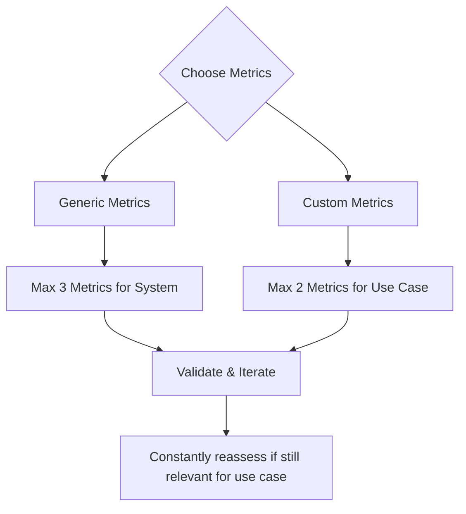

<head>
  <link rel="canonical" href="https://deepeval.com/docs/metrics-introduction" />
</head>

import Tabs from "@theme/Tabs";
import TabItem from "@theme/TabItem";
import VideoDisplayer from "@site/src/components/VideoDisplayer";

`deepeval` offers 50+ SOTA, ready-to-use metrics for you to quickly get started with. Essentially, while a test case represents the thing you're trying to measur, the metric acts as the ruler based on a specific criteria of interest.

## Quick Summary

Almost all predefined metrics on `deepeval` uses **LLM-as-a-judge**, with various techniques such as **QAG** (question-answer-generation), **DAG** (deep acyclic graphs), and **G-Eval** to score [test cases](/docs/evaluation-test-cases), which represents atomic interactions with your LLM app.

All of `deepeval`'s metrics output a **score between 0-1** based on its corresponding equation, as well as score **reasoning**. A metric is only successful if the evaluation score is equal to or greater than `threshold`, which is defaulted to `0.5` for all metrics.

<Tabs>

<TabItem value="custom" label="Custom metrics">

Custom metrics allow you to define your **custom criteria** using SOTA implementations of LLM-as-a-Judge metrics in everyday language:

- G-Eval
- DAG (Deep Acyclic Graph)
- Conversational G-Eval
- Conversational DAG
- Multi-modal G-Eval
- Arena G-Eval
- Do it yourself, 100% self-coded metrics (e.g. if you want to use BLEU, ROUGE)

You should aim to have **at least one** custom metric in your LLM evals pipeline.

</TabItem>

<TabItem value="rag" label="RAG">

RAG (retrieval augmented generation) metrics focus on the **retriever and generator components** independently.

- Retriever:
  - Contextual Relevancy
  - Contextual Precision
  - Contextual Recall

- Generator:
  - Answer Relevancy
  - Faithfulness

</TabItem>

<TabItem value="agents" label="Agents">

Agentic metrics evaluates the **overall execution flow** of your agent. In `deepeval`, there are two main agentic metrics:

- Task Completion
- Tool Correctness

The task completion metric does not require a test case and will take an LLM trace to evaluate task completion (i.e. you'll have to [setup LLM tracing](/docs/evaluation-llm-tracing)).

</TabItem>

<TabItem value="chatbots" label="Chatbots (multi-turn)">

Multi-turn metrics' main use case are for evaluating chatbots and uses a `ConversationalTestCase` instead. They include:

- Knowledge Retention
- Role Adherence
- Conversation Completeness
- Conversation Relevancy

Multi-turn metrics evaluates conversations as a whole and takes prior context into consideration when doing so.

</TabItem>

<TabItem value="safety" label="Safety">

Safety metrics concerns more on LLM security. They include:

- Bias
- Toxicity
- Non-Advice
- Misuse
- PIILeakage
- Role Violation

For those looking for a full-blown LLM red teaming orchestration frameowork, checkout [DeepTeam](https://www.trydeepteam.com/). DeepTeam is DeepEval but for red teaming LLMs specifically.

</TabItem>

<TabItem value="multi-modal" label="Multimodal">

Multimodal metrics in `deepeval` currently supports images, and the RAG metrics but for a multimodal use case. They include:

- Image Coherence
- Image Helpfulness
- Image Reference
- Text-to-Image
- Image-Editing
- Multimodal Answer Relevancy
- Multimodal Faithfulness
- Multimodal Contextual Relevancy
- Multimodal Contextual Recall
- Multimodal Contextual Precision

Note that multimodal metrics requires `MLLMTestCase`s instead.

</TabItem>

<TabItem value="others" label="Others">

Not use case specific, but still useful for some use cases:

- Hallucination
- Json Correctness
- Summarization
- Ragas

</TabItem>

</Tabs>

:::info
**Most metrics only require 1-2 parameters** in a test case, so it's important that you visit each metric's documentation pages to learn what's required.
:::

Your LLM app can be evaluated **end-to-end** (component-level example further below) by providing a list of metrics and test cases:

```python title="main.py"
from deepeval.test_case import LLMTestCase
from deepeval.metrics import AnswerRelevancyMetric
from deepeval import evaluate

evaluate(
    metrics=[AnswerRelevancyMetric()],
    test_cases=[LLMTestCase(input="What's DeepEval?", actual_output="Your favorite eval framework's favorite evals framework.")]
)
```

If you're logged into [Confident AI](https://confident-ai.com) before running an evaluation (`deepeval login` or `deepeval view` in the CLI), you'll also get entire testing reports on the platform:

<VideoDisplayer
  src="https://confident-docs.s3.us-east-1.amazonaws.com/evaluation:single-turn-e2e-report.mp4"
  confidentUrl="/docs/llm-evaluation/dashboards/testing-reports"
  label="Run Evaluations on Confident AI"
/>

More information on everything can be found on the [Confident AI evaluation docs.](https://www.confident-ai.com/docs/llm-evaluation/quickstart)

## Why DeepEval Metrics?

Apart from the variety of metrics offered, `deepeval`'s metrics are a step up to other implementations because they:

- Are research-backed LLM-as-as-Judge (`GEval`)
- One of the most used in the world (20 million+ daily evaluations)
- Make deterministic metric scores possible (when using `DAGMetric`)
- Are extra reliable as LLMs are only used for extremely confined tasks during evaluation to greatly reduce stochasticity and flakiness in scores
- Provide a comprehensive reason for the scores computed
- Integrated 100% with Confident AI

## Create Your First Metric

### Custom Metrics

`deepeval` provides G-Eval, a state-of-the-art LLM evaluation framework for anyone to create a custom LLM-evaluated metric using natural language. G-Eval is available for all single-turn, multi-turn, and multimodal evals.

<Tabs>

<TabItem value="geval" label="G-Eval">

```python
from deepeval.test_case import LLMTestCase, LLMTestCaseParams
from deepeval.metrics import GEval

test_case = LLMTestCase(input="...", actual_output="...", expected_output="...")
correctness = GEval(
    name="Correctness",
    criteria="Correctness - determine if the actual output is correct according to the expected output.",
    evaluation_params=[LLMTestCaseParams.ACTUAL_OUTPUT, LLMTestCaseParams.EXPECTED_OUTPUT],
    strict_mode=True
)

correctness.measure(test_case)
print(correctness.score, correctness.reason)
```

</TabItem>
<TabItem value="conversational-geval" label="Conversational G-Eval">

```python
from deepeval.test_case import Turn, TurnParams, ConversationalTestCase
from deepeval.metrics import ConversationalGEval

convo_test_case = ConversationalTestCase(turns=[Turn(role="...", content="..."), Turn(role="...", content="...")])
professionalism_metric = ConversationalGEval(
    name="Professionalism",
    criteria="Determine whether the assistant has acted professionally based on the content."
    evaluation_params=[TurnParams.CONTENT],
    strict_mode=True
)

professionalism_metric.measure(convo_test_case)
print(professionalism_metric.score, professionalism_metric.reason)
```

</TabItem>

<TabItem value="multimodal" label="Multimodal G-Eval">

```python
from deepeval.test_case import MLLMTestCaseParams, MLLMTestCase, MLLMImage
from deepeval.metrics import MultimodalGEval

m_test_case = MLLMTestCase(input=[...], actual_output=[...])
text_image_coherence = MultimodalGEval(
    name="Text-Image Coherence",
    criteria="Determine whether the images and text is coherence in the actual output.",
    evaluation_params=[MLLMTestCaseParams.ACTUAL_OUTPUT],
    strict_mode=True
)

text_image_coherence.measure(convo_test_case)
print(text_image_coherence.score, text_image_coherence.reason)
```

</TabItem>
</Tabs>

Under the hood, `deepeval` first generates a series of evaluation steps, before using these steps in conjunction with information in an `LLMTestCase` for evaluation. For more information, visit the [G-Eval documentation page.](/docs/metrics-llm-evals)

:::tip

If you're looking for decision-tree based LLM-as-a-Judge, checkout the [Deep Acyclic Graph (DAG)](/docs/metrics-dag) metric.

:::

### Default Metrics

<Tabs>

<TabItem value="RAG" label="RAG">

The most used RAG metrics include:

- **Answer Relevancy:** Evaluates if the generated answer is relevant to the user query
- **Faithfulness:** Measures if the generated answer is factually consistent with the provided context
- **Contextual Relevancy:** Assesses if the retrieved context is relevant to the user query
- **Contextual Recall:** Evaluates if the retrieved context contains all relevant information
- **Contextual Precision:** Measures if the retrieved context is precise and focused

Which can be simply imported from the `deepeval.metrics` module:

```python title="main.py"
from deepeval.test_case import LLMTestCase
from deepeval.metrics import AnswerRelevancyMetric

test_case = LLMTestCase(input="...", actual_output="...")
relevancy = AnswerRelevancyMetric(threshold=0.5)

relevancy.measure(test_case)
print(relevancy.score, relevancy.reason)
```

</TabItem>
<TabItem value="Agents" label="Agents">

The most used agentic metrics include:

- **Task Completion:** Assesses if the agent successfully completed a given task for a given LLM trace
- **Tool Correctness:** Evaluates if tools were called and used correctly

There's not a lot of metrics required for agents since most is taken care of by task completion. To use the task completion metric, you have to [setup tracing](/docs/evaluation-llm-tracing) (just like for component-level evals shown above):

```python title="main.py" {8,11}
from deepeval.metrics import TaskCompletionMetric
from deepeval.tracing import observe
from deepeval.dataset import Golden
from deepeval import evaluate

task_completion = TaskCompletionMetric(threshold=0.5)

@observe(metrics=[task_completion])
def trip_planner_agent(input):

    @observe()
    def itinerary_generator(destination, days):
        return ["Eiffel Tower", "Louvre Museum", "Montmartre"][:days]

    return itinerary_generator("Paris", 2)

evaluate(observed_callback=trip_planner_agent, goldens=[Golden(input="Paris, 2")])
```

</TabItem>

<TabItem value="Chatbots" label="Chatbots">

Chatbots require "conversational" (or multi-turn) metrics and they include:

- **Conversation Completeness:** Evaluates if conversation satisify user needs.
- **Conversation Relevancy:** Measures if the generated outputs are relevant to user inputs.
- **Role Adherence:** Assesses if the chatbot stays in character throughout a conversation.
- **Knowledge Retention:** Evaluates if the chatbot is able to retain knowledge learnt throughout a conversation.

You'll need to also use [`ConversationalTestCase`](/docs/evaluation-multiturn-test-cases#conversational-test-case)s instead of regular `LLMTestCase` for conversational metrics:

```python title="main.py"
from deepeval.test_case import Turn, ConversationalTestCase
from deepeval.metrics import ConversationalGEval

convo_test_case = ConversationalTestCase(turns=[Turn(role="...", content="..."), Turn(role="...", content="...")])
role_adherence = RoleAdherenceMetric(threshold=0.5)

role_adherence.measure(convo_test_case)
print(role_adherence.score, role_adherence.reason)
```

</TabItem>

<TabItem value="Multimodal" label="Multimodal">

```python
from deepeval.test_case import MLLMTestCase, MLLMImage
from deepeval.metrics import ImageCoherenceMetric

m_test_case = MLLMTestCase(input=[...], actual_output=[...])
image_coherence = ImageCoherenceMetric(threshold=0.5)

image_coherence.measure(m_test_case)
print(image_coherence.score, image_coherence.reason)
```

</TabItem>

<TabItem value="Safety" label="Safety">

```python
from deepeval.test_case import LLMTestCase
from deepeval.metrics import BiasMetric

test_case = LLMTestCase(input="...", actual_output="...")
bias = BiasMetric(threshold=0.5)

bias.measure(test_case)
print(bias.score, bias.reason)
```

</TabItem>

</Tabs>

## Choosing Your Metrics

These are the metric categories to consider when choosing your metrics:

- **Custom metrics** are use case specific and architecture agnostic:
  - G-Eval – best for **subjective** criteria like correctness, coherence, or tone; easy to set up.
  - DAG – **decision-tree** metric for **objective or mixed** criteria (e.g., verify format before tone).
  - Start with G-Eval for simplicity; use DAG for more control. You can also subclass `BaseMetric` to create your own.
- **Generic metrics** are system specific and use case agnostic:
  - RAG metrics: measures retriever and generator separately
  - Agent metrics: evaluate tool usage and task completion
  - Multi-turn metrics: measure overall dialogue quality
  - Combine these for multi-component LLM systems.
- **Reference vs. Referenceless**:
  - Reference-based metrics need **ground truth** (e.g., contextual recall or tool correctness).
  - Referenceless metrics work **without labeled data**, ideal for online or production evaluation.
  - Check each metric’s docs for required parameters.

:::info
If you're running metrics in production, you _must_ choose a referenceless metric since no labelled data will exist.
:::

When deciding on metrics, no matter how tempting, try to limit yourself to **no more than 5 metrics**, with this breakdown:

- **2-3** generic, system-specific metrics (e.g. contextual precision for RAG, tool correctness for agents)
- **1-2** custom, use case-specific metrics (e.g. helpfulness for a medical chatbot, format correctness for summarization)

The goal is to force yourself to prioritize and clearly define your evaluation criteria. This will not only help you use `deepeval`, but also help you understand what you care most about in your LLM application.

<div style={{textAlign: 'center', margin: "1rem 0"}}>



</div>

Here are some additional ideas if you're not sure:

- **RAG**: Focus on the `AnswerRelevancyMetric` (evaluates `actual_output` alignment with the `input`) and `FaithfulnessMetric` (checks for hallucinations against `retrieved_context`)
- **Agents**: Use the `ToolCorrectnessMetric` to verify proper tool selection and usage
- **Chatbots**: Implement a `ConversationCompletenessMetric` to assess overall conversation quality
- **Custom Requirements**: When standard metrics don't fit your needs, create custom evaluations with `G-Eval` or `DAG` frameworks

In some cases, where your LLM model is doing most of the heavy lifting, it is not uncommon to have more use case specific metrics.

## Configure LLM Judges

You can use **ANY** LLM judge in `deepeval`, including OpenAI, Azure OpenAI, Ollama, Anthropic, Gemini, LiteLLM, etc. You can also wrap your own LLM API in `deepeval`'s `DeepEvalBaseLLM` class to use ANY model of your choice. [Click here](/guides/guides-using-custom-llms) for full guide.

<Tabs>

<TabItem value="open-ai" label="Open AI">

To use OpenAI for `deepeval`'s LLM metrics, supply your `OPENAI_API_KEY` in the CLI:

```bash
export OPENAI_API_KEY=<your-openai-api-key>
```

Alternatively, if you're working in a notebook environment (Jupyter or Colab), set your `OPENAI_API_KEY` in a cell:

```bash
%env OPENAI_API_KEY=<your-openai-api-key>
```

:::note
Please **do not include** quotation marks when setting your `API_KEYS` as environment variables if you're working in a notebook environment.
:::

</TabItem>

<TabItem value="azure-open-ai" label="Azure Open AI">

`deepeval` also allows you to use Azure OpenAI for metrics that are evaluated using an LLM. Run the following command in the CLI to configure your `deepeval` environment to use Azure OpenAI for **all** LLM-based metrics.

```bash
deepeval set-azure-openai \
    --openai-endpoint=<endpoint> \ # e.g. https://example-resource.azure.openai.com/
    --openai-api-key=<api_key> \
    --openai-model-name=<model_name> \ # e.g. gpt-4.1
    --deployment-name=<deployment_name> \  # e.g. Test Deployment
    --openai-api-version=<openai_api_version> \ # e.g. 2025-01-01-preview
    --model-version=<model_version> # e.g. 2024-11-20
```

:::info
Your OpenAI API version must be at least `2024-08-01-preview`, when structured output was released.
:::

Note that the `model-version` is **optional**. If you ever wish to stop using Azure OpenAI and move back to regular OpenAI, simply run:

```bash
deepeval unset-azure-openai
```

</TabItem>

<TabItem value="ollama" label="Ollama">

:::note
Before getting started, make sure your [Ollama model](https://ollama.com/search) is installed and running. You can also see the full list of available models by clicking on the previous link.

```bash
ollama run deepseek-r1:1.5b
```

:::

To use **Ollama** models for your metrics, run `deepeval set-ollama <model>` in your CLI. For example:

```bash
deepeval set-ollama deepseek-r1:1.5b
```

Optionally, you can specify the **base URL** of your local Ollama model instance if you've defined a custom port. The default base URL is set to `http://localhost:11434`.

```bash
deepeval set-ollama deepseek-r1:1.5b \
    --base-url="http://localhost:11434"
```

To stop using your local Ollama model and move back to OpenAI, run:

```bash
deepeval unset-ollama
```

:::caution
The `deepeval set-ollama` command is used exclusively to configure LLM models. If you intend to use a custom embedding model from Ollama with the synthesizer, please [refer to this section of the guide](/guides/guides-using-custom-embedding-models).
:::

</TabItem>

<TabItem value="gemini" label="Gemini">

To use Gemini models with `deepeval`, run the following command in your CLI.

```bash
deepeval set-gemini \
    --model-name=<model_name> \ # e.g. "gemini-2.0-flash-001"
    --google-api-key=<api_key>
```

</TabItem>

<TabItem value="custom-example" label="Custom LLM example">

`deepeval` allows you to use **ANY** custom LLM for evaluation. This includes LLMs from langchain's `chat_model` module, Hugging Face's `transformers` library, or even LLMs in GGML format.

This includes any of your favorite models such as:

- Azure OpenAI
- Claude via AWS Bedrock
- Google Vertex AI
- Mistral 7B

All the examples can be [found here](/guides/guides-using-custom-llms#more-examples), but down below is a quick example of a custom Azure OpenAI model through langchain's `AzureChatOpenAI` module for evaluation:

```python
from langchain_openai import AzureChatOpenAI
from deepeval.models.base_model import DeepEvalBaseLLM

class AzureOpenAI(DeepEvalBaseLLM):
    def __init__(
        self,
        model
    ):
        self.model = model

    def load_model(self):
        return self.model

    def generate(self, prompt: str) -> str:
        chat_model = self.load_model()
        return chat_model.invoke(prompt).content

    async def a_generate(self, prompt: str) -> str:
        chat_model = self.load_model()
        res = await chat_model.ainvoke(prompt)
        return res.content

    def get_model_name(self):
        return "Custom Azure OpenAI Model"

# Replace these with real values
custom_model = AzureChatOpenAI(
    openai_api_version=openai_api_version,
    azure_deployment=azure_deployment,
    azure_endpoint=azure_endpoint,
    openai_api_key=openai_api_key,
)
azure_openai = AzureOpenAI(model=custom_model)
print(azure_openai.generate("Write me a joke"))
```

When creating a custom LLM evaluation model you should **ALWAYS**:

- inherit `DeepEvalBaseLLM`.
- implement the `get_model_name()` method, which simply returns a string representing your custom model name.
- implement the `load_model()` method, which will be responsible for returning a model object.
- implement the `generate()` method with **one and only one** parameter of type string that acts as the prompt to your custom LLM.
- the `generate()` method should return the final output string of your custom LLM. Note that we called `chat_model.invoke(prompt).content` to access the model generations in this particular example, but this could be different depending on the implementation of your custom model object.
- implement the `a_generate()` method, with the same function signature as `generate()`. **Note that this is an async method**. In this example, we called `await chat_model.ainvoke(prompt)`, which is an asynchronous wrapper provided by LangChain's chat models.

:::tip
The `a_generate()` method is what `deepeval` uses to generate LLM outputs when you execute metrics / run evaluations asynchronously.

If your custom model object does not have an asynchronous interface, simply reuse the same code from `generate()` (scroll down to the `Mistral7B` example for more details). However, this would make `a_generate()` a blocking process, regardless of whether you've turned on `async_mode` for a metric or not.
:::

Lastly, to use it for evaluation for an LLM-Eval:

```python
from deepeval.metrics import AnswerRelevancyMetric
...

metric = AnswerRelevancyMetric(model=azure_openai)
```

:::note
While the Azure OpenAI command configures `deepeval` to use Azure OpenAI globally for all LLM-Evals, a custom LLM has to be set each time you instantiate a metric. Remember to provide your custom LLM instance through the `model` parameter for metrics you wish to use it for.
:::

:::caution
We **CANNOT** guarantee that evaluations will work as expected when using a custom model. This is because evaluation requires high levels of reasoning and the ability to follow instructions such as outputting responses in valid JSON formats. [**To better enable custom LLMs output valid JSONs, read this guide**](/guides/guides-using-custom-llms).

Alternatively, if you find yourself running into JSON errors and would like to ignore it, use the [`-c` and `-i` flag during `deepeval test run`](/docs/evaluation-flags-and-configs#flags-for-deepeval-test-run):

```bash
deepeval test run test_example.py -i -c
```

The `-i` flag ignores errors while the `-c` flag utilizes the local `deepeval` cache, so for a partially successful test run you don't have to rerun test cases that didn't error.

:::

</TabItem>

</Tabs>

## Using Metrics

There are three ways you can use metrics:

1. [End-to-end](/docs/evaluation-end-to-end-llm-evals) evals, treating your LLM system as a black-box and evaluating the system inputs and outputs.
2. [Component-level](/docs/evaluation-component-level-llm-evals) evals, placing metrics on individual components in your LLM app instead.
3. One-off (or standalone) evals, where you would use a metric to execute it individually.

### For End-to-End Evals

To run end-to-end evaluations of your LLM system using any metric of your choice, simply provide a list of [test cases](/docs/evaluation-test-cases) to evaluate your metrics against:

```python
from deepeval.test_case import LLMTestCase
from deepeval.metrics import AnswerRelevancyMetric
from deepeval import evaluate

test_case = LLMTestCase(input="...", actual_output="...")

evaluate(test_cases=[test_case], metrics=[AnswerRelevancyMetric()])
```

The [`evaluate()` function](/docs/evaluation-introduction#evaluating-without-pytest) or `deepeval test run` **is the best way to run evaluations**. They offer tons of features out of the box, including caching, parallelization, cost tracking, error handling, and integration with [Confident AI.](https://confident-ai.com)

:::tip
[`deepeval test run`](/docs/evaluation-introduction#evaluating-with-pytest) is `deepeval`'s native Pytest integration, which allows you to run evals in CI/CD pipelines.
:::

### For Component-Level Evals

To run component-level evaluations of your LLM system using any metric of your choice, simply decorate your components with `@observe` and create [test cases](/docs/evaluation-test-cases) at runtime:

```python
from deepeval.dataset import EvaluationDataset, Golden
from deepeval.tracing import observe, update_current_span
from deepeval.metrics import AnswerRelevancyMetric

# 1. observe() decorator traces LLM components
@observe()
def llm_app(input: str):
    # 2. Supply metric at any component
    @observe(metrics=[AnswerRelevancyMetric()])
    def nested_component():
        # 3. Create test case at runtime
        update_current_span(test_case=LLMTestCase(...))
        pass

    nested_component()

# 4. Create dataset
dataset = EvaluationDataset(goldens=[Golden(input="Test input")])

# 5. Loop through dataset
for goldens in dataset.evals_iterator():
    # Call LLM app
    llm_app(golden.input)
```

### For One-Off Evals

You can also execute each metric individually. All metrics in `deepeval`, including [custom metrics that you create](/docs/metrics-custom):

- can be executed via the `metric.measure()` method
- can have its score accessed via `metric.score`, which ranges from 0 - 1
- can have its score reason accessed via `metric.reason`
- can have its status accessed via `metric.is_successful()`
- can be used to evaluate test cases or entire datasets, with or without Pytest
- has a `threshold` that acts as the threshold for success. `metric.is_successful()` is only true if `metric.score` is above/below `threshold`
- has a `strict_mode` property, which when turned on enforces `metric.score` to a binary one
- has a `verbose_mode` property, which when turned on prints metric logs whenever a metric is executed

In addition, all metrics in `deepeval` execute asynchronously by default. You can configure this behavior using the `async_mode` parameter when instantiating a metric.

:::tip
Visit an individual metric page to learn how they are calculated, and what is required when creating an `LLMTestCase` in order to execute it.
:::

Here's a quick example:

```python
from deepeval.metrics import AnswerRelevancyMetric
from deepeval.test_case import LLMTestCase

# Initialize a test case
test_case = LLMTestCase(...)

# Initialize metric with threshold
metric = AnswerRelevancyMetric(threshold=0.5)
metric.measure(test_case)

print(metric.score, metric.reason)
```

All of `deepeval`'s metrics give a `reason` alongside its score.

## Using Metrics Async

When a metric's `async_mode=True` (which is the default for all metrics), invocations of `metric.measure()` will execute internal algorithms concurrently. However, it's important to note that while operations **INSIDE** `measure()` execute concurrently, the `metric.measure()` call itself still blocks the main thread.

:::info
Let's take the [`FaithfulnessMetric` algorithm](/docs/metrics-faithfulness#how-is-it-calculated) for example:

1. **Extract all factual claims** made in the `actual_output`
2. **Extract all factual truths** found in the `retrieval_context`
3. **Compare extracted claims and truths** to generate a final score and reason.

```python
from deepeval.metrics import FaithfulnessMetric
...

metric = FaithfulnessMetric(async_mode=True)
metric.measure(test_case)
print("Metric finished!")
```

When `async_mode=True`, steps 1 and 2 execute concurrently (i.e., at the same time) since they are independent of each other, while `async_mode=False` causes steps 1 and 2 to execute sequentially instead (i.e., one after the other).

In both cases, "Metric finished!" will wait for `metric.measure()` to finish running before printing, but setting `async_mode` to `True` would make the print statement appear earlier, as `async_mode=True` allows `metric.measure()` to run faster.

:::

To measure multiple metrics at once and **NOT** block the main thread, use the asynchronous `a_measure()` method instead.

```python
import asyncio
...

# Remember to use async
async def long_running_function():
    # These will all run at the same time
    await asyncio.gather(
        metric1.a_measure(test_case),
        metric2.a_measure(test_case),
        metric3.a_measure(test_case),
        metric4.a_measure(test_case)
    )
    print("Metrics finished!")

asyncio.run(long_running_function())
```

## Debug A Metric Judgement

You can turn on `verbose_mode` for **ANY** `deepeval` metric at metric initialization to debug a metric whenever the `measure()` or `a_measure()` method is called:

```python
...

metric = AnswerRelevancyMetric(verbose_mode=True)
metric.measure(test_case)
```

:::note
Turning `verbose_mode` on will print the inner workings of a metric whenever `measure()` or `a_measure()` is called.
:::

## Customize Metric Prompts

All of `deepeval`'s metrics use LLM-as-a-judge evaluation with unique default prompt templates for each metric. While `deepeval` has well-designed algorithms for each metric, you can customize these prompt templates to improve evaluation accuracy and stability. Simply provide a custom template class as the `evaluation_template` parameter to your metric of choice (example below).

:::info
For example, in the `AnswerRelevancyMetric`, you might disagree with what we consider something to be "relevant", but with this capability you can now override any opinions `deepeval` has in its default evaluation prompts.
:::

You'll find this particularly valuable when [using a custom LLM](/guides/guides-using-custom-llms), as `deepeval`'s default metrics are optimized for OpenAI's models, which are generally more powerful than most custom LLMs.

:::note
This means you can better handle invalid JSON outputs (along with [JSON confinement](/guides/guides-using-custom-llms#json-confinement-for-custom-llms)) which comes with weaker models, and provide better examples for in-context learning for your custom LLM judges for better metric accuracy.
:::

Here's a quick example of how you can define a custom `AnswerRelevancyTemplate` and inject it into the `AnswerRelevancyMetric` through the `evaluation_params` parameter:

```python
from deepeval.metrics import AnswerRelevancyMetric
from deepeval.metrics.answer_relevancy import AnswerRelevancyTemplate

# Define custom template
class CustomTemplate(AnswerRelevancyTemplate):
    @staticmethod
    def generate_statements(actual_output: str):
        return f"""Given the text, breakdown and generate a list of statements presented.

Example:
Our new laptop model features a high-resolution Retina display for crystal-clear visuals.

{{
    "statements": [
        "The new laptop model has a high-resolution Retina display."
    ]
}}
===== END OF EXAMPLE ======

Text:
{actual_output}

JSON:
"""

# Inject custom template to metric
metric = AnswerRelevancyMetric(evaluation_template=CustomTemplate)
metric.measure(...)
```

:::tip
You can find examples of how this can be done in more detail on the **Customize Your Template** section of each individual metric page, which shows code examples, and a link to `deepeval`'s GitHub showing the default templates currently used.
:::

## What About Non-LLM-as-a-judge Metrics?

If you're looking to use something like **ROUGE**, **BLEU**, or **BLEURT**, etc. you can create a custom metric and use the `scorer` module available in `deepeval` for scoring by following [this guide](/docs/metrics-custom).

The [`scorer` module](https://github.com/confident-ai/deepeval/blob/main/deepeval/scorer/scorer.py) is available but not documented because our experience tells us these scorers are not useful as LLM metrics where outputs require a high level of reasoning to evaluate.
