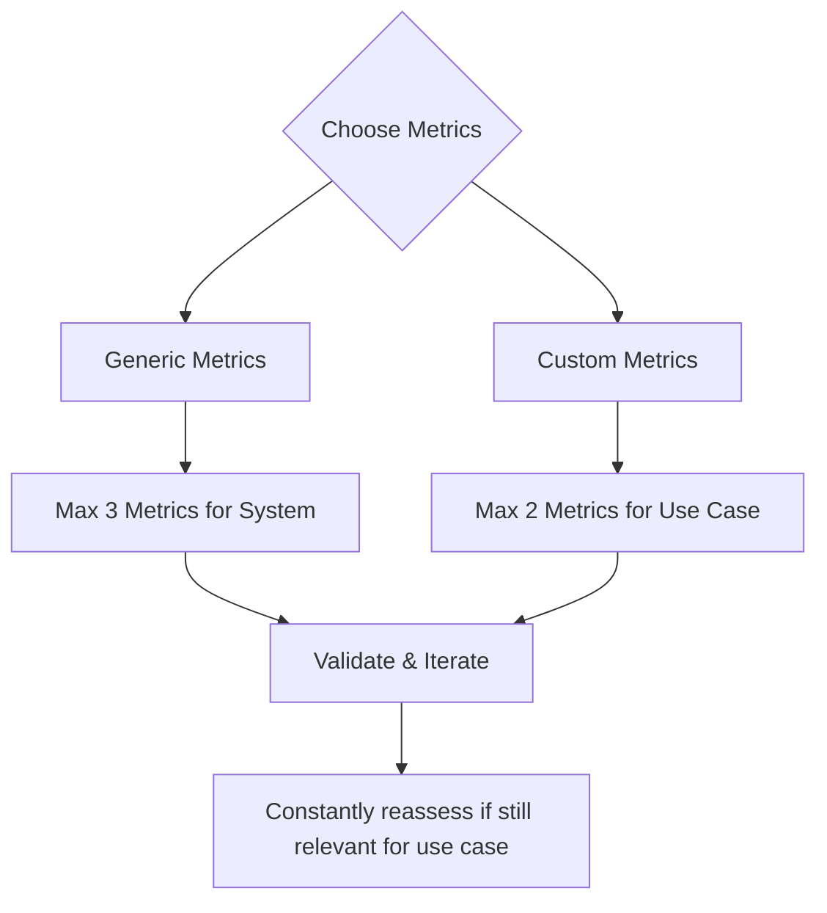

<head>
  <link rel="canonical" href="https://deepeval.com/docs/metrics-introduction" />
</head>

import VideoDisplayer from "@site/src/components/VideoDisplayer";

## Quick Summary

In `deepeval`, a metric serves as a standard of measurement for evaluating the performance of an LLM output based on a specific criteria of interest. Essentially, while the metric acts as the ruler, a test case represents the thing you're trying to measure. `deepeval` offers a range of default metrics for you to quickly get started with, such as:

- G-Eval
- DAG (Deep Acyclic Graph)
- RAG:
  - Answer Relevancy
  - Faithfulness
  - Contextual Relevancy
  - Contextual Precision
  - Contextual Recall
- Agents:
  - Tool Correctness
  - Task Completion
- Chatbots (for conversational agents):
  - Conversational G-Eval
  - Knowledge Retention
  - Role Adherence
  - Conversation Completeness
  - Conversation Relevancy
- Others:
  - Json Correctness
  - Ragas
  - Hallucination
  - Toxicity
  - Bias
  - Summarization

All predefined metrics on `deepeval` uses LLM-as-a-judge, with various techniques such as QAG (question-answer-generation), DAG (deep acyclic graphs), and G-Eval to score [test cases](/docs/evaluation-test-cases), which represents atomic interactions with your LLM app.

If you prefer to write your own metric algorithm, or use more traditional NLP scorers such as ROUGE, BLEU, or BLEURT, you can easily develop your own custom evaluation metrics in `deepeval`. All custom metrics you create are also automatically 100% integrated with `deepeval`'s ecosystem.

:::note
Your LLM application can be benchmarked by providing a list of metrics and [test cases](/docs/evaluation-test-cases):

```python
from deepeval.metrics import AnswerRelevancyMetric
from deepeval import evaluate

evaluate(test_cases=[...], metrics=[AnswerRelevancyMetric()])
```

You should also login to the `deepeval` cloud platform, [Confident AI](https://confident-ai.com), before running `evaluate()`:

```bash
deepeval login
```

When you run an evaluation using the `evaluate()` function or `deepeval test run`, you get testing reports on Confident AI.

<VideoDisplayer
  src="https://confident-docs.s3.us-east-1.amazonaws.com/evaluation:testing-report.mp4"
  confidentUrl="/docs/llm-evaluation/evaluation-features/testing-reports"
  label="Run Evaluations on Confident AI"
/>

More information on everything can be found on the [Confident AI evaluation docs.](https://documentation.confident-ai.com/docs/llm-evaluation/introduction)

:::

## Why DeepEval Metrics?

`deepeval`'s metrics are a step up to other implementations because they:

- Make deterministic metric scores possible (when using `DAGMetric`).
- Can be scored using any LLM judge.
- Are "routable" - meaning you can apply different metrics based on different scenarios.
- Can be used for both end-to-end and component-level evaluation.
- Easily customizable (`GEval` and `DAGMetric`).
- Are extra reliable as LLMs are only used for extremely confined tasks during evaluation to greatly reduce stochasticity and flakiness in scores.
- Provide a comprehensive reason for the scores computed.
- Can be customized by [overriding evaluation prompts.](/docs/metrics-introduction#customizing-metric-prompts)
- Integrated 100% with Confident AI.

All of `deepeval`'s metrics output a score between 0-1. A metric is only successful if the evaluation score is equal to or greater than `threshold`, which is defaulted to `0.5` for all metrics.

Additionally, `deepeval`'s metrics can also be used for both **end-to-end** evals:

```python
from deepeval.test_case import LLMTestCase
from deepeval.metrics import AnswerRelevancyMetric
from deepeval import evaluate

evaluate(test_cases=[LLMTestCase(...)], metrics=[AnswerRelevancyMetric()])
```

And **component-level** evals:

```python
from deepeval.dataset import Golden
from deepeval.metrics import AnswerRelevancyMetric
from deepeval.tracing import observe, update_current_span
from deepeval import evaluate

@observe(metrics=[AnswerRelevancyMetric()])
def nested_component():
    update_current_span(test_case=LLMTestCase(...))
    pass

@observe
def llm_app(input: str):
    nested_component()

evaluate(goldens=[Golden(...)], observed_callback=[llm_app])
```

## Types of Metrics

`deepeval` offers a wide range of **custom** and **generic** metrics and all of them uses LLM-as-a-judge. This choice is deliberate because our experience tells us LLM-as-a-judge better align with human expectations when compared to traditional model based approaches.

:::info
In the early versions of `deepeval` back in late 2023, our initial implementation relied on non-LLM-as-judge approaches, but we found these methods significantly underperformed compared to LLM-based evaluation techniques in terms of alignment with human judgment.
:::

### Custom Metrics

Custom metrics are **use case specific** (i.e. system agnostic). They work across different implementation approaches, allowing you to use the same evaluation criteria whether your application uses RAG, agents, or a hybrid architecture. A use case refers to the specific application context—such as a medical chatbot, meeting summarizer, or travel planner agent.

There are two types of custom metrics, with varying degree of deterministicity:

- [G-Eval](/docs/metrics-llm-evals)
- [DAG](/docs/metrics-dag)

The DAG metric is a decision-tree based LLM-evaluated metric, and is currently the most versatile metric `deepeval` has to offer. However, G-Eval is also extremely competent and takes no effort at all to setup so we recommend everyone to start with G-Eval and move to DAG if there's a need for it.

:::tip

If your evaluation criteria is more subjective (e.g. answer "correctness", coherence, and tonality), go for G-Eval. If your evaluation criteria involves objective requirements (e.g. format correctness), choose DAG. If it is a mixture of both (e.g. ensure the format of an LLM output is correct before assessing its tonality), you can use G-Eval within the DAG metric.

:::

You can also inherit a `BaseMetric` class to create your own custom metric. They are extremely easy to create and almost 10% of all metrics ran using `deepeval` are self-built metrics.

### Generic Metrics

`deepeval` also offers **generic metrics** that are **system specific** (i.e. use case agnostic). These metrics target particular LLM architectures regardless of domain:

- **RAG metrics** evaluate retrieval and generation quality
- **Agent metrics** assess tool usage, task completion
- **Conversational metrics** measure overall conversation quality

Here are the most popular RAG metrics `deepeval` offers out-of-the-box:

- [Answer Relevancy](/docs/metrics-answer-relevancy)
- [Faithfulness](/docs/metrics-faithfulness)
- [Contextual Relevancy](/docs/metrics-contextual-relevancy)
- [Contextual Precision](/docs/metrics-contextual-precision)
- [Contextual Recall](/docs/metrics-contextual-recall)

For complex LLM applications combining multiple architectures (like RAG systems with agentic capabilities or multi-step reasoning workflows), use a combination of targeted metrics to evaluate each component effectively. This modular approach ensures comprehensive evaluation across your entire application pipeline.

### Referenceless Metrics

Metrics in `deepeval` are categorized by whether they require ground truth for evaluation:

- **Reference-based metrics** require ground truth data through specific test case parameters. Examples include contextual recall/precision (needs `expected_output`), tool correctness (needs `expected_tools`), and hallucination detection (needs original `context`).

- **Referenceless metrics** evaluate outputs without ground truth comparisons. Most generic metrics in `deepeval` are referenceless, allowing evaluation without labeled datasets.

For custom metrics (G-Eval and DAG), reference requirements depend on your evaluation criteria. For instance, users define answer correctness in G-Eval typically compares `actual_output` with `expected_output`. Check each metric's "Required Parameters" section in its documentation to see whether it is a referenceless metric or not.

:::note
By definition, [online metrics used in production](https://documentation.confident-ai.com/docs/llm-tracing/tracing-features/online-evaluation) **cannot** be reference-based.
:::

## Choosing Your Metrics

When deciding which metrics to use, it is very tempting to evaluate everything (I mean, who doesn't like to evaluate bias in their RAG QA app?). But using too many metrics means evaluating nothing at all. Limit yourself to **no more than 5 metrics**, with this breakdown:

- **2-3** generic, system-specific metrics (e.g. contextual precision for RAG, tool correctness for agents)
- **1-2** custom, use case-specific metrics (e.g. helpfulness for a medical chatbot, format correctness for summarization)

If you feel extreme pain and struggle when trying to cut down on your metric selection, especially for generic ones, you're on the right track. The goal is to force yourself to prioritize and clearly define your evaluation criteria. This will not only help you use `deepeval`, but also help you understand what you care most about in your LLM application.

:::note
In some cases, where your LLM model is doing most of the heavy lifting (e.g. drafting documents, summarizers), it is not uncommon for there to be more use case targeted metric than system targeted ones.
:::

<div style={{textAlign: 'center', margin: "1rem 0"}}>



</div>

Here are some additional ideas if you're not sure:

- **RAG**: Focus on the `AnswerRelevancyMetric` (evaluates `actual_output` alignment with the `input`) and `FaithfulnessMetric` (checks for hallucinations against `retrieved_context`)
- **Agents**: Use the `ToolCorrectnessMetric` to verify proper tool selection and usage
- **Chatbots**: Implement a `ConversationCompletenessMetric` to assess overall conversation quality
- **Custom Requirements**: When standard metrics don't fit your needs, create custom evaluations with `G-Eval` or `DAG` frameworks

If you're not sure which metric to use, [join our discord](https://discord.com/invite/a3K9c8GRGt) community or run the follow command to get some suggestions:

```bash
deepeval recommend metrics
```

## LLM Judges

You can use **ANY** LLM judge in `deepeval`, including:

- [OpenAI](/integrations/models/openai)
- [Azure OpenAI](/integrations/models/azure-openai)
- [Ollama](/integrations/models/ollama)
- [Anthropic](/integrations/models/anthropic) 
- [Gemini](/integrations/models/gemini) 
- [Vertex AI](/integrations/models/vertex-ai) 
- [vLLM](/integrations/models/vllm) 
- [LMStudio](/integrations/models/lmstudio) 
- [LiteLLM](/integrations/models/litellm) 

You can also wrap your own LLM API in `deepeval`'s `DeepEvalBaseLLM` class to use ANY model of your choice. [Click here](/guides/guides-using-custom-llms) for full guide.

### OpenAI

To use OpenAI for `deepeval`'s LLM metrics, supply your `OPENAI_API_KEY` in the CLI:

```bash
export OPENAI_API_KEY=<your-openai-api-key>
```

Alternatively, if you're working in a notebook environment (Jupyter or Colab), set your `OPENAI_API_KEY` in a cell:

```bash
%env OPENAI_API_KEY=<your-openai-api-key>
```

:::note
Please **do not include** quotation marks when setting your `OPENAI_API_KEY` if you're working in a notebook environment.
:::

### Azure OpenAI

`deepeval` also allows you to use Azure OpenAI for metrics that are evaluated using an LLM. Run the following command in the CLI to configure your `deepeval` environment to use Azure OpenAI for **all** LLM-based metrics.

```bash
deepeval set-azure-openai \
    --openai-endpoint=<endpoint> \ # e.g. https://example-resource.azure.openai.com/
    --openai-api-key=<api_key> \
    --openai-model-name=<model_name> \ # e.g. gpt-4.1
    --deployment-name=<deployment_name> \  # e.g. Test Deployment
    --openai-api-version=<openai_api_version> \ # e.g. 2025-01-01-preview
    --model-version=<model_version> # e.g. 2024-11-20
```

:::info
Your OpenAI API version must be at least `2024-08-01-preview`, when structured output was released.
:::

Note that the `model-version` is **optional**. If you ever wish to stop using Azure OpenAI and move back to regular OpenAI, simply run:

```bash
deepeval unset-azure-openai
```

### Ollama

:::note
Before getting started, make sure your [Ollama model](https://ollama.com/search) is installed and running. You can also see the full list of available models by clicking on the previous link.

```bash
ollama run deepseek-r1:1.5b
```

:::

To use **Ollama** models for your metrics, run `deepeval set-ollama <model>` in your CLI. For example:

```bash
deepeval set-ollama deepseek-r1:1.5b
```

Optionally, you can specify the **base URL** of your local Ollama model instance if you've defined a custom port. The default base URL is set to `http://localhost:11434`.

```bash
deepeval set-ollama deepseek-r1:1.5b \
    --base-url="http://localhost:11434"
```

To stop using your local Ollama model and move back to OpenAI, run:

```bash
deepeval unset-ollama
```

:::caution
The `deepeval set-ollama` command is used exclusively to configure LLM models. If you intend to use a custom embedding model from Ollama with the synthesizer, please [refer to this section of the guide](/guides/guides-using-custom-embedding-models).
:::

### Gemini

To use Gemini models with DeepEval, run the following command in your CLI.

```bash
deepeval set-gemini \
    --model-name=<model_name> \ # e.g. "gemini-2.0-flash-001"
    --google-api-key=<api_key>
```

### Using Any Custom LLM

`deepeval` allows you to use **ANY** custom LLM for evaluation. This includes LLMs from langchain's `chat_model` module, Hugging Face's `transformers` library, or even LLMs in GGML format.

This includes any of your favorite models such as:

- Azure OpenAI
- Claude via AWS Bedrock
- Google Vertex AI
- Mistral 7B

All the examples can be [found here](/guides/guides-using-custom-llms#more-examples), but down below is a quick example of a custom Azure OpenAI model through langchain's `AzureChatOpenAI` module for evaluation:

```python
from langchain_openai import AzureChatOpenAI
from deepeval.models.base_model import DeepEvalBaseLLM

class AzureOpenAI(DeepEvalBaseLLM):
    def __init__(
        self,
        model
    ):
        self.model = model

    def load_model(self):
        return self.model

    def generate(self, prompt: str) -> str:
        chat_model = self.load_model()
        return chat_model.invoke(prompt).content

    async def a_generate(self, prompt: str) -> str:
        chat_model = self.load_model()
        res = await chat_model.ainvoke(prompt)
        return res.content

    def get_model_name(self):
        return "Custom Azure OpenAI Model"

# Replace these with real values
custom_model = AzureChatOpenAI(
    openai_api_version=openai_api_version,
    azure_deployment=azure_deployment,
    azure_endpoint=azure_endpoint,
    openai_api_key=openai_api_key,
)
azure_openai = AzureOpenAI(model=custom_model)
print(azure_openai.generate("Write me a joke"))
```

When creating a custom LLM evaluation model you should **ALWAYS**:

- inherit `DeepEvalBaseLLM`.
- implement the `get_model_name()` method, which simply returns a string representing your custom model name.
- implement the `load_model()` method, which will be responsible for returning a model object.
- implement the `generate()` method with **one and only one** parameter of type string that acts as the prompt to your custom LLM.
- the `generate()` method should return the final output string of your custom LLM. Note that we called `chat_model.invoke(prompt).content` to access the model generations in this particular example, but this could be different depending on the implementation of your custom model object.
- implement the `a_generate()` method, with the same function signature as `generate()`. **Note that this is an async method**. In this example, we called `await chat_model.ainvoke(prompt)`, which is an asynchronous wrapper provided by LangChain's chat models.

:::tip
The `a_generate()` method is what `deepeval` uses to generate LLM outputs when you execute metrics / run evaluations asynchronously.

If your custom model object does not have an asynchronous interface, simply reuse the same code from `generate()` (scroll down to the `Mistral7B` example for more details). However, this would make `a_generate()` a blocking process, regardless of whether you've turned on `async_mode` for a metric or not.
:::

Lastly, to use it for evaluation for an LLM-Eval:

```python
from deepeval.metrics import AnswerRelevancyMetric
...

metric = AnswerRelevancyMetric(model=azure_openai)
```

:::note
While the Azure OpenAI command configures `deepeval` to use Azure OpenAI globally for all LLM-Evals, a custom LLM has to be set each time you instantiate a metric. Remember to provide your custom LLM instance through the `model` parameter for metrics you wish to use it for.
:::

:::caution
We **CANNOT** guarantee that evaluations will work as expected when using a custom model. This is because evaluation requires high levels of reasoning and the ability to follow instructions such as outputting responses in valid JSON formats. [**To better enable custom LLMs output valid JSONs, read this guide**](/guides/guides-using-custom-llms).

Alternatively, if you find yourself running into JSON errors and would like to ignore it, use the [`-c` and `-i` flag during `deepeval test run`](/docs/evaluation-flags-and-configs#flags-for-deepeval-test-run):

```bash
deepeval test run test_example.py -i -c
```

The `-i` flag ignores errors while the `-c` flag utilizes the local `deepeval` cache, so for a partially successful test run you don't have to rerun test cases that didn't error.

:::

## Running LLM Evals Metrics

### End-to-end

To run end-to-end evaluations of your LLM system using any metric of your choice, simply provide a list of [test cases](/docs/evaluation-test-cases) to evaluate your metrics against:

```python
from deepeval.test_case import LLMTestCase
from deepeval.metrics import AnswerRelevancyMetric
from deepeval import evaluate

test_case = LLMTestCase(input="...", actual_output="...")

evaluate(test_cases=[test_case], metrics=[AnswerRelevancyMetric()])
```

### Component-level

To run component-level evaluations of your LLM system using any metric of your choice, simply decorate your components with `@observe` and create [test cases](/docs/evaluation-test-cases) at runtime:

```python
from deepeval.dataset import Golden
from deepeval.metrics import AnswerRelevancyMetric
from deepeval.tracing import observe, update_current_span
from deepeval import evaluate

@observe(metrics=[AnswerRelevancyMetric()])
def nested_component():
    update_current_span(test_case=LLMTestCase(...))
    pass

@observe
def llm_app(input: str):
    nested_component()

evaluate(goldens=[Golden(...)], observed_callback=[llm_app])
```

The [`evaluate()` function](/docs/evaluation-introduction#evaluating-without-pytest) or `deepeval test run` **is the best way to run evaluations**. They offer tons of features out of the box, including caching, parallelization, cost tracking, error handling, and integration with [Confident AI.](https://confident-ai.com)

:::tip
[`deepeval test run`](/docs/evaluation-introduction#evaluating-with-pytest) is `deepeval`'s native Pytest integration, which allows you to run evals in CI/CD pipelines.
:::

## Measuring A Metric

You can also execute each metric individually. All metrics in `deepeval`, including [custom metrics that you create](/docs/metrics-custom):

- can be executed via the `metric.measure()` method
- can have its score accessed via `metric.score`, which ranges from 0 - 1
- can have its score reason accessed via `metric.reason`
- can have its status accessed via `metric.is_successful()`
- can be used to evaluate test cases or entire datasets, with or without Pytest
- has a `threshold` that acts as the threshold for success. `metric.is_successful()` is only true if `metric.score` is above/below `threshold`
- has a `strict_mode` property, which when turned on enforces `metric.score` to a binary one
- has a `verbose_mode` property, which when turned on prints metric logs whenever a metric is executed

In addition, all metrics in `deepeval` execute asynchronously by default. You can configure this behavior using the `async_mode` parameter when instantiating a metric.

:::tip
Visit an individual metric page to learn how they are calculated, and what is required when creating an `LLMTestCase` in order to execute it.
:::

Here's a quick example.

```bash
export OPENAI_API_KEY=<your-openai-api-key>
```

```python
from deepeval.metrics import AnswerRelevancyMetric
from deepeval.test_case import LLMTestCase

# Initialize a test case
test_case = LLMTestCase(
    input="...",
    actual_output="...",
    retrieval_context=["..."]
)

# Initialize metric with threshold
metric = AnswerRelevancyMetric(threshold=0.5)
```

Using this metric, you can execute it directly as a standalone to get its score and reason:

```python
...

metric.measure(test_case)
print(metric.score)
print(metric.reason)
```

Or you can assert a test case using [`assert_test()` via `deepeval test run`](/docs/evaluation-test-cases#assert-a-test-case):

```python title="test_file.py"
from deepeval import assert_test
...

def test_answer_relevancy():
    assert_test(test_case, [metric])
```

```bash
deepeval test run test_file.py
```

Or using the [`evaluate` function:](/docs/evaluation-test-cases#evaluate-test-cases-in-bulk)

```python
from deepeval import evaluate
...

evaluate([test_case], [metric])
```

## Measuring Metrics in Async

When a metric's `async_mode=True` (which is the default for all metrics), invocations of `metric.measure()` will execute internal algorithms concurrently. However, it's important to note that while operations **INSIDE** `measure()` execute concurrently, the `metric.measure()` call itself still blocks the main thread.

:::info
Let's take the [`FaithfulnessMetric` algorithm](/docs/metrics-faithfulness#how-is-it-calculated) for example:

1. **Extract all factual claims** made in the `actual_output`
2. **Extract all factual truths** found in the `retrieval_context`
3. **Compare extracted claims and truths** to generate a final score and reason.

```python
from deepeval.metrics import FaithfulnessMetric
...

metric = FaithfulnessMetric(async_mode=True)
metric.measure(test_case)
print("Metric finished!")
```

When `async_mode=True`, steps 1 and 2 execute concurrently (i.e., at the same time) since they are independent of each other, while `async_mode=False` causes steps 1 and 2 to execute sequentially instead (i.e., one after the other).

In both cases, "Metric finished!" will wait for `metric.measure()` to finish running before printing, but setting `async_mode` to `True` would make the print statement appear earlier, as `async_mode=True` allows `metric.measure()` to run faster.

:::

To measure multiple metrics at once and **NOT** block the main thread, use the asynchronous `a_measure()` method instead.

```python
import asyncio
...

# Remember to use async
async def long_running_function():
    # These will all run at the same time
    await asyncio.gather(
        metric1.a_measure(test_case),
        metric2.a_measure(test_case),
        metric3.a_measure(test_case),
        metric4.a_measure(test_case)
    )
    print("Metrics finished!")

asyncio.run(long_running_function())
```

## Debugging A Metric

You can turn on `verbose_mode` for **ANY** `deepeval` metric at metric initialization to debug a metric whenever the `measure()` or `a_measure()` method is called:

```python
...

metric = AnswerRelevancyMetric(verbose_mode=True)
metric.measure(test_case)
```

:::note
Turning `verbose_mode` on will print the inner workings of a metric whenever `measure()` or `a_measure()` is called.
:::

## Customizing Metric Prompts

All of `deepeval`'s metrics use LLM-as-a-judge evaluation with unique default prompt templates for each metric. While `deepeval` has well-designed algorithms for each metric, you can customize these prompt templates to improve evaluation accuracy and stability. Simply provide a custom template class as the `evaluation_template` parameter to your metric of choice (example below).

:::info
For example, in the `AnswerRelevancyMetric`, you might disagree with what we consider something to be "relevant", but with this capability you can now override any opinions `deepeval` has in its default evaluation prompts.
:::

You'll find this particularly valuable when [using a custom LLM](/guides/guides-using-custom-llms), as `deepeval`'s default metrics are optimized for OpenAI's models, which are generally more powerful than most custom LLMs.

:::note
This means you can better handle invalid JSON outputs (along with [JSON confinement](/guides/guides-using-custom-llms#json-confinement-for-custom-llms)) which comes with weaker models, and provide better examples for in-context learning for your custom LLM judges for better metric accuracy.
:::

Here's a quick example of how you can define a custom `AnswerRelevancyTemplate` and inject it into the `AnswerRelevancyMetric` through the `evaluation_params` parameter:

```python
from deepeval.metrics import AnswerRelevancyMetric
from deepeval.metrics.answer_relevancy import AnswerRelevancyTemplate

# Define custom template
class CustomTemplate(AnswerRelevancyTemplate):
    @staticmethod
    def generate_statements(actual_output: str):
        return f"""Given the text, breakdown and generate a list of statements presented.

Example:
Our new laptop model features a high-resolution Retina display for crystal-clear visuals.

{{
    "statements": [
        "The new laptop model has a high-resolution Retina display."
    ]
}}
===== END OF EXAMPLE ======

Text:
{actual_output}

JSON:
"""

# Inject custom template to metric
metric = AnswerRelevancyMetric(evaluation_template=CustomTemplate)
metric.measure(...)
```

:::tip
You can find examples of how this can be done in more detail on the **Customize Your Template** section of each individual metric page, which shows code examples, and a link to `deepeval`'s GitHub showing the default templates currently used.
:::

## What About Non-LLM-as-a-judge Metrics?

If you're looking to use something like **ROUGE**, **BLEU**, or **BLEURT**, etc. you can create a custom metric and use the `scorer` module available in `deepeval` for scoring by following [this guide](/guides/guides-building-custom-metrics#building-a-custom-non-llm-eval).

The [`scorer` module](https://github.com/confident-ai/deepeval/blob/main/deepeval/scorer/scorer.py) is available but not documented because our experience tells us these scorers are not useful as LLM metrics where outputs require a high level of reasoning to evaluate.
