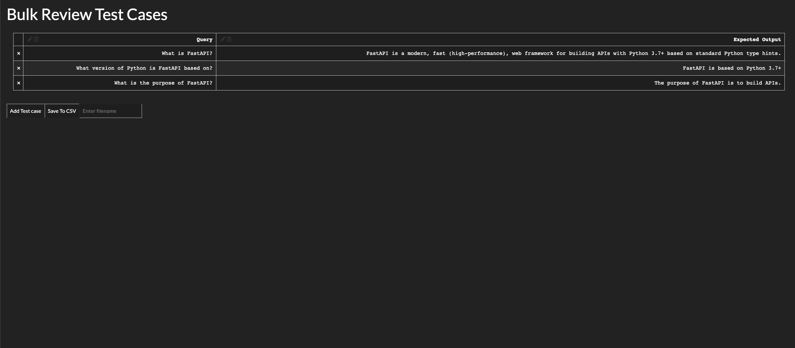

# QuickStart

Once you have installed, run the login command. During this step, you will be asked to visit https://app.confident-ai.com to grab your API key.

Note: this step is entirely optional if you do not wish to track your results but we highly recommend it so you can view how results differ over time.

```bash
deepeval login

# If you already have an API key and want to feed it in through CLI
deepeval login --api-key $API_KEY

# If you have project name and api key 
deepeval login --api-key $API_KEY --implementation-name "sample"
```

Once you have logged in, you can generate a sample test file as shown below. This test file allows you to quickly get started modifying it with various tests. (More on this later)

```bash
deepeval test generate --output-file test_sample.py
```

Once you have generated the test file, you can then run tests as shown.

```bash
deepeval test run test_sample.py
# if you wish to fail first 
deepeval test run -x test_sample.py
# If you want to run an interactive debugger when a test fails
deepeval test run --pdb test_sample.py
```

Under the hood, it triggers pytest and offers support for a number of pytest command line functionalities. Similarly, you may also trigger `pytest` natively for these tests such as 

```bash
pytest test_sample.py
```

Once you run the tests, you should be able to see a dashboard similar to the one below.


## Diving Into The Example

Diving into the example, it shows what a sample test looks like. It uses `assert_overall_score` to ensure that the overall score exceeds a certain threshold. We recommend experimenting with different tests to ensure that the LLMs work as intended across domains such as Bias, Answer Relevancy and Factual Consistency.

With overall score, if you leave out `query` or `expected_output`, DeepEval will automatically run the relevant tests.

For these tests, you will need a `test_` prefix for this to be ran in Python.

```python
from deepeval.metrics.overall_score import OverallScoreMetric
from deepeval import assert_test, LLMTestCase


def test_0():
    query = "How does photosynthesis work?"
    output = "Photosynthesis is the process by which green plants and some other organisms use sunlight to synthesize foods with the help of chlorophyll pigment."
    expected_output = "Photosynthesis is the process by which green plants and some other organisms use sunlight to synthesize food with the help of chlorophyll pigment."
    context = "Biology"

    test_case = LLMTestCase(
        query=query,
        output=output,
        expected_output=expected_output,
        context=context
    )
    metric = OverallScoreMetric()
    # if you want to make sure that the test returns an error
    assert_test(test_case, metrics=[metric])
    
    # If you want to run the test
    test_result = run_test(test_case, metrics=[metric])
    # You can also inspect the test result class 
    print(test_result.success)
    print(test_result.score)

```

## Automatically Create Tests Cases

Now we often don't want to write our own tests or at least be given a variety of queries by which we can create these tests.

You can automatically create tests in DeepEval in just a few lines of code:

```python
from deepeval.dataset import create_evaluation_dataset
dataset = create_evaluation_query_answer_pairs(
    openai_api_key="<YOUR_OPENAI_API_KEY>",
    context="FastAPI is a modern, fast (high-performance), web framework for building APIs with Python 3.7+ based on standard Python type hints.",
    n=3    
)

```

What just happened?

We automatically created a dataset that stored the query answer pairs for you.

You can replace the string with whatever is stored in your database and it will automatically create question-answer pairs.

Once you have created your dataset, we provide an easy way for you to just review what is inside your dataset.

This is done with our `review` function.

```python
dataset.review()
```

When you run this code, it will spin up a quick server for you to review your dataset.



This synthetic creator dashboard allows you to automatically review the text cases in your dataset.

Simply click "Add Test Case" to add a new row to the dataset or click the "X" button to the left to remove if you don't think the generated synthetic question was worth it. 

Once you finish reviewing the synthetic data, name your file and hit "Save File".

Once you save the file, you can load the dataset back using:

```python
from deepeval.dataset import EvaluationDataset

# Replace 'filename.csv' with the actual filename
ds = EvaluationDataset.from_csv('review-test.csv')

# Access the data in the CSV file
# For example, you can print a few rows
print(ds.sample())
```

Great! Your evaluation dataset is ready to go! Now to run tests on your evaluation dataset, simply run: 

```python
import openai
def generate_chatgpt_output(query: str):
    response = openai.ChatCompletion.create(
        model="gpt-3.5-turbo",
        messages=[
            {"role": "system", "content": "You are a helpful assistant."},
            {"role": "assistant", "content": "The customer success phone line is 1200-231-231 and the customer success state is in Austin."},
            {"role": "user", "content": query}
        ]
    )
    expected_output = response.choices[0].message.content
    return expected_output

ds.run_evaluation(completion_fn=generate_chatgpt_output)
```

## What next?

We recommend diving into [creating a dataset](dataset) to learn how to run tests in bulk or [defining custom metrics](../quickstart/custom-metrics) so you can support writing custom tests and metrics for your own use cases.

