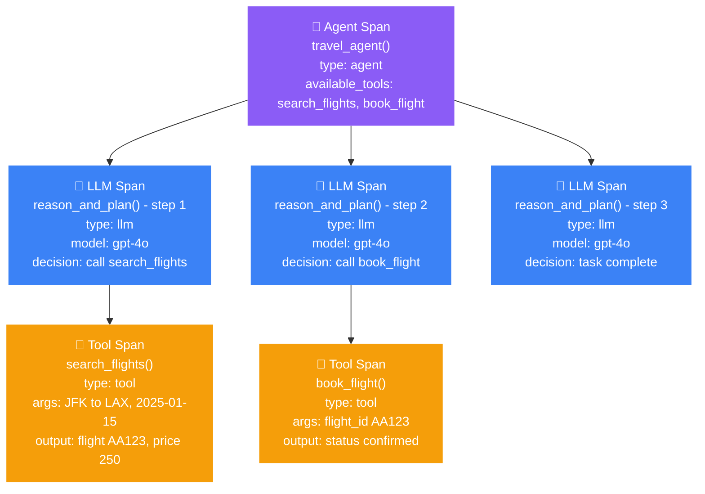

<head>
  <link
    rel="canonical"
    href="https://deepeval.com/guides/guides-agentic-observability"
  />
</head>

import { ASSETS } from "@site/src/assets";
import VideoDisplayer from "@site/src/components/VideoDisplayer";
import { Timeline, TimelineItem } from '@site/src/components/Timeline';

**Agentic tracing** is the practice of tracking the non-deterministic execution paths of AI agents to monitor their reasoning steps, tool usage, and sub-agent handoffs. Unlike standard LLM applications where the execution path is linear and predefined, agents operate in dynamic loops—deciding *what* to do next based on the results of their previous actions. To debug and evaluate an agent, you must map out its entire execution tree to see not just the final output, but the exact sequence of decisions that led there.

:::info
To accurately map an agent's execution tree, `deepeval` utilizes four specialized span types: `"agent"` (for the orchestration layer), `"llm"` (for inference and decision making), `"tool"` (for external API or function executions), and `"retriever"` (for any context fetching steps).
:::

:::note
This guide assumes you have already configured the global trace manager. If you haven't, start with the [LLM Observability guide](/guides/guides-llm-tracing) to set up `trace_manager.configure()` before continuing.
:::



## Common Pitfalls in AI Agents

When an agent fails to complete a user's goal, the final text response is rarely helpful for debugging. Because agents operate autonomously, you need span-level visibility to determine if the failure occurred in the reasoning layer (bad planning) or the action layer (bad tool execution).

### Silent Tool Failures

Agents rely heavily on external tools (APIs, databases, calculators) to interact with the world. Often, an API will return a `200 OK` status but provide an empty list, a fallback message, or an unexpected JSON schema. The tool didn't "crash," so the application doesn't throw an error, but the agent is left with useless data and often hallucinates to compensate.

Here are the key questions observability aims to solve regarding silent tool failures:

- **Did the tool return the expected schema?** If a weather API changes its response format, the agent might misinterpret the data.
- **Did the agent pass the correct arguments?** The model might hallucinate a `flight_id` or format a date incorrectly when calling the tool.

### Reasoning Loops

Because agents execute in a `while` loop until a goal is met, a confused agent can become a massive liability. If an agent receives a confusing tool output, it might decide to call the exact same tool with the exact same arguments over and over again, draining your token limits and severely spiking latency.

Here are the key questions observability aims to solve regarding reasoning loops:

- **How many LLM inference calls did the agent make?** A simple task should not require 15 inference steps.
- **Is the agent looping endlessly?** You must be able to see if the agent is stuck retrying the same failed tool call instead of trying an alternative approach.

## Instrumenting Your Agent

To trace an agent, you decorate the different layers of your system with `@observe`, specifying the corresponding `type`. `deepeval` automatically infers the parent-child relationships based on the call stack, building the execution tree for you.

### The Agent Span

The root function that orchestrates the reasoning loop should be decorated with `type="agent"`. This span accepts two unique optional parameters: `available_tools` (a list of tools the agent is allowed to use) and `agent_handoffs` (a list of other agents it can delegate to).

```python
from deepeval.tracing import observe

@observe(
    type="agent", 
    available_tools=[...],
    agent_handoffs=["hotel_booking_agent"]
)
def travel_agent(user_request: str) -> str:
    # Orchestration logic goes here...
    pass
```

### Tool Spans

Every external function the agent can call — an API, a database query, a calculator — should be decorated with `type="tool"`. You can optionally provide a `description` that is logged with the span and automatically propagated to the parent LLM span's `tools_called` attribute.

```python title="agent.py"
from deepeval.tracing import observe

@observe(type="tool", description="Search for available flights between two cities")
def search_flights(origin: str, destination: str, date: str) -> list:
    return [{"flight_id": "123", "price": 450}]

@observe(type="tool", description="Book a selected flight by its ID")
def book_flight(flight_id: str) -> dict:
    return {"status": "confirmed", "booking_ref": "AB123"}
```

:::tip
`deepeval` automatically infers `tools_called` on the parent LLM span from any `type="tool"` child spans. You do not need to set this manually — just decorate your tool functions and the wiring happens for you.
:::

### LLM Spans

The function that makes the actual inference call to your LLM — where the agent *decides* what to do next — should be decorated with `type="llm"`. If you have configured auto-patching via `trace_manager.configure(openai_client=client)`, the model name and token counts are captured automatically.

```python title="agent.py"
from deepeval.tracing import observe

@observe(type="llm")
def reason_and_plan(messages: list) -> str:
    response = client.chat.completions.create(model="gpt-4o", messages=messages)
    return response.choices[0].message.content
```

## A Complete Single-Agent Example

Here is a fully instrumented travel agent combining all span types from the sections above:
```python title="agent.py"
from deepeval.tracing import observe, update_current_trace, update_current_span
from deepeval.test_case import ToolCall

@observe(type="tool", description="Search for available flights")
def search_flights(origin: str, destination: str, date: str) -> list:
    # Your API call here
    return [{"flight_id": "AA123", "price": 450}]

@observe(type="tool", description="Book a flight by ID")
def book_flight(flight_id: str) -> dict:
    # Your booking API call here
    return {"status": "confirmed", "ref": "XKCD99"}

@observe(type="llm")
def reason_and_plan(messages: list) -> str:
    response = client.chat.completions.create(model="gpt-4o", messages=messages)
    return response.choices[0].message.content

@observe(
    type="agent",
    available_tools=["search_flights", "book_flight"],
    metric_collection="agent-task-completion-metrics",
)
def travel_agent(user_request: str) -> str:
    update_current_trace(
        tags=["travel-booking"],
        metadata={"agent_version": "v3.1"}
    )
    messages = [{"role": "user", "content": user_request}]
    while True:
        decision = reason_and_plan(messages)
        if "search_flights" in decision:
            results = search_flights("JFK", "LAX", "2025-01-15")
            messages.append({"role": "tool", "content": str(results)})
        elif "book_flight" in decision:
            confirmation = book_flight("AA123")
            messages.append({"role": "tool", "content": str(confirmation)})
        else:
            return decision
```

When `travel_agent()` runs, `deepeval` builds the full execution tree: the `agent` span at the root, each `reason_and_plan()` call as an `llm` child span, and each tool call as a `tool` grandchild span. The `metric_collection` on the agent span triggers asynchronous task-completion evaluation in Confident AI after each execution, with zero latency added to the live agent.

## Accessing Raw Agent Traces Locally

If you are not using Confident AI, agent traces are still captured in memory and accessible as plain Python dictionaries. This is especially useful for agents because the full execution tree — every reasoning step, tool argument, and tool output — is nested within a single trace dictionary that you can inspect, log, or forward to your own storage.
```python title="agent.py"
from deepeval.tracing import trace_manager

# Run your agent
travel_agent("Book me a flight from JFK to LAX on January 15th")

# Retrieve all captured traces as dictionaries
traces = trace_manager.get_all_traces_dict()

for trace in traces:
    print(f"Agent input: {trace.get('input')}")
    print(f"Agent output: {trace.get('output')}")
    
    # Inspect every span in the execution tree
    for span_type in ["agentSpans", "llmSpans", "toolSpans"]:
        for span in trace.get(span_type, []):
            print(f"  [{span_type}] {span.get('name')}: {span.get('input')} → {span.get('output')}")
```

Iterating over `"llmSpans"` and `"toolSpans"` in the raw dictionary lets you verify exactly what arguments each tool received and what it returned — without a UI, without a platform, purely in code.

:::tip
Use `trace_manager.clear_traces()` between test runs in long-lived scripts to avoid accumulating traces from previous executions in memory.
:::

## Multi-Agent Systems

When building complex systems, developers often use a multi-agent architecture where a primary coordinator agent delegates tasks to specialized sub-agents. `deepeval` tracks these delegations natively. Because `@observe` uses `ContextVar` to track the call stack, when one agent function calls another, the spans automatically nest correctly.

You can declare these relationships upfront using the `agent_handoffs` parameter.

```python title="multi_agent.py"
from deepeval.tracing import observe

@observe(
    type="agent",
    available_tools=[...],
    agent_handoffs=[]
)
def hotel_agent(user_request: str) -> str:
    # Sub-agent logic
    pass

@observe(
    type="agent",
    available_tools=[...],
    agent_handoffs=["hotel_agent"]
)
def travel_coordinator(user_request: str) -> str:
    # Coordinator logic
    flight_result = search_flights("JFK", "LAX", "2024-12-01")
    
    # Sub-agent handoff — automatically becomes a child span
    hotel_result = hotel_agent("Need a hotel in LAX for Dec 1st")
    
    return f"Flight: {flight_result}, Hotel: {hotel_result}"
```

In Confident AI, `hotel_agent` will appear as a child span of `travel_coordinator`. The platform renders this as a nested graph, showing exactly which sub-agent handled which part of the overarching task.

:::note
The `agent_handoffs` parameter is a static declaration of what handoffs are *possible* within your architecture. The actual handoffs that occur during runtime are captured dynamically by the span tree itself.
:::

## Tracking Tool Usage for Evaluation

To evaluate an agent's reasoning, you must compare what the agent *actually did* against what it *should have done*.

`deepeval` handles the first part automatically: any time a `type="tool"` span executes inside an `type="llm"` span, `deepeval` infers the connection and automatically populates the `tools_called` attribute on the LLM span.

To provide the ground truth for evaluation, you must supply the `expected_tools`. You do this by calling `update_current_span()` from within the LLM inference function.

```python title="agent.py"
from deepeval.tracing import observe, update_current_span
from deepeval.test_case import ToolCall

@observe(type="llm")
def reason_and_plan(messages: list, expected_tool_calls: list = None) -> str:
    response = client.chat.completions.create(model="gpt-4o", messages=messages)
    
    # Provide ground truth for component-level evaluation
    if expected_tool_calls:
        update_current_span(expected_tools=expected_tool_calls)
        
    return response.choices[0].message.content
```

By providing `expected_tools`, metrics like the `ToolCorrectnessMetric` can calculate exact precision and recall scores for the agent's tool selection process.

## Attaching Evaluations

Agent architectures require two distinct scopes of evaluation. You must evaluate the final outcome of the task, but you must also evaluate the individual reasoning steps that led there.

You enable these evaluations by attaching a `metric_collection` to the appropriate span. Both scopes can be active simultaneously in the same trace.

### Evaluating Locally During Development

During development, you can attach `deepeval` metrics directly to `@observe` using the `metrics` parameter. The metrics run synchronously when the function completes, giving you immediate per-span evaluation results in your terminal — no Confident AI connection needed.
```python title="agent.py"
from deepeval.tracing import observe
from deepeval.metrics import ToolCorrectnessMetric, TaskCompletionMetric

tool_correctness = ToolCorrectnessMetric(threshold=0.8)
task_completion = TaskCompletionMetric(threshold=0.7)

# Component-level: evaluate tool selection on each reasoning step
@observe(type="llm", metrics=[tool_correctness])
def reason_and_plan(messages: list) -> str:
    response = client.chat.completions.create(model="gpt-4o", messages=messages)
    return response.choices[0].message.content

# End-to-end: evaluate task completion on the full agent trace
@observe(
    type="agent",
    available_tools=["search_flights", "book_flight"],
    metrics=[task_completion],
)
def travel_agent(user_request: str) -> str:
    ...
```

:::note
The `metrics` parameter runs LLM-as-a-judge evaluations synchronously and will add latency to your agent's execution. Use this exclusively during development and testing. For production, switch to `metric_collection` as shown in the sections below. It requires Confident AI so ensure you ran the `deepeval login` command and have a valid API key configured.
:::

### Component-Level (The LLM Span)

Attach a metric collection to the `type="llm"` span to evaluate the isolated reasoning steps. This allows you to catch when an agent chooses the wrong tool or hallucinates arguments, even if it eventually fumbles its way to a correct final answer.

```python
@observe(type="llm", metric_collection="tool-correctness-metrics")
def reason_and_plan(messages: list) -> str:
    ...
```

### End-to-End (The Agent Span)

Attach a metric collection to the root `type="agent"` span to evaluate the final trajectory and output of the entire task.

```python
@observe(
    type="agent",
    available_tools=[...],
    metric_collection="agent-task-completion-metrics"
)
def travel_agent(user_request: str) -> str:
    ...
```

Here is a summary of how to map your metric collections:

| Scope               | Set via                                 | Example Metrics                                      |
| ------------------- | --------------------------------------- | ---------------------------------------------------- |
| **End-to-end**      | `metric_collection` on the `agent` span | `TaskCompletionMetric`, `StepEfficiencyMetric`       |
| **Component-level** | `metric_collection` on the `llm` span   | `ToolCorrectnessMetric`, `ArgumentCorrectnessMetric` |

Both scopes can be active on the same trace simultaneously. A single agent execution might have `ToolCorrectnessMetric` running on the LLM span (catching when the agent chose the wrong tool mid-task) while `TaskCompletionMetric` runs on the agent span (measuring whether the user's goal was ultimately achieved). This matters because an agent can make a bad tool selection in step 3, recover by step 5, and still complete the task — end-to-end metrics alone would miss the intermediate failure.

:::tip
For a comprehensive breakdown of the formulas and use cases for these metrics, read the [AI Agent Evaluation Metrics guide](/docs/guides/guides-ai-agent-evaluation-metrics).
:::

## Agentic Observability In Production

When you deploy autonomous agents to production, relying on standard text logs to debug a failed task or an infinite loop is nearly impossible. You need a visual representation of the execution tree and asynchronous evaluation to catch regressions without degrading the user experience.

Confident AI renders the complex parent-child span relationships of your agents into an interactive graph, allowing you to trace exactly how an agent reasoned and what tools it called.

<Timeline>
<TimelineItem title="Create agentic metric collections">

Log in to Confident AI and create metric collections tailored to your evaluation scope. For example, create an end-to-end collection (containing `TaskCompletionMetric`) and a component-level collection (containing `ToolCorrectnessMetric`).

<VideoDisplayer
  src={ASSETS.metricsCreateCollection}
  confidentUrl="/docs/llm-tracing/evaluations"
  label="Create Agentic Metric Collections on Confident AI"
/>

</TimelineItem>
<TimelineItem title="Attach collections to your spans">

In your production code, attach the appropriate collection names to your `@observe` decorators. 

```python
@observe(type="agent", metric_collection="agent-task-completion")
def travel_coordinator(user_request: str):
    ...
```

When the trace is sent to Confident AI, the platform evaluates the entire execution tree asynchronously, ensuring your live agent experiences zero added latency.

</TimelineItem>
<TimelineItem title="Debug with the Agent Trace Graph">

Use Confident AI's trace visualization to inspect runaway loops, silent tool failures, and sub-agent handoffs. You can click into any individual tool span to see the exact arguments passed and the JSON schema returned by your external APIs.

<VideoDisplayer
src={ASSETS.tracingTraces}
confidentUrl="/docs/llm-tracing/evaluations"
label="Track agent execution paths and metrics on Confident AI"
/>

</TimelineItem>
</Timeline>

## Conclusion

In this guide, you learned how to instrument complex AI agents to capture their non-deterministic execution paths, reasoning steps, and tool usage:

  - **`type="agent"`** defines the orchestrator and tracks `available_tools` and `agent_handoffs`.
  - **`type="llm"`** captures the inference and decision-making steps.
  - **`type="tool"`** captures external executions, automatically propagating to the parent's `tools_called` attribute.
  - **`expected_tools`** provides the ground truth required to accurately evaluate an agent's tool selection process.
  - **`metrics=[...]` on `@observe`** runs `ToolCorrectnessMetric`, `TaskCompletionMetric`, and other agent-specific metrics locally during development — no external platform required.
  - **`trace_manager.get_all_traces_dict()`** gives you raw access to the full execution tree — every reasoning step, tool argument, and tool output — as a Python dictionary for local inspection and logging.

:::info Development vs Production

- **Development** — Attach `metrics=[tool_correctness]` to your `llm` span and `metrics=[task_completion]` to your `agent` span to catch tool selection failures and task completion regressions instantly. Use `trace_manager.get_all_traces_dict()` to inspect the full execution tree as raw dictionaries without any external dependency.
- **Production** — Export traces to Confident AI to visually debug complex execution graphs. Use asynchronous `metric_collection`s on both the agent and LLM spans to continuously monitor task completion and tool precision without blocking execution.

:::

## Next Steps And Additional Resources

Now that your agent is fully instrumented, you can establish a robust evaluation pipeline to measure its autonomous performance over time:

1.  **Review Agent Metrics** — Understand the exact formulas for tool correctness and task completion in the [AI Agent Evaluation Metrics guide](/guides/guides-ai-agent-evaluation-metrics)
2.  **Read the Evaluation Workflow** — See how these metrics fit into the broader testing lifecycle in the [AI Agent Evaluation guide](/guides/guides-ai-agent-evaluation)
3.  **Curate Golden Datasets** — Export failing agent traces from production into your development testing bench using [Evaluation Datasets](/docs/evaluation-datasets)
4.  **Join the community** — Have questions? Join the [DeepEval Discord](https://discord.com/invite/a3K9c8GRGt)—we're happy to help\!

**Congratulations 🎉!** You now have the knowledge to instrument any AI agent—from single-loop scripts to complex multi-agent systems—with full span-level observability.
