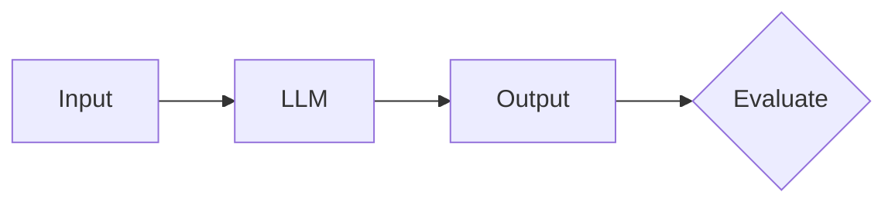
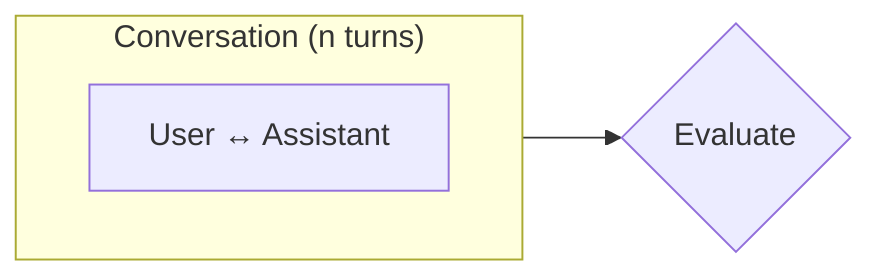
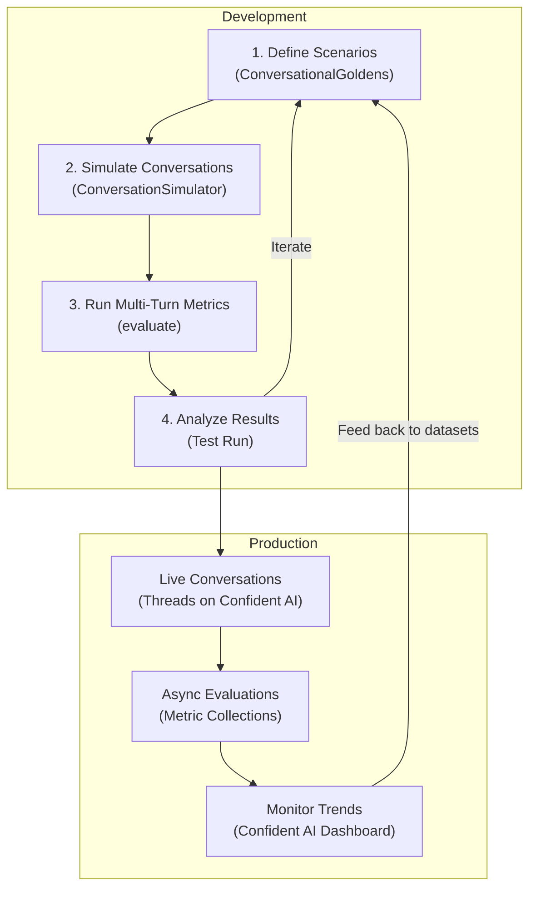
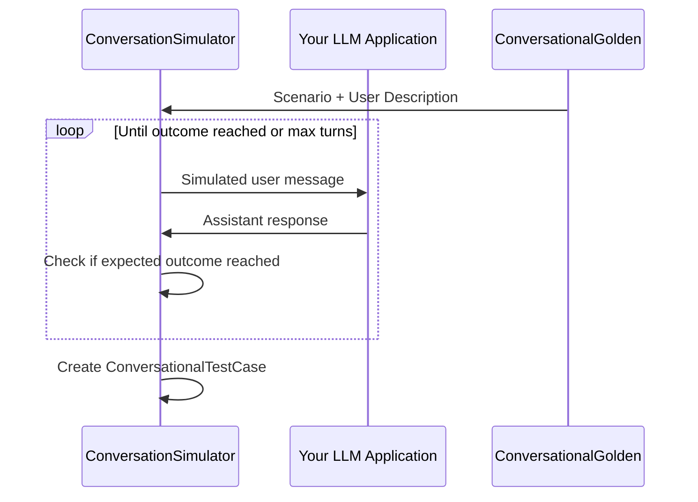
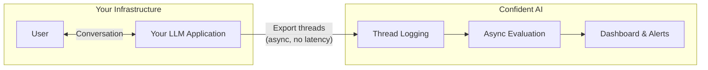
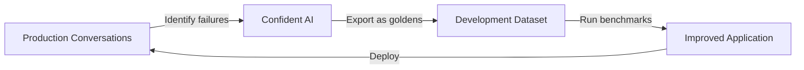

import { Timeline, TimelineItem } from '@site/src/components/Timeline';
import VideoDisplayer from '@site/src/components/VideoDisplayer';
import { ASSETS } from '@site/src/assets';

**Multi-turn evaluation** is the process of measuring how well an LLM system maintains context, generates relevant responses, and satisfies user intentions across multiple turns of dialogue. But first, what exactly makes multi-turn evaluation different?

A multi-turn LLM application—such as a chatbot, customer support agent, or conversational assistant—is designed for back-and-forth exchanges where the user and AI build on previous messages. Unlike single-turn LLM applications that process one input and produce one output, multi-turn systems must track conversation history, remember what was said earlier, and adapt responses based on evolving context.

:::info
The fundamental challenge of multi-turn evaluation is that **conversations are non-deterministic**. The nth AI response depends on the (n-1)th user message, which in turn depends on all prior exchanges. This makes standardized benchmarking significantly harder than single-turn evaluation.
:::

Since a successful outcome depends on sustained quality across an entire conversation—not just any single response—multi-turn evaluation focuses on evaluating the conversation holistically while also assessing individual turn quality.

_For a deeper dive into multi-turn metrics, see the [Multi-Turn Evaluation Metrics guide](/guides/guides-multi-turn-evaluation-metrics). For automating conversation generation, see the [Multi-Turn Simulation guide](/guides/guides-multi-turn-simulation)._

## Multi-Turn vs Single-Turn Evaluation

Before diving into the multi-turn evaluation workflow, it's important to understand why it requires a fundamentally different approach from single-turn evaluation.

### Single-Turn Evaluation

In single-turn evaluation, you have a straightforward mapping: one input produces one output. You evaluate whether that output is correct, relevant, or faithful to context. The test case is self-contained.



With single-turn evaluation, you can create a dataset of input-output pairs and run metrics against each one independently. There's no dependency between test cases—each one lives in isolation.

### Multi-Turn Evaluation

Multi-turn evaluation is fundamentally different because each response depends on the entire conversation history that preceded it. A response that seems irrelevant in isolation might be perfectly appropriate given what was discussed three turns ago.



This creates two key challenges:

1. **You can't pre-define expected outputs.** Since each user message depends on the previous assistant response, you can't know ahead of time what the conversation will look like. This is why `deepeval` uses **scenarios** instead of fixed input-output pairs—see the [Multi-Turn Simulation guide](/guides/guides-multi-turn-simulation) for how this works in practice.

2. **Quality must be sustained.** An LLM that gives five perfect responses and then one terrible one has still failed. Multi-turn metrics need to evaluate consistency across the entire conversation, not just individual turns.


In `deepeval`, multi-turn interactions are grouped by **scenarios** defined as [`ConversationalGolden`s](/docs/conversation-simulator#simulate-a-conversation). If two conversations occur under the same scenario (e.g., "Angry user asking for a refund"), we consider those comparable—even if the exact messages differ.

## Common Pitfalls in Multi-Turn AI

Multi-turn conversations can fail in ways that single-turn systems simply cannot. Understanding these failure modes is the first step to building a robust evaluation pipeline.

### Context & Memory Failures

The most common category of multi-turn failures relates to maintaining context across turns:

- **Forgetting previous information** — The user mentions their name in turn 1, and the assistant asks for it again in turn 5. This erodes trust and creates frustration.
- **Contradicting earlier statements** — The assistant recommends Product A in turn 2, then says Product A is out of stock in turn 6, without acknowledging the contradiction.
- **Losing track of the conversation thread** — In complex multi-topic conversations, the assistant may lose track of which topic is currently being discussed.

### Response Quality Failures

Even with perfect memory, individual responses can fail:

- **Irrelevant responses** — The assistant generates a response that doesn't address what the user just said, often due to poor context window management.
- **Role violations** — A customer support assistant suddenly starts giving medical advice, or a professional assistant uses overly casual language.
- **Incomplete resolution** — The assistant addresses part of the user's request but ignores other aspects, leaving the user unsatisfied.

### Conversation Flow Failures

Beyond individual turns, the overall conversation arc can break down:

- **Failing to reach resolution** — The conversation goes in circles without ever solving the user's problem, often from an assistant that keeps asking clarifying questions without acting on the answers.
- **Premature closure** — The assistant ends the conversation or changes topics before the user's needs are fully met.
- **Topic drift** — The conversation gradually drifts away from the user's original intent without the assistant steering it back.

## Workflows for Multi-turn Evals

Multi-turn evaluation spans two environments that feed into each other:

- **Development** — Define conversational scenarios, simulate user interactions, and benchmark with multi-turn metrics.
- **Production** — Log real conversations as threads on Confident AI and evaluate them asynchronously.

Failing production conversations get fed back into your development dataset, creating a continuous improvement loop.



:::caution
A common shortcut is exporting historical conversations and running metrics on them as a benchmark. This is flawed because those conversations were shaped by your _current_ system—they won't:

- Stress-test new prompt changes
- Catch regressions in unseen scenarios
- Surface edge cases your users haven't hit yet

Use **[scenario-based simulation](/guides/guides-multi-turn-simulation)** instead. It generates fresh, diverse conversations on demand, giving you a reproducible test bench that evolves independently of production traffic.
:::

## Multi-Turn Evals In Development

Development evaluation is about benchmarking—comparing different versions of your multi-turn LLM application on the same set of scenarios to measure improvement.



The simulation works in three steps:

1. A `ConversationalGolden` feeds the scenario and user description into the `ConversationSimulator`.
2. The simulator generates user messages, your LLM responds, and this loops until the expected outcome is reached or max turns is hit.
3. The full conversation is packaged into a `ConversationalTestCase` for evaluation.

### Define Scenarios

Instead of pre-defined input-output pairs, multi-turn evaluation starts with **scenarios**—descriptions of the conversational situations you want to test. In `deepeval`, these are represented as [`ConversationalGolden`s](/docs/conversation-simulator#simulate-a-conversation):

```python
from deepeval.dataset import EvaluationDataset, ConversationalGolden

dataset = EvaluationDataset(goldens=[
    ConversationalGolden(
        scenario="Frustrated customer requesting a refund for a defective product",
        expected_outcome="Customer receives refund confirmation and apology",
        user_description="Impatient customer who has already contacted support twice"
    ),
    ConversationalGolden(
        scenario="New user asking for help setting up their account",
        expected_outcome="User successfully creates account and understands key features",
        user_description="Non-technical user, first time using the product"
    ),
    ConversationalGolden(
        scenario="User asking complex technical questions about API integration",
        expected_outcome="User gets accurate technical guidance with code examples",
        user_description="Senior software engineer integrating the product's REST API"
    ),
])
```

Each golden defines _what_ the conversation is about and _what success looks like_, without dictating the exact messages. This is the key insight that makes multi-turn benchmarking possible.

:::tip
Aim for at least 20 diverse scenarios covering your application's primary use cases, edge cases, and failure-prone situations. The more scenarios you have, the more robust your benchmark.
:::

### Simulate Conversations

Manually chatting with your LLM for every test case is time-consuming and non-reproducible. `deepeval`'s [`ConversationSimulator`](/docs/conversation-simulator) automates this by playing the role of the user, driving conversations based on your scenarios. For a deep dive into simulation concepts, callback patterns, and advanced usage, see the [Multi-Turn Simulation guide](/guides/guides-multi-turn-simulation).

Here's how to set it up:

```python
from deepeval.test_case import Turn
from deepeval.conversation_simulator import ConversationSimulator

# Wrap your LLM application in a callback
async def model_callback(input: str, turns: list, thread_id: str) -> Turn:
    response = await your_llm_app(input, turns, thread_id)
    return Turn(role="assistant", content=response)

# Create simulator and run
simulator = ConversationSimulator(model_callback=model_callback)
test_cases = simulator.simulate(goldens=dataset.goldens, max_turns=10)
```

The simulator role-plays as the user from each `ConversationalGolden`, looping until the expected outcome is reached or max turns is hit. The result is a set of [`ConversationalTestCase`s](/docs/evaluation-multiturn-test-cases) ready for evaluation—each containing the full turn history plus the original scenario and expected outcome.

#### Returning Rich Turns

The `model_callback` returns a `Turn` object, which can carry more than just `content`. If your application uses RAG or calls tools, include `retrieval_context` and `tools_called` on the returned turn—several metrics depend on these fields:

```python
from deepeval.test_case import Turn, ToolCall

async def model_callback(input: str, turns: list, thread_id: str) -> Turn:
    result = await your_llm_app(input, turns, thread_id)
    return Turn(
        role="assistant",
        content=result["response"],
        retrieval_context=result.get("retrieved_docs"),
        tools_called=[
            ToolCall(name=tc["name"], description=tc["description"])
            for tc in result.get("tool_calls", [])
        ] or None,
    )
```

| `Turn` field        | Required by                                                                                                              |
| ------------------- | ------------------------------------------------------------------------------------------------------------------------ |
| `content`           | All metrics                                                                                                              |
| `retrieval_context` | `TurnFaithfulnessMetric`, `TurnContextualRelevancyMetric`, `TurnContextualPrecisionMetric`, `TurnContextualRecallMetric` |
| `tools_called`      | `ToolUseMetric`, `GoalAccuracyMetric`                                                                                    |

:::tip
If you only need conversation-level metrics like `ConversationCompletenessMetric` or `TurnRelevancyMetric`, returning `Turn(role="assistant", content=...)` is sufficient. Add the extra fields only when you want to evaluate retrieval or tool-use quality.
:::

### Choose and Run Metrics

`deepeval` provides a [wide range of multi-turn metrics](/guides/guides-multi-turn-evaluation-metrics) that target different aspects of conversational quality. Here are some of the most commonly used ones:

| Metric                           | What It Measures                                                         | When to Use                                                           |
| -------------------------------- | ------------------------------------------------------------------------ | --------------------------------------------------------------------- |
| `ConversationCompletenessMetric` | Whether user intentions are satisfied throughout the conversation        | Always—this is the most fundamental multi-turn metric                 |
| `TurnRelevancyMetric`            | Whether each assistant response is relevant to what the user said        | Always—catches off-topic or non-sequitur responses                    |
| `KnowledgeRetentionMetric`       | Whether the assistant remembers facts shared earlier in the conversation | When your application handles information-heavy conversations         |
| `RoleAdherenceMetric`            | Whether the assistant stays in character and follows its assigned role   | When your application has a specific persona or behavioral guidelines |
| `ConversationalGEval`            | Any custom criteria you define in plain English                          | When built-in metrics don't cover your specific quality requirements  |

:::info
`deepeval` offers many more multi-turn metrics beyond those listed above, including `GoalAccuracyMetric`, `TopicAdherenceMetric`, `ToolUseMetric`, and multi-turn RAG metrics like `TurnFaithfulnessMetric` and `TurnContextualRelevancyMetric`. See the [Multi-Turn Evaluation Metrics guide](/guides/guides-multi-turn-evaluation-metrics) for a complete breakdown.
:::

With simulated conversations in hand, run your chosen metrics:

```python
from deepeval import evaluate
from deepeval.metrics import (
    ConversationCompletenessMetric,
    TurnRelevancyMetric,
    KnowledgeRetentionMetric,
    RoleAdherenceMetric,
)

evaluate(
    test_cases=test_cases,
    metrics=[
        ConversationCompletenessMetric(),
        TurnRelevancyMetric(),
        KnowledgeRetentionMetric(),
        RoleAdherenceMetric(),
    ]
)
```

This creates a **test run**—a snapshot of your LLM application's conversational performance at a point in time. Each test case is evaluated against all specified metrics, producing scores, reasons, and pass/fail results.

<VideoDisplayer src={ASSETS.conversationTestReport} />

After each test run, analyze which scenarios consistently fail and which metrics score lowest. Use these insights to improve your system prompt, context management, or retrieval pipeline, then re-run the evaluation to measure impact.

### Using Custom Criteria

The built-in metrics cover common quality dimensions, but your application likely has specific requirements. Use [`ConversationalGEval`](/docs/metrics-conversational-g-eval) to define custom evaluation criteria in plain English:

```python
from deepeval.metrics import ConversationalGEval

empathy = ConversationalGEval(
    name="Empathy",
    criteria="Evaluate whether the assistant demonstrates empathy and emotional awareness when the user expresses frustration, confusion, or dissatisfaction."
)

policy_compliance = ConversationalGEval(
    name="Policy Compliance",
    criteria="Evaluate whether the assistant follows company policies, such as not offering unauthorized discounts, not making promises outside its authority, and always directing sensitive issues to human agents."
)

evaluate(test_cases=test_cases, metrics=[empathy, policy_compliance])
```

:::tip
`ConversationalGEval` is the multi-turn equivalent of [`GEval`](/docs/metrics-llm-evals). It evaluates the entire conversation against your criteria, not just individual turns.
:::

## Multi-Turn Evals In Production

In production, the goal shifts from benchmarking to **continuous monitoring**. Real user conversations are unpredictable—they'll surface edge cases your development scenarios never anticipated.

Production evaluation needs to:

- **Run asynchronously** — never add latency to your application's responses
- **Scale automatically** — handle thousands of concurrent conversations
- **Surface actionable insights** — identify quality degradation before users churn

While you could build this infrastructure yourself, [Confident AI](https://confident-ai.com) handles it seamlessly.

### Setting Up Production Monitoring



<Timeline>
<TimelineItem title="Create a metric collection">

Log in to Confident AI and create a metric collection containing the conversational metrics you want to run in production:

<VideoDisplayer
  src={ASSETS.metricsCreateCollection}
  confidentUrl="/docs/llm-tracing/evaluations"
  label="Create a Metric Collection on Confident AI"
/>

</TimelineItem>
<TimelineItem title="Log conversations as threads">

Confident AI groups multi-turn conversations into **threads**—the production equivalent of `ConversationalTestCase`s. Each thread captures the full conversation history and can be evaluated against your metric collection.

<VideoDisplayer
  src={ASSETS.tracingThreads}
  confidentUrl="/docs/llm-tracing/evaluations#offline-evaluations"
  label="Monitor conversations on Confident AI"
/>

</TimelineItem>
<TimelineItem title="Feed production data back to development">

The most powerful aspect of production monitoring is the feedback loop. When you discover failing conversations in production, you can convert them into `ConversationalGolden`s and add them to your development dataset. This ensures your benchmark evolves with real-world usage patterns.



:::tip
To get started, run `deepeval login` in your terminal and follow the [Confident AI LLM tracing setup guide](https://www.confident-ai.com/docs/llm-tracing/quickstart).
:::

</TimelineItem>
</Timeline>

## Conclusion

In this guide, you learned that multi-turn evaluation requires a fundamentally different approach from single-turn LLM evaluation:

- **Multi-turn conversations are non-deterministic** — you can't pre-define expected outputs, so you use scenarios instead
- **Quality must be sustained** — a single bad turn can ruin an otherwise good conversation
- **[Simulation](/guides/guides-multi-turn-simulation) enables standardized benchmarking** — the `ConversationSimulator` automates user interactions for reproducible testing

To catch multi-turn failures, `deepeval` provides a [rich set of conversational metrics](/guides/guides-multi-turn-evaluation-metrics) you can apply at the conversation level—from `ConversationCompletenessMetric` and `TurnRelevancyMetric` to `KnowledgeRetentionMetric`, `RoleAdherenceMetric`, and many more. You can also define custom criteria with `ConversationalGEval`.

:::info Development vs Production

- **Development** — Simulate conversations from scenario-based goldens, benchmark with multi-turn metrics, and iterate
- **Production** — Export conversation threads to Confident AI and evaluate asynchronously to monitor quality over time

:::

With proper evaluation in place, you can catch quality regressions before users notice, ensure your application handles diverse conversational scenarios gracefully, make data-driven decisions about prompt and model changes, and continuously improve through production feedback loops.

## Next Steps And Additional Resources

While `deepeval` handles the metrics and simulation logic, [Confident AI](https://confident-ai.com) is the platform that brings everything together for production multi-turn evaluation:

- **Thread Monitoring** — Visualize full conversations, replay user interactions, and identify failure patterns
- **Async Production Evals** — Run multi-turn evaluations without blocking your application or consuming production resources
- **Dataset Management** — Curate and version conversational golden datasets on the cloud, and feed production failures back into your test bench
- **Performance Tracking** — Monitor conversation quality trends over time and catch degradation early
- **Shareable Reports** — Generate testing reports with conversation-level detail you can share with your team

Ready to get started? Here's what to do next:

1. **Explore the metrics** — Learn how each multi-turn metric works in the [Multi-Turn Evaluation Metrics guide](/guides/guides-multi-turn-evaluation-metrics)
2. **Set up simulation** — Follow the [Multi-Turn Simulation guide](/guides/guides-multi-turn-simulation) to automate your test bench
3. **Login to Confident AI** — Run `deepeval login` in your terminal to connect your account
4. **Read the quickstart** — For a hands-on walkthrough, check out the [Chatbot Evaluation Quickstart](/docs/getting-started-chatbots)
5. **Reference docs** — [ConversationalTestCase](/docs/evaluation-multiturn-test-cases) · [ConversationSimulator](/docs/conversation-simulator) · [EvaluationDataset](/docs/evaluation-datasets)
6. **Join the community** — Have questions? Join the [DeepEval Discord](https://discord.com/invite/a3K9c8GRGt)—we're happy to help!

**Congratulations 🎉!** You now have the knowledge to build robust multi-turn evaluation pipelines for your LLM applications.
