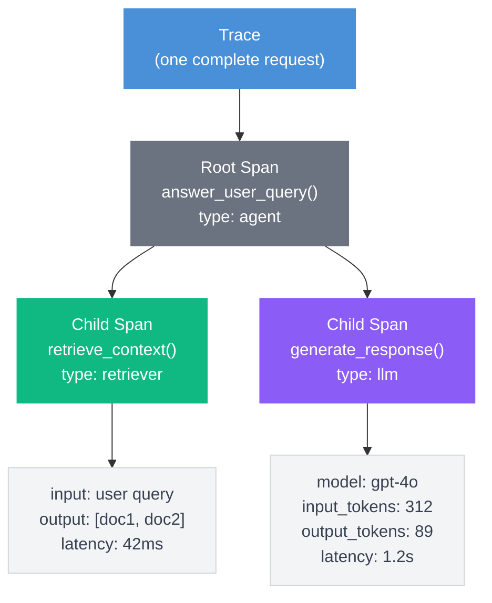

<head>
  <link
    rel="canonical"
    href="https://deepeval.com/guides/guides-llm-tracing"
  />
</head>

import Tabs from "@theme/Tabs";
import TabItem from "@theme/TabItem";
import { ASSETS } from "@site/src/assets";
import VideoDisplayer from "@site/src/components/VideoDisplayer";
import { Timeline, TimelineItem } from '@site/src/components/Timeline';

**LLM tracing** is the practice of mapping the complete execution graph of your application to monitor inputs, outputs, latency, and token usage at every step. By wrapping the functions in your pipeline with `deepeval`'s `@observe` decorator, you automatically capture a structured tree of your application's execution without adding any latency to your underlying systems. This guide covers tracing for single-turn and Retrieval-Augmented Generation (RAG) applications.

:::info
A **trace** represents the entire lifecycle of a single request (from user input to final output), while a **span** represents a single function call within that trace (like a database retrieval or LLM generation). A trace is composed of multiple spans arranged in a parent-child hierarchy.
:::



## Common Pitfalls in LLM Pipelines

When an LLM application produces a poor response, the final output rarely tells you *why* it failed. Without tracing, your application operates as a black box, making it impossible to confidently debug or evaluate the intermediate steps.

### Monolithic Functions

Many LLM applications are built as monolithic functions where prompt formatting, vector retrieval, and LLM generation happen sequentially without clear boundaries. When these steps are bundled together, intermediate states are lost.

1. **Input processing** — the user's raw query is transformed into a search query.
2. **Context retrieval** — external knowledge is fetched from a vector store.
3. **Generation** — the LLM produces a response based on the retrieved context.

Here are the key questions tracing aims to solve in monolithic functions:

- **Is the retriever fetching the right context?** If the retrieval step pulls irrelevant documents, the LLM cannot generate a correct answer.
- **Is the prompt formatted correctly?** A malformed prompt string or missing variables will confuse the model.
- **Which component is causing latency?** You need to know if a slow response is due to the vector search, an external API, or the LLM generation itself.

### Silent Failures

In complex pipelines, a component might fail or return suboptimal results without throwing a hard system error. The application continues executing, and the final LLM call attempts to compensate, often resulting in hallucinations.

1. **Context truncation** — retrieved documents exceed the context window and are silently dropped.
2. **Empty retrievals** — the vector database returns zero results, leaving the LLM to guess.
3. **Malformed JSON** — the LLM outputs a string instead of the requested JSON schema.

Here are the key questions tracing aims to solve regarding silent failures:

- **Did the database return the expected data?** A query might return an empty list or a generic fallback message instead of throwing an error.
- **Did the LLM hallucinate arguments?** The model might guess an ID or parameter that doesn't actually exist in the retrieved context.

## Setting Up Tracing

Before instrumenting individual functions, you must configure the global trace manager. This one-time setup step dictates how traces are collected, sampled, and exported.

### Auto-Patching LLM Clients

The most powerful feature of the trace manager is auto-patching. By passing your initialized LLM client to the configuration, `deepeval` automatically intercepts calls to `chat.completions.create` (OpenAI) or `messages.create` (Anthropic). This captures the model name, input token count, output token count, and raw messages without any manual instrumentation.

```python title="main.py"
from openai import OpenAI
from deepeval.tracing import trace_manager

client = OpenAI()

trace_manager.configure(
    openai_client=client,
)
```

:::note
For unsupported clients, you can manually log token counts and model names using `update_llm_span()` to capture cost and usage metrics.
:::

### Connecting to Confident AI (Optional)

To export your traces for visualizing execution graphs and running asynchronous evaluations, you must provide a Confident AI API key. Without this, traces are only collected locally. Run `deepeval login` in your terminal to authenticate, or pass the key directly.

```python title="main.py"
trace_manager.configure(
    openai_client=client,
    confident_api_key="your-confident-api-key",
)
```

### Configuring Environments and Sampling

In high-traffic production environments, tracing every single request can be unnecessary. You can control the volume of traces using the `sampling_rate` parameter (a float between `0.0` and `1.0`) and tag them using the `environment` parameter (`"development"`, `"staging"`, or `"production"`).

```python title="main.py"
trace_manager.configure(
    openai_client=client,
    confident_api_key="your-confident-api-key",
    environment="production",
    sampling_rate=0.1 # Only trace 10% of requests
)
```

:::tip
For development and testing, always leave the `sampling_rate` at `1.0` (the default) so you don't miss any traces while debugging.
:::

### Masking Sensitive Data

By default, all function inputs and outputs are captured verbatim. If your application handles personally identifiable information (PII) — such as user emails, names, or financial data — you should provide a masking function to sanitize data before it is serialized and exported.

```python title="main.py"
def redact_pii(data):
    if isinstance(data, str) and "@" in data:
        return "[EMAIL REDACTED]"
    return data

trace_manager.configure(
    confident_api_key="your-api-key",
    mask=redact_pii,
)
```

The mask function is applied to all span inputs and outputs before they leave your application. It receives the raw value and should return the sanitized version.

## Instrumenting Your LLM Pipeline

The core of `deepeval`'s tracing system is the `@observe` decorator. When you apply this decorator to a function, `deepeval` automatically intercepts the function call, records the arguments as the span `input`, records the return value as the span `output`, and calculates the exact execution latency.

More importantly, `deepeval` natively understands the call stack. When one decorated function calls another, they are automatically nested into a parent-child span hierarchy without any manual thread-wiring or global variables.

Here is how you instrument a standard Retrieval-Augmented Generation (RAG) pipeline:

```python title="rag_pipeline.py"
from deepeval.tracing import observe

@observe(type="retriever")
def retrieve_context(query: str) -> list:
    # Simulated vector database search
    return ["DeepEval traces parent-child execution automatically."]

@observe(type="llm")
def generate_response(query: str, context: list) -> str:
    # Simulated LLM generation (auto-patched)
    response = client.chat.completions.create(
        model="gpt-4o",
        messages=[{"role": "user", "content": f"Context: {context} Query: {query}"}]
    )
    return response.choices[0].message.content

@observe # Root span (no type required)
def answer_user_query(user_query: str) -> str:
    context = retrieve_context(user_query)
    return generate_response(user_query, context)
```

When `answer_user_query()` is executed, `deepeval` creates a root trace. Inside that trace, the `retriever` span will execute first, followed by the `llm` span.

:::tip
Always explicitly define the `type` parameter (`llm`, `retriever`, `tool`, or `agent`). Typed spans unlock component-specific evaluation metrics — `FaithfulnessMetric` and `AnswerRelevancyMetric` on `llm` spans, contextual metrics on `retriever` spans — and enable specialized rendering in Confident AI's trace explorer.
:::

## Tracking Dynamic Context

While `@observe` handles explicit function inputs and outputs, complex applications often generate internal variables that are critical for evaluation but are never formally returned by the function.

For example, your retriever function might fetch documents, but your generation function needs those exact documents to be evaluated for hallucinations. You must track this dynamic context manually using `update_current_span()`.

```python title="rag_pipeline.py"
from deepeval.tracing import observe, update_current_span

@observe(type="retriever")
def retrieve_context(query: str) -> list:
    results = vector_store.search(query, k=3)
    documents = [res.text for res in results]
    
    # Attach the retrieved documents directly to the current span
    update_current_span(
        retrieval_context=documents,
        metadata={"chunk_size": 512, "embedder": "text-embedding-3-small"}
    )
    
    return documents
```

By calling `update_current_span()` from *within* the decorated function, you inject data directly into the active span.

### `update_current_span()` Parameters

| Parameter           | Type             | Purpose                                                                |
|---------------------|----------------- |------------------------------------------------------------------------|
| `input`             | `Any`            | Override the auto-captured function input                              |
| `output`            | `Any`            | Override the auto-captured function output                             |
| `retrieval_context` | `List[str]`      | Chunks retrieved from a vector store — required for RAG metrics        |
| `context`           | `List[str]`      | Ground-truth context for the span                                      |
| `expected_output`   | `str`            | The ideal output — used as ground truth for correctness metrics        |
| `tools_called`      | `List[ToolCall]` | Tools the LLM called during this span                                  |
| `expected_tools`    | `List[ToolCall]` | Tools the LLM *should* have called — used for tool correctness metrics |
| `metadata`          | `Dict[str, Any]` | Free-form key-value pairs for filtering and debugging                  |
| `name`              | `str`            | Override the span name (defaults to the function name)                 |
| `metric_collection` | `str`            | Attach a Confident AI metric collection to this span                   |

These parameters allow you to set attributes to your spans inside any trace manually. This is especially useful for capturing data inside special functions of your application.

### Trace-Level Metadata

You can also use `update_current_trace()` to append metadata to the entire execution graph, rather than just the active span. This is highly useful for tracking user sessions, application versions, or A/B testing flags.

```python title="rag_pipeline.py"
from deepeval.tracing import observe, update_current_trace

@observe
def answer_user_query(user_query: str, user_plan: str) -> str:
    update_current_trace(
        tags=["rag-v2"],
        metadata={"user_plan": user_plan}
    )
    context = retrieve_context(user_query)
    return generate_response(user_query, context)
```

### `update_current_trace()` Parameters

The `update_current_trace()` function allows you to set attributes on the trace level, which applies to the top level execution of your application.

| Parameter           | Type                       | Purpose                                                              |
| ------------------- | -------------------------- | -------------------------------------------------------------------- |
| `name`              | `Optional[str]`            | Override the trace name                                              |
| `tags`              | `Optional[List[str]]`      | Tags for categorizing and filtering traces                           |
| `metadata`          | `Optional[Dict[str, Any]]` | Free-form key-value pairs for debugging and filtering                |
| `thread_id`         | `Optional[str]`            | Identifier for grouping related traces (e.g., a conversation thread) |
| `user_id`           | `Optional[str]`            | Identifier for the end user                                          |
| `input`             | `Optional[Any]`            | Override the trace input                                             |
| `output`            | `Optional[Any]`            | Override the trace output                                            |
| `retrieval_context` | `Optional[List[str]]`      | Retrieved chunks (used for RAG evaluation metrics)                   |
| `context`           | `Optional[List[str]]`      | Ground-truth reference context                                       |
| `expected_output`   | `Optional[str]`            | Ideal output for correctness evaluation                              |
| `tools_called`      | `Optional[List[ToolCall]]` | Tools actually invoked during execution                              |
| `expected_tools`    | `Optional[List[ToolCall]]` | Tools expected to be invoked (for tool correctness evaluation)       |
| `test_case`         | `Optional[LLMTestCase]`    | Bulk assignment of multiple fields from a test case                  |
| `confident_api_key` | `Optional[str]`            | API key for Confident AI integration                                 |
| `test_case_id`      | `Optional[str]`            | Identifier for the associated test case                              |
| `turn_id`           | `Optional[str]`            | Identifier for the specific interaction turn                         |
| `metric_collection` | `Optional[str]`            | Attach a predefined Confident AI metric collection                   |

## Evaluating Your Pipeline with Traces

What separates `deepeval`'s tracing from other tracing / instrumentation frameworks is that traces are not just logs — they are the data source for running real, research-backed evaluation metrics directly against the components of your pipeline. Most tracing tools stop at visibility. `deepeval` goes further: once your execution graph is captured, you can evaluate it.

### Component-Level Evaluation

Instead of only evaluating the final output of your pipeline, you can attach `deepeval` metrics directly to specific spans to evaluate components in isolation. During local development, you pass instantiated metrics to the `metrics` parameter of the `@observe` decorator. When the function finishes executing, `deepeval` intercepts the span data and immediately runs the specified metrics locally — no separate evaluation step required.

```python title="rag_pipeline.py"
from deepeval.tracing import observe
from deepeval.metrics import AnswerRelevancyMetric, FaithfulnessMetric

relevancy_metric = AnswerRelevancyMetric(threshold=0.7)
faithfulness_metric = FaithfulnessMetric(threshold=0.8)

@observe(type="llm", metrics=[relevancy_metric, faithfulness_metric])
def generate_response(query: str, context: list) -> str:
    response = client.chat.completions.create(
        model="gpt-4o",
        messages=[{"role": "user", "content": f"Context: {context} Query: {query}"}]
    )
    return response.choices[0].message.content
```

Now call your function using the `evals_iterator` of `EvaluationDataset` to run component evals on pre-defined inputs

```python
from deepeval.dataset import EvaluationDataset, Golden

dataset = EvaluationDataset(goldens=[
    Golden(input="..."),
    ...
])

for golden in dataset.evals_iterator():
    generate_response(golden.input)
```

When `generate_response()` runs, `deepeval` automatically extracts the function's `input` (the query), `output` (the response), and any `retrieval_context` attached to the span, and feeds them into both metrics. If a metric fails its threshold, it is highlighted in your local trace output immediately — before you ever push code.

:::note
Running metrics via the `metrics` parameter is a blocking operation. The metric uses an LLM judge to evaluate the span locally, meaning execution will pause until the evaluation is complete. This is intended exclusively for development and testing environments. For production, use `metric_collection` instead — see the [production section](#llm-observability-in-production) below.
:::

### End-to-End Evaluation

Component-level metrics evaluate individual spans in isolation, but sometimes you need to evaluate the full request from start to finish — whether the final answer was correct given the user's original question. You can do this by attaching metrics to the root span instead.

```python title="rag_pipeline.py"
from deepeval.tracing import observe

@observe
def answer_user_query(user_query: str) -> str:
    context = retrieve_context(user_query)
    return generate_response(user_query, context)
```

Now call your function using the `evals_iterator` of `EvaluationDataset` with metrics to run end-to-end evals

```python
from deepeval.dataset import EvaluationDataset, Golden
from deepeval.metrics import GEval
from deepeval.test_case import LLMTestCaseParams

correctness_metric = GEval(
    name="Correctness",
    criteria="Determine whether the actual output is factually correct based on the expected output.",
    evaluation_params=[LLMTestCaseParams.ACTUAL_OUTPUT, LLMTestCaseParams.EXPECTED_OUTPUT],
    threshold=0.7,
)

dataset = EvaluationDataset(goldens=[
    Golden(input="..."),
    ...
])

for golden in dataset.evals_iterator(metrics=[correctness_metric]):
    generate_response(golden.input)
```

:::tip
Use component-level metrics (on `retriever` and `llm` spans) to diagnose *where* your pipeline is failing. Use end-to-end metrics to measure whether the pipeline is succeeding for the user. Both are most useful together.
:::

## Accessing Raw Traces Locally

If you are using `deepeval` without Confident AI, traces are still collected in memory and available as plain Python dictionaries. This lets you log them to your own storage, pipe them into your own analytics system, or inspect them programmatically without any external dependency.

After your decorated functions have been called, use `trace_manager` to retrieve all captured traces:

```python title="rag_pipeline.py"
from deepeval.tracing import trace_manager

# Run your pipeline as normal
answer_user_query("What are the visa requirements for Japan?")

# Retrieve all traces captured in this process as dictionaries
traces = trace_manager.get_all_traces_dict()

for trace in traces:
    print(trace)
```

Each dictionary in the returned list represents one complete trace — including all nested spans, their inputs, outputs, latency values, types, and any metadata you attached via `update_current_span()` or `update_current_trace()`. The structure mirrors exactly what is sent to Confident AI, so you can index it in your own data store, forward it to your logging pipeline, or use it to build custom dashboards.

:::tip
`trace_manager.get_all_traces_dict()` returns every trace collected since the process started. For long-running servers, call `trace_manager.clear_traces()` periodically to free memory if you are not sending traces to Confident AI.
:::

## Framework Integrations

If you're already using **LlamaIndex** or **LangChain** to build your RAG pipeline, deepeval provides native integrations that automatically instrument your application — capturing retriever spans, LLM spans, and retrieval context — with just a couple of lines of setup code. No manual `@observe` decorators are needed.

<Tabs>
<TabItem value="llamaindex" label="LlamaIndex">

Call `instrument_llama_index` once before building your index. deepeval then hooks into LlamaIndex's internal event system and automatically records every retrieval operation (the retrieved nodes are stored as `retrieval_context` on the retriever span) alongside all LLM calls.

```python title="main.py" showLineNumbers
import llama_index.core.instrumentation as instrument
from llama_index.core import VectorStoreIndex, SimpleDirectoryReader

from deepeval.integrations.llama_index import instrument_llama_index

# One-line setup: auto-instruments all retrieval and LLM spans
instrument_llama_index(instrument.get_dispatcher())

documents = SimpleDirectoryReader("data/").load_data()
index = VectorStoreIndex.from_documents(documents)
query_engine = index.as_query_engine()

# Retrieval context is automatically captured in the retriever span
response = query_engine.query("What are the visa requirements for Japan?")
print(response)
```

</TabItem>
<TabItem value="langchain" label="LangChain">

Pass a `CallbackHandler` instance in the `config` when invoking your chain. deepeval intercepts the retriever's start and end events, creating a `RetrieverSpan` with the query and the retrieved documents automatically.

```python title="main.py" showLineNumbers
from langchain_openai import ChatOpenAI, OpenAIEmbeddings
from langchain_community.vectorstores import Chroma
from langchain_core.prompts import ChatPromptTemplate
from langchain_core.output_parsers import StrOutputParser
from langchain_core.runnables import RunnablePassthrough

from deepeval.integrations.langchain import CallbackHandler

vectorstore = Chroma.from_texts(
    ["Japan requires a valid passport and tourist visa for many nationalities."],
    OpenAIEmbeddings(),
)
retriever = vectorstore.as_retriever()

prompt = ChatPromptTemplate.from_template(
    "Answer the question based on the following context:\n{context}\n\nQuestion: {question}"
)

chain = (
    {"context": retriever, "question": RunnablePassthrough()}
    | prompt
    | ChatOpenAI(model="gpt-4o-mini")
    | StrOutputParser()
)

# Pass CallbackHandler as config — retriever spans are captured automatically
result = chain.invoke(
    "What are the visa requirements for Japan?",
    config={"callbacks": [CallbackHandler()]},
)
print(result)
```

</TabItem>
</Tabs>

:::note
The integrations shown here are minimal tracing examples. For full options — including attaching evaluation metrics to specific spans, running component-level evals, and setting up production `metric_collection`s — see the [LlamaIndex integration docs](/integrations/llamaindex) and [LangChain integration docs](/integrations/langchain).
:::

## LLM Observability In Production

In production, the goal of observability shifts from local debugging to **continuous, non-blocking performance monitoring**. You cannot afford to run local LLM judges (metrics) that pause your application's execution and add latency for your end users.

Instead, Confident AI handles production observability and asynchronous evaluation seamlessly.

:::note
Traces are sent asynchronously in a background worker thread. For short-lived scripts that exit before the worker finishes, set the `CONFIDENT_TRACE_FLUSH=1` environment variable to ensure all traces are flushed before the process exits. For long-running servers (FastAPI, Django), this is not needed.
:::

<Timeline>
<TimelineItem title="Create a metric collection">

Log in to Confident AI and create a metric collection containing the component-level metrics (like `AnswerRelevancyMetric` or `FaithfulnessMetric`) you want to run in production:

<VideoDisplayer
  src={ASSETS.metricsCreateCollection}
  confidentUrl="/docs/llm-tracing/evaluations"
  label="Create a Metric Collection on Confident AI"
/>

</TimelineItem>
<TimelineItem title="Attach the collection to your spans">

Replace your local `metrics=[...]` list with the `metric_collection` parameter.

```python
# Reference your Confident AI metric collection by name
@observe(type="llm", metric_collection="my-production-metrics")
def generate_response(query: str, context: list) -> str:
    ...
```

Whenever your application runs, `deepeval` automatically exports the traces to Confident AI in a background thread—meaning zero latency is added to your application. Confident AI then evaluates these traces asynchronously using your specified metric collection.

</TimelineItem>
<TimelineItem title="Monitor and analyze traces">

Once your traces are exported, you can visualize the entire execution graph, inspect the dynamic context attached to every span, and review the asynchronous metric scores to catch regressions before they affect users.

<VideoDisplayer
src={ASSETS.tracingTraces}
confidentUrl="/docs/llm-tracing/evaluations"
label="Track tracing performance overtime on Confident AI"
/>

</TimelineItem>
</Timeline>

## Conclusion

In this guide, you learned how to instrument your single-turn and RAG applications to gain full visibility into their execution graphs:

- **`trace_manager.configure()`** handles global trace setup, auto-patching of LLM clients, and environment sampling.
- **`@observe`** automatically constructs a parent-child span tree, tracking inputs, outputs, and latency.
- **`update_current_span()`** allows you to inject dynamic variables like `retrieval_context` directly into the active span.
- **`metrics=[...]`** on `@observe` runs research-backed evaluation metrics against individual spans during development — no separate eval pipeline needed.
- **`trace_manager.get_all_traces_dict()`** gives you raw access to all captured traces as Python dictionaries, without requiring Confident AI.

:::info Development vs Production

- **Development** — Leave `sampling_rate=1.0`, attach `metrics` directly to `@observe` to evaluate components locally, and use `get_all_traces_dict()` to inspect or log raw traces without any external dependency.
- **Production** — Tune your `sampling_rate`, swap local metrics for asynchronous `metric_collection`s, and monitor execution via Confident AI dashboards without adding latency.

:::

## Next Steps And Additional Resources

While `deepeval` handles the decorators and trace collection, [Confident AI](https://confident-ai.com) is the platform that brings everything together for production observability:

- **Trace Explorer** — Search, filter, and inspect every trace and span in a visual tree
- **Async Production Evals** — Attach metric collections to spans and run evaluations without blocking your app
- **Dataset Curation** — Export failing production traces as goldens for your development testing bench
- **Performance Tracking** — Monitor latency, token usage, and cost trends over time

Ready to get started? Here's what to do next:

1. **Login to Confident AI** — Run `deepeval login` in your terminal to connect your account
2. **Explore multi-turn tracing** — Learn how to stitch traces together in the [Multi-Turn Tracing guide](/guides/guides-multi-turn-tracing)
3. **Explore agent tracing** — Learn how to track complex tool execution in the [Tracing AI Agents guide](/guides/guides-tracing-ai-agents)
4. **Join the community** — Have questions? Join the [DeepEval Discord](https://discord.com/invite/a3K9c8GRGt)—we're happy to help!

**Congratulations 🎉!** You now have the knowledge to instrument any standard LLM application with production-grade tracing.