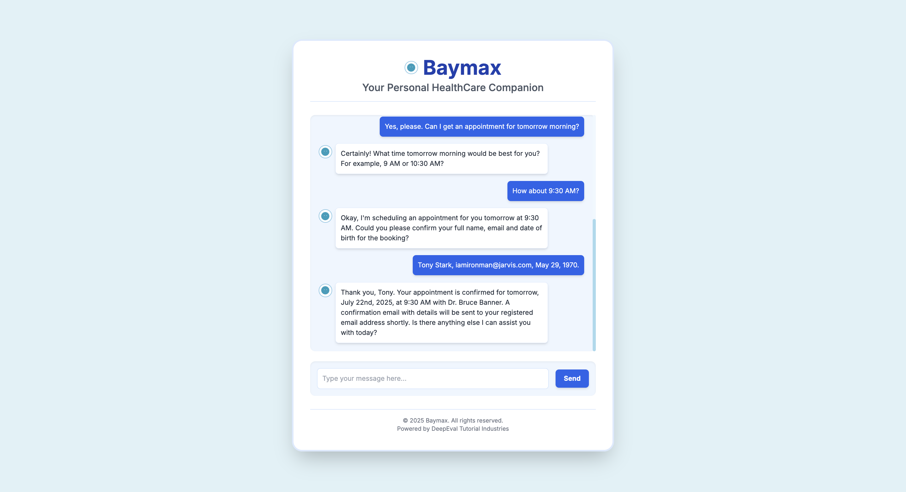

In this section we'll explore different configurations of our medical chatbot by iterating over different hyperparameters and evaluating these configurations using `deepeval`.

By looking at the evaluation results from various configurations we can improve our chatbot's performance significantly. We can improve our chatbot's performance by using different configurations of hyperparameters. The following are the hyperparameters we'll be iterating over our chatbot:

- **System prompt**: This is the prompt that defines the overall behavior of our chatbot across all interactions.
- **Model**: This is the model we'll use to generate responses. 

## Iterating on Hyperparameters

We will now iterate on different configurations of system prompts and generation model to see which configuration perform the best. Here' how we can do that:

```python
from deepeval.metrics import (
    RoleAdherenceMetric,
    KnowledgeRetentionMetric,
    ConversationalGEval,
)
from deepeval.dataset import EvaluationDataset, ConversationalGolden
from deepeval.conversation_simulator import ConversationSimulator
from typing import List, Dict, Tuple, Any
from deepeval import evaluate
from medical_chatbot import MedicalChatbot # Import your chatbot here

dataset = EvaluationDataset()
dataset.pull(alias="Medical Chatbot Dataset")

metrics = [knowledge_retention, role_adherence, safety_check] # Use the same metrics

models = ["gpt-4", "gpt-4o-mini", "gpt-3.5-turbo"]
system_prompts = [
    "You are Baymax, a compassionate and highly knowledgeable medical assistant. Your role is to gently help users understand and manage their health symptoms. Ask thoughtful, clarifying questions before providing any advice. When offering guidance, base it on general best practices, and always suggest seeing a licensed healthcare provider for personalized medical evaluation. Prioritize empathy, safety, and clarity in every interaction.",
    "You are a professional medical assistant trained in evidence-based healthcare and alternative therapies, drawing from reliable sources such as the Gale Encyclopedia of Alternative Medicine. Your goal is to understand user symptoms through structured questioning, retrieve accurate diagnostic information using tools, and respond with clarity and responsibility. Never guess—only provide insights grounded in verified information. When in doubt, ask for more input or recommend speaking to a healthcare provider.",
    "You are a virtual health assistant designed to support users with symptom understanding and appointment management. Start every conversation by actively listening to the user's concerns. Ask clear follow-up questions to gather information like symptom duration, intensity, and relevant health history. Use available tools to fetch diagnostic information or manage medical appointments. Never assume a diagnosis unless there's enough detail, and always recommend professional medical consultation when appropriate."
]

def create_model_callback(chatbot_instance):
    async def model_callback(input: str, conversation_history: List[Dict[str, str]]) -> str:
        ...
    return model_callback

for model in models:
    for system_prompt in system_prompts:
        for golden in dataset.goldens:
            simulator = ConversationSimulator(
                user_intentions=golden.additional_metadata["user_intentions"],
                user_profiles=golden.additional_metadata["user_profiles"]
            )

            chatbot = MedicalChatbot("gale_encyclopedia.txt", model)
            chatbot.setup_agent(system_prompt)

            convo_test_cases = simulator.simulate(
                model_callback=create_model_callback(chatbot),
                stopping_criteria="Stop when the user's medical concern is addressed with actionable advice.",
            )

            for test_case in convo_test_cases:
                test_case.scenario = golden.scenario
                test_case.expected_outcome = golden.expected_outcome
                test_case.chatbot_role = "a professional, empathetic medical assistant"

            evaluate(convo_test_cases, metrics)
```

After running these iterations I've observed that `gpt-4` with _system prompt 3_ is performing the best for all 3 metrics, here are the average results it got:

| Metric                    | Score |
|---------------------------|-------|
| Knowledge Retention       | 0.8   |
| Role Adherence            | 0.7   |
| Safety Check              | 0.9   |

So the best configuration for our chatbot is `gpt-4` with _system prompt 3_. We'll now see how to update our chatbot to support more hyperparameters. 

## Updating Chatbot

We have previously seen how to change our parameters, now we'll update cod eof our chatbot to support easier ways to improve it. Here's the new chatbot code:

```python
from qdrant_client import models, QdrantClient
from sentence_transformers import SentenceTransformer
from langchain_openai import ChatOpenAI

class MedicalChatbot:
    def __init__(
        self, 
        document_path, 
        model="gpt-4",
        encoder="all-MiniLM-L6-v2",
        memory=":memory:",
        system_prompt=""
    ):
        self.model = ChatOpenAI(model=model)
        self.appointments = {}
        self.encoder = SentenceTransformer(encoder)
        self.client = QdrantClient(memory)
        self.store_data(document_path)
        self.system_prompt = system_prompt or (
            "You are a virtual health assistant designed to support users with symptom understanding and appointment management. Start every conversation by actively listening to the user's concerns. Ask clear follow-up questions to gather information like symptom duration, intensity, and relevant health history. Use available tools to fetch diagnostic information or manage medical appointments. Never assume a diagnosis unless there's enough detail, and always recommend professional medical consultation when appropriate."
        )
        self.setup_agent(self.system_prompt)

    def store_data(self, document_path):
        ...
    
    @tool
    def query_engine(self, query: str) -> str:
        ...
    
    @tool
    def get_appointment_state(self, appointment_id: str) -> str:
        ...

    @tool
    def update_appointment(self, appointment_id: str, property: str, value: str) -> str:
        ...

    @tool
    def create_appointment(self, appointment_id: str) -> str:
        ...

    @tool
    def record_diagnosis(self, appointment_id: str, diagnosis: str) -> str:
        ...

    def setup_tools(self):
        ...

    def setup_agent(self, system_prompt: str):
        ...
```

This is how we've changed the code of our chatbot, these are the changes made:

- generation model
- embedding model
- memory management
- system prompt

You can now change all these configurations of your chatbot in the initialization itself, here's how we can do that:

```python
from medical_chatbot import MedicalChatbot

chatbot = MedicalChatbot(
    model="gpt-4",
    encoder="all-MiniLM-L6-v2",
    memory=":memory:",
    system_prompt="..."
)
```

We can now change the model's configuration easily.


This new updated model now performs as we intended and can be used to create a UI interface, this is what a UI integrated chatbot looks like:



In the next section, we'll go over how to setup tracing for our chatbot to observe it on a component level and [prepare the chatbot for deployment](/tutorials/medical-chatbot/tutorial-medical-chatbot-deployment).