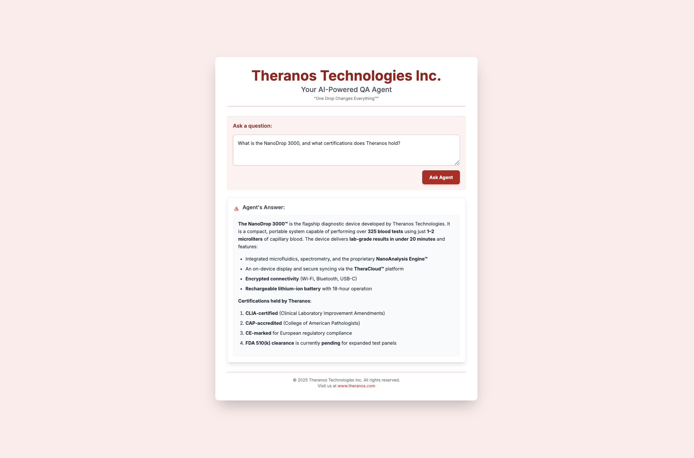
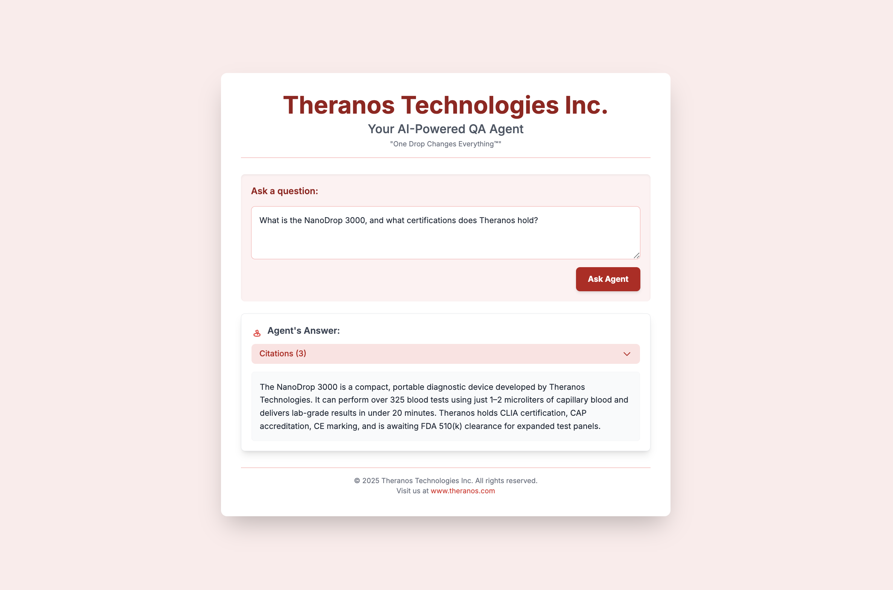

import Tabs from "@theme/Tabs";
import TabItem from "@theme/TabItem";

In this section, we're going to create our **RAG QA Agent** using **_Langchain_** and **_OpenAI_**. A RAG application typically consists of two
components — A **retriever** and a **generator**.

The retriever is used for fetching or retrieving all the relevant the documents from the knowledge base for a given query. 
The generator is responsible for responding to the user by generating an answer to their query by using the retrieved context. 
Both of them combined make up a RAG (_Retrieval-Augmented Generation_) application.

## Creating The RAG Agent

We are going to create a class called `RAGAgent` that combines both the retriever and generator's responses to answer the user's query. 
To do this we will define the retrieval part and generation part separately as helper functions. This allows us to evaluate our retriever's 
and generator's quality independently, which helps us improve our Agent. Before we can retrieve any data, we first need to store our 
data in a database that the retriever can easily access and look through. We can do this using vector stores offered by `langchain`.

:::note
A **vector store** is a specialized database that efficiently stores and indexes **vector embeddings** (numerical representations of data's 
meaning) to enable rapid **similarity search**, it is crucial for AI applications like RAG.
:::

We can use various embedding models that can convert data into numerical representations of their meanings to turn our data into a vector 
store — our knowledge base. We will be using the `OpenAIEmbeddings` and `FAISS` vector store provided by `langchain` for this example, you 
can use any embedding model and vector store you like. Here's how to create a vector store for our data using `langchain`:

```python
from langchain.vectorstores import FAISS
from langchain.embeddings import OpenAIEmbeddings
from langchain.text_splitter import RecursiveCharacterTextSplitter

class RAGAgent:
    def __init__(
        self,
        document_paths: list,
        embedding_model=None,
        chunk_size: int = 500,
        chunk_overlap: int = 50,
        vector_store_class=FAISS,
        k: int = 2
    ):
        self.document_paths = document_paths
        self.chunk_size = chunk_size
        self.chunk_overlap = chunk_overlap
        self.embedding_model = embedding_model or OpenAIEmbeddings()
        self.vector_store_class = vector_store_class
        self.k = k
        self.vector_store = self._load_vector_store()
    
    def _load_vector_store(self):
        documents = []
        for document_path in self.document_paths:
            with open(document_path, "r", encoding="utf-8") as file:
                raw_text = file.read()
            
            splitter = RecursiveCharacterTextSplitter(
                chunk_size=self.chunk_size,
                chunk_overlap=self.chunk_overlap
            )
            documents.extend(splitter.create_documents([raw_text]))

        return self.vector_store_class.from_documents(documents, self.embedding_model)
```

You can modify the above code to use an embedding model or vector store of your choice. Now that we have our vector store, we can move 
on to creating a retriever that will retrieve the relevant data for a query from this vector store.

### Creating Retriever

In the context of **Retrieval-Augmented Generation (RAG)**, the retriever is a crucial component responsible for efficiently identifying and 
extracting the most relevant information from a large, external knowledge base. We will now create a `retrieve()` function to our `RAGAgent` class 
that allows you to retrieve the relevant data for a particular query. Here's how we can do that:

```python
from langchain.vectorstores import FAISS
from langchain.embeddings import OpenAIEmbeddings
from langchain.text_splitter import RecursiveCharacterTextSplitter

class RAGAgent:
    def __init(...):
        ...
    
    def _load_vector_store(...):
        ...

    def retrieve(self, query: str):
        return self.vector_store.similarity_search(query, k=self.k)
```

This allows us to retrieve `k` documents that are most relevant to the `query` we supplied by using similarity search. We can test our retriever with the following code:

```python
doc_path = ["theranos_legacy.txt"]

retriever = RAGAgent(doc_path)
retrieved_docs = retriever.retrieve("How many blood tests can you perform and how much blood do you need?")

print(retrieved_docs)
```

<details>
<summary><strong>Click here to see the contents of <code>theranos_legacy.txt</code></strong></summary>

```text title="theranos_legacy.txt"
Company Name: Theranos Technologies Inc.  
Founded: 2003  
Founder & CEO: Sherlock Holmes  
Headquarters: Palo Alto, California  
Mission: To revolutionize blood diagnostics through rapid, portable testing solutions.

Overview:  
Theranos Technologies Inc. is a medical technology company dedicated to transforming how blood diagnostics are performed. 
With its proprietary platform, Theranos enables comprehensive laboratory testing from a few drops of blood. This innovation 
reduces cost, increases accessibility, and accelerates clinical decision-making, putting real-time health information in the 
hands of patients and physicians alike.

Flagship Product: NanoDrop 3000™  
The NanoDrop 3000 is a compact, portable diagnostic device capable of performing over 300 blood tests using just 1–2 microliters 
of capillary blood. The device integrates microfluidics, spectrometry, and Theranos’s patented NanoAnalysis Engine™ to provide 
lab-grade results in under 20 minutes.

Key Features:  
- Sample volume: 1.2 microliters (average)  
- Test menu: 325+ assays including metabolic, hormonal, infectious, hematologic, and genomic panels  
- Results delivery: On-device display and synced via TheraCloud™ platform  
- Power: Rechargeable lithium-ion battery with 18-hour operation  
- Connectivity: Encrypted Wi-Fi, Bluetooth, and USB-C

Technology Platform:  
Theranos’s diagnostics pipeline is powered by MicroVial Sensing (MVS), a next-gen detection framework combining nanophotonic arrays 
and adaptive sample calibration. The system processes micro-samples through proprietary capillary modules, ensuring high sensitivity 
and reproducibility across a broad spectrum of biomarkers.

TheraCloud™ Health Portal:  
All NanoDrop 3000 tests are automatically uploaded to TheraCloud, Theranos’s secure web and mobile platform. Patients and providers 
can review full diagnostic panels, trend health data over time, and receive personalized insights based on AI-powered analytics. 
Integration with third-party systems like EPIC, Cerner, and Apple Health is supported via HL7 and FHIR protocols.

Use Cases:
- Primary care clinics: Rapid diagnostics during check-ups  
- Pharmacies: In-store wellness panels  
- Telemedicine: At-home blood testing for remote consultations  
- Clinical trials: Fast, decentralized biomarker screening  
- Emergency settings: Point-of-care triage

Corporate Structure:  
Theranos employs over 1,800 staff across R&D, diagnostics engineering, cloud systems, regulatory science, and clinical operations. 
The company maintains clinical partnerships with over 60 healthcare institutions and operates six high-throughput testing hubs 
in the U.S.

Leadership:  
- Sherlock Holmes – Founder & CEO  
- Dr. Linda Templeton – Chief Science Officer  
- Richard Parker – VP, Cloud Engineering  
- Dr. Helen Kelly – Director of Clinical Applications  
- Luthor Martin – General Counsel

Selected Partnerships:
- Walgreens Health  
- Cleveland Medical Research Institute  
- United Diagnostic Alliance  
- MedWorks Clinical Trials  
- TelePath Global (for remote care distribution)

Recent Milestones:
- FDA Emergency Use Approval granted for the COVID-19 MicroDrop Panel (2021)  
- Expanded test menu to include pharmacogenomic testing (Q3 2022)  
- Strategic licensing deal signed with Medix Korea for Asia-Pacific rollout  
- Completion of Series F funding round, raising $240M from Fidelity, BlackRock, and Sequoia Capital (Q1 2023)  
- Published real-world performance results in *Clinical Diagnostics Today*, Vol. 58, Issue 4

FAQs:

Q: How accurate are Theranos test results?  
A: Independent validation studies report sensitivity and specificity exceeding 94% for most core assays, with reproducibility between 
92–97% across sample types and environments.

Q: What certifications does Theranos hold?  
A: Theranos labs are CLIA-certified and CAP-accredited. NanoDrop 3000 is CE-marked and pending full FDA 510(k) clearance for expanded 
panels.

Q: Can Theranos tests be administered at home?  
A: Yes. Through our partnership with TheraDirect™, patients can request a NanoDrop Home Kit, available in select states with licensed 
telehealth coverage.

Q: Where can I view the latest test menu?  
A: Visit theranos.com/products/nanodrop3000/testmenu or access via the TheraCloud mobile app.

Media Contacts:  
press@theranos.com  
investorrelations@theranos.com

Company Motto: “One Drop Changes Everything™”
```
</details>

This is the output of the above code:

```text
[Document(page_content='The NanoDrop 3000 is a compact, portable diagnostic device capable of performing over 300 blood tests using just 1-2 microliters of capillary blood. The device integrates microfluidics, spectrometry, and Theranos’s patented NanoAnalysis Engine™ to provide lab-grade results in under 20 minutes.', metadata={}),
 Document(page_content='Key Features:\n- Sample volume: 1.2 microliters (average)\n- Test menu: 325+ assays including metabolic, hormonal, infectious, hematologic, and genomic panels', metadata={})]
```

Now that we have a working retriever, we can move on to creating our generator.

### Creating generator

In a **Retrieval-Augmented Generation (RAG)** system, the **generator** is the component that produces natural language responses based on 
both the input query and the retrieved documents. We will now add the generate function in our `RAGAgent` class that takes the retrieved 
context and generates a natural sounding coherent answer using an LLM.

```python
from langchain.vectorstores import FAISS
from langchain.embeddings import OpenAIEmbeddings
from langchain.text_splitter import RecursiveCharacterTextSplitter
from langchain.llms import OpenAI

class RAGAgent:
    def __init(...):
        ...
    
    def _load_vector_store(...):
        ...

    def retrieve(...):
        ...

    def generate(
        self,
        query: str, 
        retrieved_docs: list, 
        llm_model=None, 
        prompt_template: str = None
    ):
        context = "\n".join([doc.page_content for doc in retrieved_docs])
        model = llm_model or OpenAI(temperature=0)
        prompt = prompt_template or (
            "Answer the query using the context below.\n\nContext:\n{context}\n\nQuery:\n{query}"
            "Only use information from the context. If nothing relevant is found, respond with: 'No relevant information available.'"
        )
        prompt = prompt.format(context=context, query=query)
        return model(prompt)
```

This allows us to generate an answer to the query based on the retrieved docs. Here's how we can use our generator:

```python
doc_path = ["theranos_legacy.txt"]
query = "How many blood tests can you perform and how much blood do you need?"

retriever = RAGAgent(doc_path)
retrieved_docs = retriever.retrieve(query)
generated_answer = retriever.generate(query, retrieved_docs)

print(generated_answer)
```

This is the output of the above code:

```text
The NanoDrop 3000 can perform over 325 blood tests using just 1-2 microliters of capillary blood. 
This enables comprehensive diagnostics with minimal sample volume.
```

We can use these helper functions in a single method that will be used to answer any query. Here's how we can do that:

```python
from langchain.vectorstores import FAISS
from langchain.embeddings import OpenAIEmbeddings
from langchain.text_splitter import RecursiveCharacterTextSplitter
from langchain.llms import OpenAI

class RAGAgent:
    def __init(...):
        ...
    
    def _load_vector_store(...):
        ...

    def retrieve(...):
        ...

    def generate(...):
        ...

    def answer(
        self, 
        query: str,
        llm_model=None, 
        prompt_template: str = None
    ):
        retrieved_docs = self.retrieve(query)
        generated_answer = self.generate(query, retrieved_docs, llm_model, prompt_template)
        return generated_answer, retrieved_docs
```

We have now created a RAG Agent that answers a user's query. Now let's try and use our retriever to answer a user's query to see how it answers:

```python
document_paths = ["theranos_legacy.txt"]
query = "What is the NanoDrop 3000, and what certifications does Theranos hold?"

retriever = RAGAgent(document_paths)
answer, _ = retriever.answer(query)
```

The LLM outputs a response in markdown format by default, which makes it harder to extract structured data such as citations. However, this is not ideal because we cannot parse the 
output to show citations in the UI. This is the best we can do in UI with what our retriever generates for now:

<Tabs groups="ui-raw">

<TabItem id="ui" value="UI">



</TabItem>

<TabItem id="raw" value="Raw">

```md
**The NanoDrop 3000™** is the flagship diagnostic device developed by Theranos Technologies. It is a compact, portable system capable of performing over **325 blood tests** using just **1–2 microliters** of capillary blood. The device delivers **lab-grade results in under 20 minutes** and features:

* Integrated microfluidics, spectrometry, and the proprietary **NanoAnalysis Engine™**
* An on-device display and secure syncing via the **TheraCloud™** platform
* **Encrypted connectivity** (Wi-Fi, Bluetooth, USB-C)
* **Rechargeable lithium-ion battery** with 18-hour operation

**Certifications held by Theranos**:

1.  **CLIA-certified** (Clinical Laboratory Improvement Amendments)
2.  **CAP-accredited** (College of American Pathologists)
3.  **CE-marked** for European regulatory compliance
4.  **FDA 510(k) clearance** is currently **pending** for expanded test panels
```

</TabItem>

</Tabs>

## Updating The RAG Agent

We can update our retriever's response by using a better prompt for generating our answer in a `json` format which helps us parse the 
given output and use it to render the data in any style we want. Here's how we can update our retriever and the system prompt to use:

We can use the following prompt template to generate our response in `json`:

```text
You are a helpful assistant. Use the context below to answer the user's query. 
Format your response strictly as a JSON object with the following structure:

{
  "answer": "<a concise, complete answer to the user's query>",
  "citations": [
    "<relevant quoted snippet or summary from source 1>",
    "<relevant quoted snippet or summary from source 2>",
    ...
  ]
}

Only include information that appears in the provided context. Do not make anything up.
Only respond in JSON — No explanations needed. Only use information from the context. If 
nothing relevant is found, respond with: 

{
  "answer": "No relevant information available.",
  "citations": []
}


Context:
{context}

Query:
{query}
```

We can update our `answer()` function to parse the output as `json` and return the `json` object. Here's how to update our `answer()` function: 

```python
import json
from langchain.vectorstores import FAISS
from langchain.embeddings import OpenAIEmbeddings
from langchain.text_splitter import RecursiveCharacterTextSplitter
from langchain.llms import OpenAI

class RAGAgent:
    ...

    def answer(self, query: str):
        retrieved_docs = self.retrieve(query)
        generated_answer = self.generate(query, retrieved_docs)

        try:
            res = json.loads(generated_answer)
            return res
        except json.JSONDecodeError:
            return {"error": "Invalid JSON returned from model", "raw_output": generated_answer}
```

Now our `RAGAgent` outputs a valid `json`, we can use this output to render UI and create webpages or handle our responses in 
any way we want. Here's what the new responses allow us to do:

<Tabs groups="ui-raw">

<TabItem id="ui" value="UI">



</TabItem>

<TabItem id="raw" value="Raw">

```json
{
  "answer": "The NanoDrop 3000 is a compact, portable diagnostic device developed by Theranos Technologies. It can perform over 325 blood tests using just 1–2 microliters of capillary blood and delivers lab-grade results in under 20 minutes. Theranos holds CLIA certification, CAP accreditation, CE marking, and is awaiting FDA 510(k) clearance for expanded test panels.",
  "citations": [
    "The NanoDrop 3000 is a compact, portable diagnostic device capable of performing over 300 blood tests using just 1–2 microliters of capillary blood.",
    "Key Features: Sample volume: 1.2 microliters (average), Test menu: 325+ assays",
    "Theranos labs are CLIA-certified and CAP-accredited. NanoDrop 3000 is CE-marked and pending full FDA 510(k) clearance for expanded panels."
  ]
}
```

</TabItem>

</Tabs>

We now have a RAG agent that generates the output in our desired format, but how reliable is this agent? It is very important to make sure 
that the answers generated by the agent are reliable, especially for a company like **Theranos**. Hence there is a need for rigourous testing of our agent.

In the next section, we'll see [how to evaluate our RAG QA Agent](/tutorials/rag-qa-agent/tutorial-rag-qa-evaluation) using `deepeval`.