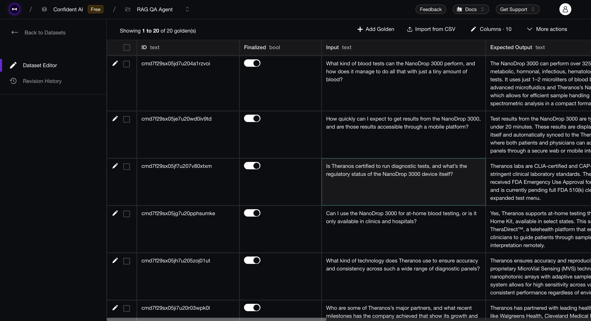

In this tutorial, we are going to see how to evaluate our `RAGAgent` using `deepeval`. We'll learn how to create an evaluation dataset that you can use to evaluate your RAG agent.

:::tip
It is recommended to create an evaluation dataset because they allow you to test your LLM application anywhere — development or production. DeepEval's datasets are stored in cloud and can be pulled anytime you wanna use them. You need to be signed in to your [Confident AI](https://www.confident-ai.com) account to do this, **it's free to get started**. (_No credit card required!_)

```bash
deepeval login
```

You can run the above code or click here to [set up Confident AI](https://deepeval.com/tutorials/tutorial-setup#setting-up-confident-ai).
:::

## DeepEval's Datasets

Before we evaluate any LLM application, it is important to create a few test cases to test our agent or application against. These test cases are usually called evaluation datasets, most developers create human annotated datasets which contain inputs and expected outputs which are the ideal outputs they expect from their LLM application.

Creating these datasets is not feasible and it's also time consuming. However, you can use solve this issue by creating _synthetic datasets_ which are created by another LLM, these datasets are much like human annotated datasets but they cover more depth and create test cases that test your application on edge-cases you wouldn't think otherwise.

### Synthesizer

You can create these datasets by using `deepeval`'s [`Synthesizer`](https://deepeval.com/docs/synthesizer-introduction) and [`EvaluationDataset`](https://deepeval.com/docs/evaluation-datasets#create-a-dataset). Here's how you can create goldens using the `Synthesizer`:

```python
from deepeval.synthesizer import Synthesizer

synthesizer = Synthesizer()

goldens = synthesizer.generate_goldens_from_docs(
    # Provide the path to your documents
    document_paths=['theranos_legacy.txt', 'theranos_legacy.docx', 'theranos_legacy.pdf']
)
```

This above code snippet returns a list of `Golden`s.

### DeepEval's Goldens

A dataset can only be created with a list of goldens, and it's important to know how they are different from test cases. `Golden`s represent a more flexible alternative to test cases in the `deepeval`, and **it is the preferred way to initialize a dataset using goldens**. Unlike test cases, `Golden`s:

- Don't require an `actual_output` when created
- Store expected results like `expected_output` and `expected_tools`
- Serve as templates before becoming fully-formed test cases

This means you can store these goldens in the cloud and create your own test cases during run time by pulling this dataset and generating your `actual_output`s by calling your LLM application.


### Using Datasets

Now that you have your goldens, you can use these goldens to create a dataset that you can use to evaluate your LLM application. Here's how you can create a dataset:

```python
from deepeval.dataset import EvaluationDataset

dataset = EvaluationDataset(goldens=goldens)
dataset.push(alias="QA Agent Dataset")
```

Here's what the dataset looks like on the Confident AI platform:



You can edit this dataset, finalize and do much more. Here's how you can pull this dataset for evaluations:

```python
from deepeval.dataset import EvaluationDataset

dataset = EvaluationDataset()
dataset.pull(alias="QA Agent Dataset")
```

Now that we have an evaluation dataset, we can move on to evaluating our RAG agent.

## Defining Evaluation Criteria

**Retrieval-Augmented Generation (RAG)** applications are made up of two components — a retriever and a generator. Each component performs it's own tasks and is prune to errors in their own ways, this is why it is necessary to evaluate them by isolating them. 

**DeepEval** offers specialised RAG metrics that can be used to evaluate retrievers and generators seperately and combined as well. Here are the list of RAG metrics offered by `deepeval`:

1. [Contextual Relevancy](https://deepeval.com/docs/metrics-contextual-relevancy) — _Is the retrieved context relevant to the query?_
2. [Contextual Recall](https://deepeval.com/docs/metrics-contextual-recall) — _Is the retrieved context enough to answer the query?_
3. [Contextual Precision](https://deepeval.com/docs/metrics-contextual-precision) — _Is the retrieved context precise and does not include unnecessary details?_
4. [Faithfulness](https://deepeval.com/docs/metrics-faithfulness) — _Does the answer stick to the retrieved context?_
5. [Answer Relevancy](https://deepeval.com/docs/metrics-answer-relevancy) — _Is the answer focused on the query?_
6. [G-Eval](https://deepeval.com/docs/metrics-llm-evals) — _A custom metric that can be used to evaluate any custom criteria._

### Retriever Evaluation

Now we can use the dataset we just pulled to evaluate the retriever. Here's how we can evaluate our retriever using the _relevancy, recall and precision_ metrics that are specialized for retriever evaluations:

```python
from deepeval.test_case import LLMTestCase
from deepeval.metrics import (
    ContextualRelevancyMetric,
    ContextualRecallMetric,
    ContextualPrecisionMetric,
)
from qa_agent import RAGAgent

# Initialize metrics
relevancy = ContextualRelevancyMetric()
recall = ContextualRecallMetric()
precision = ContextualPrecisionMetric()

metrics = [relevancy, recall, precision]

# Evaluate for each golden
document_path = ["theranos_legacy.txt"]
retriever = RAGAgent(document_path)
for golden in dataset.goldens:
    retrieved_docs = retriever.retrieve(golden.input)
    context_list = [doc.page_content for doc in retrieved_docs]
    test_case = LLMTestCase(
        input=golden.input,
        actual_output=golden.expected_output,
        expected_output=golden.expected_output,
        retrieval_context=context_list
    )
    dataset.add_test_case(test_case)

evaluate(dataset, metrics)
```

After running this evaluation, I got the following scores:

| Metric               | Score |
|----------------------|-------|
| Contextual Relevancy | 0.6   |
| Contextual Recall    | 0.7   |
| Contextual Precision | 0.6   |

These results can be improved by tuning the hyperparameters of your retriever, we'll see how we can improve our retriver in the improvement section of this tutorial. Now let's move on to generator evaluation.

### Generator Evaluation

We can use the exact same dataset to evaluate our generator. Before that we need to define the criteria for our generator evals. Since our generator responds in pure `json` we can use `G-Eval` to write custom criterias that helps us evaluate our generator. Here's the criteria we'll be using to evaluate our generator:

1. [Answer Correctness](https://deepeval.com/docs/metrics-llm-evals) — To evaluate only the answer from our `json`.
2. [Citation Accuracy](https://deepeval.com/docs/metrics-llm-evals) — To evaluate the citations mentioned in the `json`.

These two criterion are specific to our generator so we'll be using the `GEval` metric. Here's how we can evaluate the generator:

```python
from deepeval.metrics import GEval
from deepeval.test_case import LLMTestCase, LLMTestCaseParams

answer_correctness = GEval(
    name="Answer Correctness",
    criteria="Evaluate if the actual output's 'answer' property is correct and complete from the input and retrieved context. If the answer is not correct or complete, reduce score."
    evaluation_params=[LLMTestCaseParams.INPUT, LLMTestCaseParams.ACTUAL_OUTPUT, LLMTestCaseParams.RETRIEVAL_CONTEXT]
)

citation_accuracy = GEval(
    name="Citation Accuracy",
    criteria="Check if the citations in the actual output are correct and relevant based on input and retrieved context. If they're not correct, reduce score."
    evaluation_params=[LLMTestCaseParams.INPUT, LLMTestCaseParams.ACTUAL_OUTPUT, LLMTestCaseParams.RETRIEVAL_CONTEXT]
)

metrics = [answer_correctness, citation_accuracy]

for golden in dataset.goldens:
    retrieved_docs = retriever.retrieve(golden.input)
    generated_answer = retriever.generate(golden.input, retrieved_docs)
    context_list = [doc.page_content for doc in retrieved_docs]
    test_case = LLMTestCase(
        input=golden.input,
        actual_output=str(generated_answer),
        retrieval_context=context_list
    )
    dataset.add_test_case(test_case)

evaluate(dataset, metrics)
```

After running this evaluation, I got the following average scores:

| Metric               | Score |
|----------------------|-------|
| Answer Correctness   | 0.5   |
| Citation Accuracy    | 0.5   |

Most of `deepeval`'s metrics provide a reason along with a score which let's us know why certain test cases fail. From all the reasons, these were the observations made:

For answer correctness:

> The answers were too short and informal, they can benefit from being a bit more professional and informative.

For citation accuracy:

> There are many irrelevant and hallucinating citations which could mislead a user about the product.

In the next section we will iterate over multiple hyperparameters for our RAG agent and evaluate it using `deepeval` to see [how to improve our RAG agent](/tutorials/rag-qa-agent/tutorial-rag-qa-improvement).