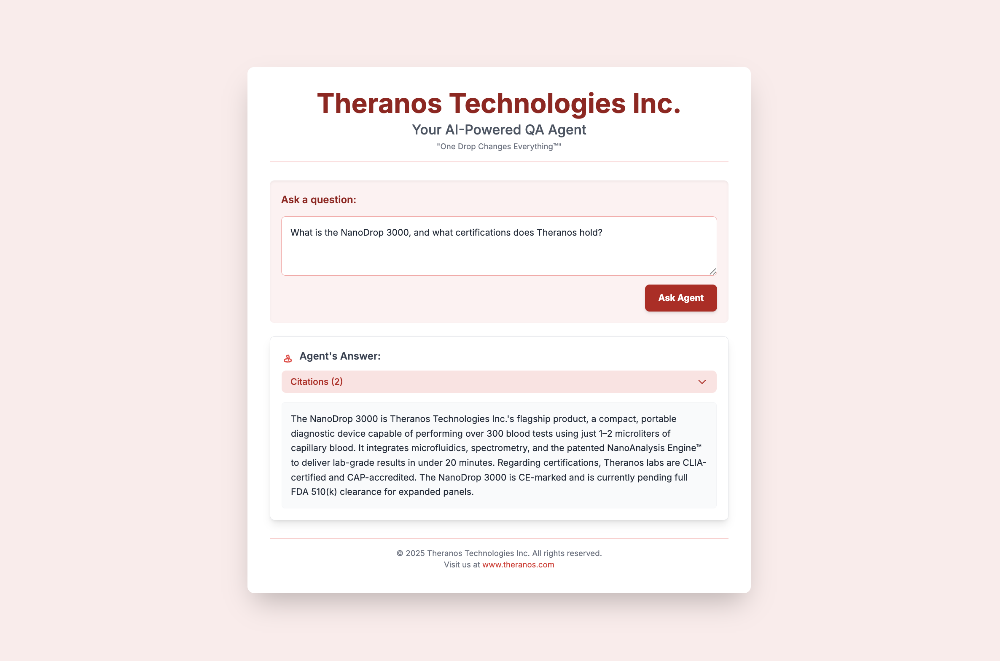

import Tabs from "@theme/Tabs";
import TabItem from "@theme/TabItem";

In this section, we are going to iterate on multiple hyperparameters for our RAG agent to see which of them perform the best by using `deepeval`'s evaluations.

**Retrieval-Augmented Generation (RAG)** applications in particular among most LLM applications have a very large set of tunable hyperparameters that significantly improve the performance of the agent, some of these hyperparameters are:

- Vector store (_The vector database used to store our knowledge base_)
- Embedding model (_The model which is used to convert data to numerical representations_)
- Chunk size (_The length of each text piece when splitting documents_)
- Chunk overlap (_The number of words shared between chunks to keep context_)
- Generator model (_The model that creates answers using the retrieved information_)
- k size (_The number of documents retrieved_)
- Prompt template (_The prompt used to generate the responses from generator_)

## Iterating on Hyperparameters

We will now iterate over different hyperparameters to see which configuration performs best. Here's how we will do that:

### Retriever Iteration

We will iterate on different retriever hyperparameters like chunk size, embedding model, vector store. Here's how we can do that:

```python
from deepeval.dataset import EvaluatinDataset
from deepeval.test_case import LLMTestCase, LLMTestCaseParams
from deepeval.metrics import (
    ContextualRelevancyMetric,
    ContextualRecallMetric,
    ContextualPrecisionMetric,
)
from qa_agent import RAGAgent
from langchain.embeddings import OpenAIEmbeddings, HuggingFaceEmbeddings
from langchain.vectorstores import Chroma, FAISS

dataset = EvaluationDataset()
dataset.pull("QA Agent Dataset")

metrics = [...] # Use the same metrics used before

chunking_strategies = [500, 1024, 2048]
embedding_models = [
    ("OpenAIEmbeddings", OpenAIEmbeddings()),
    ("HuggingFaceEmbeddings", HuggingFaceEmbeddings(model_name="sentence-transformers/all-MiniLM-L6-v2")),
]
vector_store_classes = [
    ("FAISS", FAISS),
    ("Chroma", Chroma)
]

document_paths = ["theranos_legacy.txt"]

for chunk_size in chunking_strategies:
    for embedding_name, embedding_model in embedding_models:
        for vector_store_class, vector_store_model in vector_store_classes:
            retriever = RAGAgent(
                document_paths,
                embedding_model=embedding_model,
                chunk_size=chunk_size,
                vector_store_class=vector_store_model,
            ) # Initialize retriever with new configuration

            for golden in dataset.goldens:
                retrieved_docs = retriever.retrieve(golden.input)
                context_list = [doc.page_content for doc in retrieved_docs]
                test_case = LLMTestCase(
                    input=golden.input,
                    actual_output=golden.expected_output,
                    expected_output=golden.expected_output,
                    retrieval_context=context_list
                )
                dataset.add_test_case(test_case)

            evaluate(
                dataset, 
                metrics,
                hyperparameters={
                    "chunk_size": chunk_size,
                    "embedding_name": embedding_name,
                    "vector_store_class": vector_store_class
                }
            )
```

After running these iterations, I've observed that the following configurations scores the highest:

- **Chunk Size**: _1024_
- **Embedding Model**: _OpenAIEmbeddings_
- **Vector Store**: _Chroma_

They got the following average results:

| Metric               | Score |
|----------------------|-------|
| Contextual Relevancy | 0.8   |
| Contextual Recall    | 0.9   |
| Contextual Precision | 0.8   |

### Generator Iteration

We will iterate on different generator hyperparameters like prompt template and generator model. Here's how we can do that:

```python
from deepeval.dataset import EvaluatinDataset
from deepeval.test_case import LLMTestCase, LLMTestCaseParams
from deepeval.metrics import GEval
from langchain.llms import Ollama, OpenAI, HuggingFaceHub
from qa_agent import RAGAgent

metrics = [...] # Use the same metrics as before

prompts_templates = [
    "You are a helpful assistant. Use the context below to answer the user's query.\nFormat your response strictly as a JSON object with the following structure:\n{\n  \"answer\": \"<a concise, complete answer to the user's query>\",\n  \"citations\": [\n    \"<relevant quoted snippet or summary from source 1>\",\n    \"<relevant quoted snippet or summary from source 2>\",\n    ...\n  ]\n}\nOnly include information that appears in the provided context. Do not make anything up.\nOnly respond in JSON — No explanations needed. Only use information from the context. If nothing relevant is found, respond with:\n{\n  \"answer\": \"No relevant information available.\",\n  \"citations\": []\n}\n\nContext:\n{context}\n\nQuery:\n{query}",
    "You are a factual assistant. Based strictly on the context provided below, answer the user's query.\nYour response must be a valid JSON object in the following structure:\n{\n  \"answer\": \"<concise and complete answer derived only from the context>\",\n  \"citations\": [\n    \"<direct quote or accurate summary from the context that supports the answer>\",\n    ...\n  ]\n}\nInstructions:\n- Do NOT use any information that is not in the context.\n- Do NOT speculate or invent information.\n- Do NOT include commentary, explanation, or markdown formatting.\n- Your output must be valid JSON and nothing else.\nIf the context contains no relevant information, respond with:\n{\n  \"answer\": \"No relevant information available.\",\n  \"citations\": []\n}\n\nContext:\n{context}\n\nQuery:\n{query}",
    "You are an AI assistant designed for factual retrieval. Using the context below, extract only the information needed to answer the user's query. Respond in strictly valid JSON using the schema below.\n\nResponse schema:\n{\n  \"answer\": \"string — a precise, factual answer found in the context\",\n  \"citations\": [\n    \"string — exact quotes or summaries from the context that support the answer\"\n  ]\n}\n\nRules:\n- Do not fabricate any information or cite anything not present in the context.\n- Do not include explanations or formatting — only return valid JSON.\n- Use complete sentences in the answer.\n- Limit the answer to the scope of the context.\n- If no answer is found in the context, return:\n{\n  \"answer\": \"No relevant information available.\",\n  \"citations\": []\n}\n\nContext:\n{context}\n\nQuery:\n{query}"
]

models = [
    ("ollama", Ollama(model="llama3")),
    ("openai", OpenAI(model_name="gpt-4")),
    ("huggingface", HuggingFaceHub(repo_id="google/flan-t5-large")),
]

for i, prompt_template in enumerate(prompts, 1):
    for model_name, model in models:
        retriever = RAGAgent(...) # Initialize retriever with best config found above

        for golden in dataset.goldens:
            answer, retrieved_docs = answer.(golden.input, prompt_template, model)
            context_list = [doc.page_content for doc in retrieved_docs]
            test_case = LLMTestCase(
                input=golden.input,
                actual_output=str(answer),
                retrieval_context=context_list
            )
            dataset.add_test_case(test_case)

        evaluate(
            dataset, 
            metrics,
            hyperparameters={
                "model_name": model_name,
                "prompt_template": i
            }
        )
```

After running the iterations, this was the configuration that scored the highest on average:

- **Generation Model**: _`gpt-4`_
- **Prompt Template**: _3_

These were the average results:

| Metric               | Score |
|----------------------|-------|
| Answer Correctness   | 0.8   |
| Citation Accuracy    | 0.9   |

## RAG Agent Improvement

These were the changes made to `RAGAgent` class to support the new configurations which improved the performance of the agent:

```python
from langchain.vectorstores import FAISS
from langchain.embeddings import OpenAIEmbeddings
from langchain.text_splitter import RecursiveCharacterTextSplitter
import tempfile

class RAGAgent:
    def __init__(
        self,
        document_paths: list,
        embedding_model=None,
        chunk_size: int = 1024,
        chunk_overlap: int = 50,
        vector_store_class=FAISS,
        k: int = 2
    ): # Added Chroma 
        self.document_paths = document_paths
        self.chunk_size = chunk_size
        self.chunk_overlap = chunk_overlap
        self.embedding_model = embedding_model or OpenAIEmbeddings()
        self.vector_store_class = vector_store_class
        self.k = k
        self.vector_store = self._load_vector_store()
        self.persist_directory = tempfile.mkdtemp()
    
    def _load_vector_store(self):
        documents = []
        for document_path in self.document_paths:
            with open(document_path, "r", encoding="utf-8") as file:
                raw_text = file.read()
            
            splitter = RecursiveCharacterTextSplitter(
                chunk_size=self.chunk_size,
                chunk_overlap=self.chunk_overlap
            )
            documents.extend(splitter.create_documents([raw_text]))

        return self.vector_store_class.from_documents(
            documents, self.embedding_model,
            persist_directory=self.persist_directory
        )

    def retrieve(self, query: str):
        return self.vector_store.similarity_search(query, k=self.k)

    def generate(
        self,
        query: str, 
        retrieved_docs: list, 
        llm_model=None, 
        prompt_template: str = None
    ): # Changed prompt template, model used
        context = "\n".join([doc.page_content for doc in retrieved_docs])
        model = llm_model or OpenAI(model_name="gpt-4")
        prompt = prompt_template or (
            "You are an AI assistant designed for factual retrieval. Using the context below, extract only the information needed to answer the user's query. Respond in strictly valid JSON using the schema below.\n\nResponse schema:\n{\n  \"answer\": \"string — a precise, factual answer found in the context\",\n  \"citations\": [\n    \"string — exact quotes or summaries from the context that support the answer\"\n  ]\n}\n\nRules:\n- Do not fabricate any information or cite anything not present in the context.\n- Do not include explanations or formatting — only return valid JSON.\n- Use complete sentences in the answer.\n- Limit the answer to the scope of the context.\n- If no answer is found in the context, return:\n{\n  \"answer\": \"No relevant information available.\",\n  \"citations\": []\n}\n\nContext:\n{context}\n\nQuery:\n{query}"
        )
        prompt = prompt.format(context=context, query=query)
        return model(prompt)

    def answer():
        ... # Remains same
```

The new `RAGAgent` now answers reliably in the desired `json` format. This is the new UI and raw output generated by the improved agent:

<Tabs  groups="ui-raw">

<TabItem id="ui" value="UI">



</TabItem>

<TabItem id="raw" value="Raw">

```json
{    
  "answer": "The NanoDrop 3000 is a compact, portable diagnostic device developed by Theranos Technologies. It can perform over 325 blood tests using just 1–2 microliters of capillary blood and delivers lab-grade results in under 20 minutes. Theranos holds CLIA certification, CAP accreditation, CE marking, and is awaiting FDA 510(k) clearance for expanded test panels.",
  "citations": [
    "According to Theranos Technologies Inc., the NanoDrop 3000 is capable of running over 325 diagnostic tests using only 1–2 microliters of blood, delivering results in under 20 minutes through its proprietary microfluidic and NanoAnalysis technologies.",
    "Theranos states that the device holds CLIA certification, CAP accreditation, and CE marking, and is currently pending FDA 510(k) clearance for expanded diagnostic panels.",
  ]
}
```

</TabItem>

</Tabs>

Now that we have a reliable RAG QA Agent, in the next section we'll see how to set up tracing to [prepare our RAG QA Agent for deployment](/tutorials/rag-qa-agent/tutorial-rag-qa-deployment).