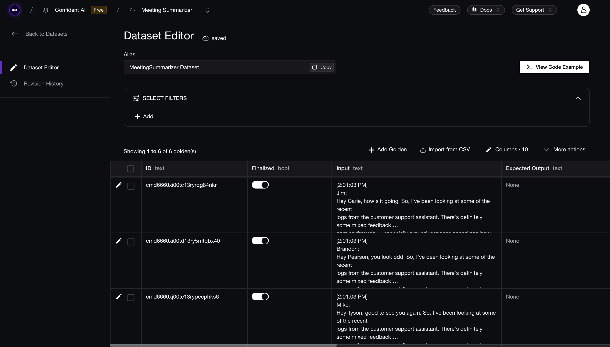

In this section, we'll explore multiple strategies to improve your summarization agent using `deepeval`. We are going to create a full evaluation suite that helps us iterate on our summarization agent to find the best hyperparameters that help improve it.

Like most LLM applications, our summarizer includes tunable hyperparameters that can significantly influence the performance of our application. In our case, the key hyperparameters for the `MeetingSummarizer` that can improve our agent are:

- Prompt template
- Generation model

The above mentioned hyperparameters are common for almost any LLM application. However, you can extend a few more hyperparameters that are specific to your use case.

## DeepEval's Datasets

In order to evaluate and figure out the best hyperparameter configuration for your summarization agent, it is not enough to evaluate it on a single test case, you need to run evaluations on multiple test cases i.e., multiple meeting transcripts. 

If you are trying to evaluate a summarizer, you might already have a few files or transcripts that you need to generate summaries of, we can use those files to create test cases that can be used to evaluate the summarizer.

**DeepEval**'s' [datasets](https://deepeval.com/docs/evaluation-datasets), which are simply a collection of `LLMTestCase`s and `Golden`s, can be stored in cloud and pulled anytime with just a few lines of code. This allows you to create a dataset that can be used to evalaute your summarization agent anytime and anywhere.

### Goldens in DeepEval

A dataset can only be created with a list of goldens, and it's important to know how they are different from test cases. `Golden`s represent a more flexible alternative to test cases in the `deepeval`, and **it is the preferred way to initialize a dataset using goldens**. Unlike test cases, `Golden`s:

- Don't require an `actual_output` when created
- Store expected results like `expected_output` and `expected_tools`
- Serve as templates before becoming fully-formed test cases

This means you can store these goldens in the cloud and create your own test cases during run time by pulling this dataset and generating your `actual_output`s by calling your LLM application.

### Creating Goldens

For our summarization agent, we only have 2 essential parameters required to create LLM test cases that allow us to evaluate our summarizer. These are `input` and `actual_output`, We can create a dataset that contains numerous goldens each corresponding to different meeting transcripts represented as `input`s which can later be used to create `LLMTestCase`s during runtime. Here's how you can create those goldens:

```python {2,16-18}
import os
from deepeval.dataset import Golden

documents_path = "path/to/documents/folder"
transcripts = []

for document in os.listdir(documents_path):
    if document.endswith(".txt"):
        file_path = os.path.join(documents_path, document)
        with open(file_path, "r") as file:
            transcript = file.read().strip()
        transcripts.append(transcript)

goldens = []
for transcript in transcripts:
    golden = Golden(
        input=transcript
    )
    goldens.append(golden)
```

You can view your goldens as shown below:

```python
for i, golden in enumerate(goldens):
    print(f"Golden {i}: ", golden.input[:20])
```


## Using Datasets

We can use the above created goldens to create a dataset and store it in cloud. Here's how you can do that:

```python
from deepeval.dataset import EvaluationDataset

dataset = EvaluationDataset(goldens=goldens)
dataset.push(alias="MeetingSummarizer Dataset")
```
:::note
You must be logged in to your [Confident AI](https://confident-ai.com) account to manage datasets on cloud. Set up Confident AI as shown [here](https://deepeval.com/tutorials/tutorial-setup#setting-up-confident-ai) or just run the following code in your terminal to get started:
```bash
deepeval login
```
:::


This allows us to create a datasets which we can manage on the Confident AI platform. You can view, edit, delete and do a lot more with your datasets on the platform, here's how it'll look on Confident AI:




These stored datasets can later be pulled and used wherever needed, here's how you can pull the datasets:

```python
from deepeval.dataset import EvaluationDataset

dataset = EvaluationDataset()
dataset.pull(alias="MeetingSummarizer Dataset")
```

The dataset pulled contains goldens, which can be used to create test cases during run time and run evals. Here's how to create test cases using datasets:

```python
from deepeval.test_case import LLMTestCase
from meeting_summarizer import MeetingSummarizer # import your summarizer here

summarizer = MeetingSummarizer() # Initialize with your best config
summary_test_cases = []
action_item_test_cases = []
for golden in dataset.goldens:
    summary, action_items = summarizer.summarize(golden.input)
    summary_test_case = LLMTestCase(
        input=golden.input,
        actual_output=summary
    )
    action_item_test_case = LLMTestCase(
        input=golden.input,
        actual_output=str(action_items)
    )
    summary_test_cases.append(summary_test_case)
    action_item_test_cases.append(action_item_test_case)

print(len(summary_test_cases))
print(len(action_item_test_cases))
```

You can use these test cases to evaluate your summarizer anywhere and anytime. Make sure you've already [created a dataset on Confident AI](https://documentation.confident-ai.com/docs/dataset-editor/introduction#quickstart) for this to work. [Click here](https://deepeval.com/docs/evaluation-datasets) to learn more about datasets.

## Iterating On Hyperparameters

Now that we have our dataset, we can use this dataset to generate test cases using our summarization agent with different configurations and evaluate it to find the best hyperparameters that work for our use case. Here's how we can run iterative evals on our summarization agent:

In the previous stages, we have evaluated our summarization agent seperately for summary conciseness and action item correctness. We will use the same approach and run our evaluations seperately for summary and action items.

### Summary Evaluation

We can pull a dataset and use that dataset to iterate over our hyperparameters to initialize our summarization agent with different configurations to produce different test cases. Here's how we can do that:

```python
from deepeval.test_case import LLMTestCase, LLMTestCaseParams
from deepeval.dataset import EvaluationDataset
from deepeval.metrics import GEval
from deepeval import evaluate
from meeting_summarizer import MeetingSummarizer # import your summarizer here

dataset = EvaluationDataset()
dataset.pull(alias="MeetingSummarizer Dataset")

summary_system_prompts = [
    "You are an AI assistant tasked with summarizing meeting transcripts. Generate a concise, readable summary of the key discussion points without copying verbatim text. Avoid speculation or interpretation. Your goal is to help someone quickly understand what was discussed in the meeting.",
    "You are an AI assistant summarizing a professional meeting transcript. Generate a concise, structured summary that covers all critical decisions, technical discussions, trade-offs, and proposed next steps. Avoid filler, redundant phrasing, or interpretation. Do not include action items or speculative conclusions. Write in a clear, skimmable format that communicates the essence of the conversation to someone who didn’t attend.",
    "You are an expert meeting summarization assistant. Generate a tightly written, executive-style summary of the meeting transcript, focusing only on high-value information: key technical insights, decisions made, problems discussed, model/tool comparisons, and rationale behind proposals. Exclude all action items and any content that is not core to the purpose of the discussion. Prioritize clarity, brevity, and factual precision. The final summary should read like a high-quality meeting brief that allows a stakeholder to fully grasp the discussion in under 60 seconds."
]

action_item_system_prompt = "..." # Use a dummy action item system prompt here

models = ["gpt-3.5-turbo", "gpt-4o", "gpt-4-turbo"]

# Use the same metric used before
summary_concision = GEval(...)

for model in models:
  for summary_system_prompt in summary_system_prompts:
    summarizer = MeetingSummarizer(
        model=model,
        summary_system_prompt=summary_system_prompt,
        action_item_system_prompt=action_item_system_prompt
    )

    summary_test_cases = []
    for golden in dataset.goldens:
        summary, action_items = summarizer.summarize(transcript) 
        # Update your summarizer to return a dummy action_items 
        # for better performance as we're only focusing on summary evaluation
        summary_test_case = LLMTestCase(
          input=golden.input,
          actual_output=summary
        )
        summary_test_cases.append(summary_test_case)

    evaluate(
      test_cases=summary_test_cases, 
      metrics=[summary_concision],
      hyperparameters={
        "model": model,
        "summary_system_prompt": summary_system_prompt,
      }
    ) # Evaluate summarizer with the current configuration
```

After running the iterations, these were the results:

|                     | System Prompt 1 | System Prompt 2 | System Prompt 3 |
|---------------------|-----------------|-----------------|-----------------|
| gpt-3.5-turbo       | 0.7             | 0.6             | 0.7             |
| gpt-4o              | 0.8             | 0.8             | 0.9             |
| gpt-4-turbo         | 0.8             | 0.7             | 0.7             |

We can observe that `gpt-4o` has consistently performed better for all the prompts and _system prompt 3_ is the best among all the results of `gpt-4o` which also happens to be the highest score in all the evaluations.

### Action Item Evaluation

We can follow the same approach for evaluating our action items generated for different configurations of the summarization agent. Here's how you can do that:

```python
from deepeval.test_case import LLMTestCase, LLMTestCaseParams
from deepeval.dataset import EvaluationDataset
from deepeval.metrics import GEval
from deepeval import evaluate
from meeting_summarizer import MeetingSummarizer # import your summarizer here

dataset = EvaluationDataset()
dataset.pull(alias="MeetingSummarizer Dataset")

summary_system_prompt = "..." # Use a dummy summary system prompt here

action_item_system_prompts = [
    "Extract all action items from the following meeting transcript. Identify both individual and team-wide tasks. Use the following JSON format exactly:\n\n{\n  \"individual_actions\": {\n    \"Alice\": [\"Task 1\", \"Task 2\"],\n    \"Bob\": [\"Task 1\"]\n  },\n  \"team_actions\": [\"Task 1\", \"Task 2\"],\n  \"entities\": [\"Alice\", \"Bob\"]\n}\n\nOnly include what is explicitly stated in the conversation. Do not infer, speculate, or generate tasks that were not clearly mentioned. Respond only with valid JSON. No explanations or extra text.",
    "Your task is to extract all action items explicitly mentioned in the following meeting transcript. Separate individual responsibilities by name, list team-wide tasks, and include a list of all named entities. Return your output strictly in the following JSON format:\n\n{\n  \"individual_actions\": {\n    \"Alice\": [\"Task 1\", \"Task 2\"],\n    \"Bob\": [\"Task 1\"]\n  },\n  \"team_actions\": [\"Task 1\", \"Task 2\"],\n  \"entities\": [\"Alice\", \"Bob\"]\n}\n\nDo not include any inferred or implied actions. Use only what is explicitly stated in the transcript. Output must be valid JSON only — no additional commentary, formatting, or plain text.",
    "Parse the following meeting transcript and extract only the action items that are explicitly stated. Organize the output into individual responsibilities, team-wide tasks, and named entities. You must respond with a valid JSON object that follows this exact format:\n\n{\n  \"individual_actions\": {\n    \"Alice\": [\"Task 1\", \"Task 2\"],\n    \"Bob\": [\"Task 1\"]\n  },\n  \"team_actions\": [\"Task 1\", \"Task 2\"],\n  \"entities\": [\"Alice\", \"Bob\"]\n}\n\nDo not invent or infer any tasks. Only include tasks that are clearly and explicitly assigned or discussed. Do not output anything except valid JSON in the structure above. No natural language, notes, or extra formatting allowed."
]
models = ["gpt-3.5-turbo", "gpt-4o", "gpt-4-turbo"]

# Use the same metrics used before
action_item_check = GEval(...)

for model in models:
  for action_item_system_prompt in action_item_system_prompts:
    summarizer = MeetingSummarizer(
      model=model,
      summary_system_prompt=summary_system_prompt,
      action_item_system_prompt=action_item_system_prompt
    )

    action_item_test_cases = []
    for golden in dataset.goldens:
      summary, action_items = summarizer.summarize(golden.input)
      # Update your summarizer to return a dummy summary 
      # for better performance as we're only focusing on action item evaluation
      action_item_test_case = LLMTestCase(
          input=golden.input,
          actual_output=str(action_items)
      )
      action_item_test_cases.append(action_item_test_case)
    
    evaluate(
      test_cases=action_item_test_cases, 
      metrics=[action_item_check],
      hyperparameters={
        "model": model,
        "summary_system_prompt": summary_system_prompt,
        "action_item_system_prompt": action_item_system_prompt
      }
    ) # Evaluate summarizer with the current configuration
```

These were the results for action item evaluation iterations:

|                     | System Prompt 1 | System Prompt 2 | System Prompt 3 |
|---------------------|-----------------|-----------------|-----------------|
| gpt-3.5-turbo       | 0.5             | 0.7             | 0.6             |
| gpt-4o              | 0.7             | 0.9             | 0.7             |
| gpt-4-turbo         | 0.8             | 0.9             | 0.9             |

From these results, we can see that `gpt-4o` and `gpt-4-turbo` both perform well but `gpt-4-turbo` being slightly better than `gpt-4o`. We can also see that we got a score of `0.9` twice for `gpt-4-turbo` on _system prompt 2_ and _system prompt 3_. 
However, since both `gpt-4o` and `gpt-4-turbo` got a score of `0.9` on _system prompt 2_, I'll be choosing that as the best system prompt for action item generation and `gpt-4-turbo` as the best model.

:::tip
By logging hyperparameters in the evaluate function, you can easily compare performance across runs in [Confident AI](https://www.confident-ai.com) and trace score changes back to specific hyperparameter adjustments. Learn more about [the evaluate function here](https://deepeval.com/docs/evaluation-introduction#evaluating-without-pytest).

Here's an example of how you can set up [**Confident AI**](https://deepeval.com/tutorials/tutorial-setup) to check the results in a report format that also provides details on hyperparameters used for test runs:
<div
  style={{
    display: "flex",
    alignItems: "center",
    justifyContent: "center",
    marginBottom: "20px",
  }}
>
  <video width="100%" autoPlay loop muted playsInlines>
    <source
      src="https://deepeval-docs.s3.us-east-1.amazonaws.com/tutorial-legal-document-summarizer-hyperparameters.mp4"
      type="video/mp4"
    />
  </video>
</div>

To get started, run the following command:
```bash
deepeval login
```
:::

## Iteration Eval Results

From the results we can see that:

- `gpt-4o` with _system prompt 3_ performed better for summary generation. 
- `gpt-4-turbo` with _system prompt 2_ performs best for action item generation. 

This raises an issue of which model to choose among the both as they each excel at their own tasks. 

In this situation, you can either use more test cases to run evaluations or use the `deepeval`'s lates `ArenaGEval` to test which model is better among them for test cases with both summaries and action items. You can learn more about it [here](http://localhost:3000/docs/metrics-arena-g-eval).

**OR** alternatively, you can update your `MeetingSummarizer` to use 2 different models for different tasks. Here's how you can do that:

```python {6-7,9-10,14,17,25,28,36,39}
class MeetingSummarizer:
      ...
    def summarize(
      self, 
      transcript: str,
      summary_model: str = "gpt-4o",
      action_item_model: str = "gpt-4-turbo",
    ) -> tuple[str, dict]:
        summary = self.get_summary(transcript, summary_model)
        action_items = self.get_action_items(transcript, action_item_model)

        return summary, action_items
    
    def get_summary(self, transcript: str, model: str = None) -> str:
      ...
      response = self.client.chat.completions.create(
          model=model or self.model,
          messages=[
              {"role": "system", "content": self.summary_system_prompt},
              {"role": "user", "content": transcript}
          ]
      )
      ...

    def get_action_items(self, transcript: str, model: str = None) -> dict:
      ...
      response = self.client.chat.completions.create(
          model=model or self.model,
          messages=[
              {"role": "system", "content": self.action_item_system_prompt},
              {"role": "user", "content": transcript}
          ]
      )
      ...
```

This setup allows you to change your model for these tasks anytime you want. You now have a robust summarization agent for generating summaries and action items.

In the next section we'll see how to [prepare your summarization agent for deployment](tutorial-summarization-deployment).