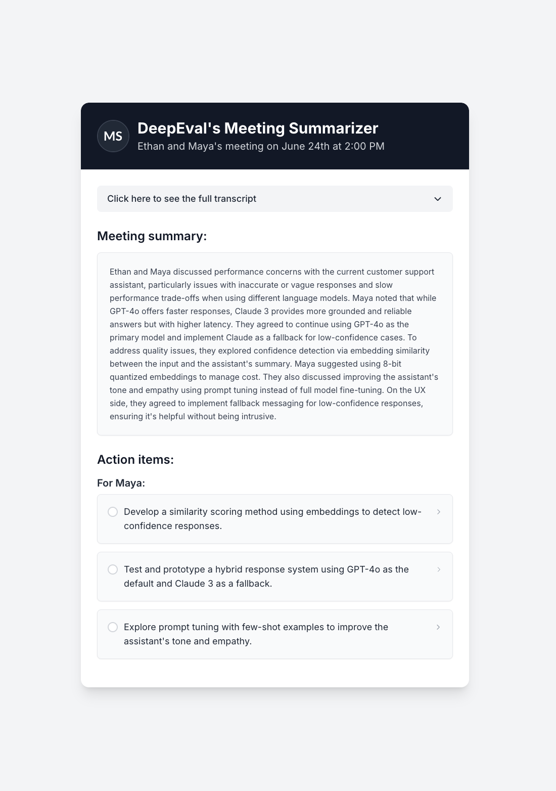
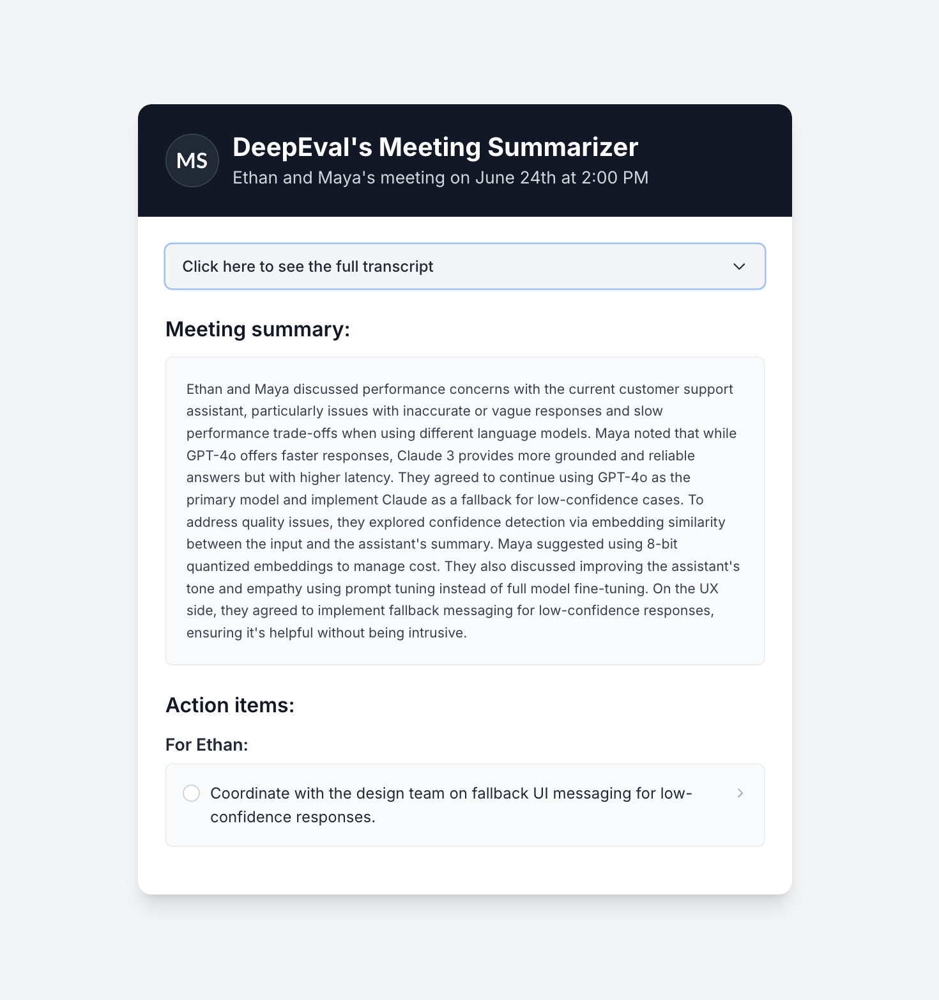

In this tutorial, we'll go through the entire process of building a robust **LLM-powered summarization agent using DeepEval**, from development to production.

:::tip
If you're working with LLMs for summarization, this tutorial is for you. While we'll specifically focus on evaluating a meeting summarizer, the concepts and practices here can be applied to **any LLM application that generates summaries**.
:::

Here are the links to jump to different stages of this tutorial:

import LinkCards from "@site/src/components/LinkCards"

<LinkCards
    tutorials={[
        {
            number: 1,
            title: 'Development',
            description: 'Go to the Development stage',
            to: '/tutorials/summarization-agent/tutorial-summarization-development',
        },
        {
            number: 2,
            title: 'Evaluation',
            description: 'Go to the Evaluation stage',
            to: '/tutorials/summarization-agent/tutorial-summarization-evaluation',
        },
        {
            number: 3,
            title: 'Improvement',
            description: 'Go to the Improvement stage',
            to: '/tutorials/summarization-agent/tutorial-summarization-improvement',
        },
        {
            number: 4,
            title: 'Production',
            description: 'Go to the Production stage',
            to: '/tutorials/summarization-agent/tutorial-summarization-production',
        },
    ]}
/>

## What You'll Learn

In this tutorial, you'll learn:

- How to build a summarization agent.
- How to define summarization criteria and choose the right evaluation metrics.
- How to run evals on your summarization agent using `deepeval`
- How to improve your summarization agent using evaluation results.
- How to prepare your summarization agent for production.

## Meeting Summarizer

Imagine you're building an industry standard meeting summarization agent. Your meeting summarizer takes the entire conversation transcription as `input` and outputs the following:

- A brief summary of the discussion.
- A list of action items.

Your goal is to build a summarizer that can be used by multiple teams to improve their productivity. Hence, you need to ensure the summarizer captures key decisions and follow-ups accurately—without missing context, misinterpreting information, or including unnecessary details.

## What You'll Build

Most meeting summarization SaaS platforms aim to give valuable information from different meetings they handle in a way that is more accessible to users. For example some platforms summarize meetings and create a list of action items in the form of tick boxes which can be used to track team progress and ultimately improve productivity.

An end product of a summarization agent might look as shown below:

**On the platform**

The above image shows what you might see on the webpage of your meeting summarization agent platform. **An overview of the meeting, transcript, the summary and the action items concerning everyone involved.**

Most meeting summarization platforms also send emails to the relevant team members with their assigned action items to be performed. These emails might look as shown below:

**Maya's email**

**Ethan's email**

This is an example of how you'll be using your meeting summarizer's responses to create an appealing meeting summarization platform that helps increase productivity of teams.

In the rest of this tutorial series, you'll build a summarization agent that outputs summaries and action items — ready to be used in any kind of interactive platform or SaaS product.

Ready to get started? Let's move on to [developing the summarization agent](tutorial-summarization-development).