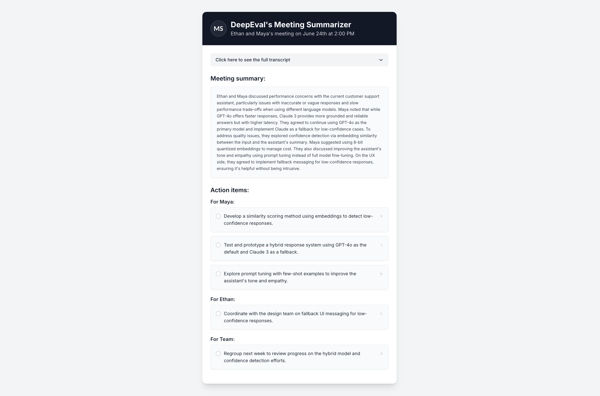

This tutorial walks you through the entire process of building a robust **LLM-powered summarization agent using DeepEval**, from development to production.

:::tip
If you're working with LLMs for summarization, this tutorial is for you. While we'll specifically focus on evaluating a meeting summarizer, the concepts and practices here can be applied to **any LLM application that generates summaries**.
:::

Here are the links to jump to different stages of this tutorial:

import LinkCards from "@site/src/components/LinkCards"

<LinkCards
    tutorials={[
        {
            number: 1,
            title: 'Development',
            description: 'Go to the Development stage',
            to: '/tutorials/summarization-agent/tutorial-summarization-development',
        },
        {
            number: 2,
            title: 'Evaluation',
            description: 'Go to the Evaluation stage',
            to: '/tutorials/summarization-agent/tutorial-summarization-evaluation',
        },
        {
            number: 3,
            title: 'Improvement',
            description: 'Go to the Improvement stage',
            to: '/tutorials/summarization-agent/tutorial-summarization-improvement',
        },
        {
            number: 4,
            title: 'Deployment',
            description: 'Go to the Deployment stage',
            to: '/tutorials/summarization-agent/tutorial-summarization-deployment',
        },
    ]}
/>

## What You'll Learn

In this tutorial, you'll learn:

- How to build a summarization agent.
- How to define summarization criteria and choose the right evaluation metrics.
- How to run evals on your summarization agent using `deepeval`.
- How to improve your summarization agent using evaluation results.
- How to prepare your summarization agent for production.

## Meeting Summarizer

Throughout this tutorial, we'll focus on building a meeting summarization agent. The agent will take a full meeting transcript as `input` and produce two structured outputs:

- A concise summary of the discussion.
- A list of clear action items to follow.

Your objective is to build a high-quality summarizer that teams across an organization can rely on to improve productivity. To achieve this, the agent must accurately capture key decisions, action points, and important context—without omitting critical information or introducing irrelevant details.

## What You'll Build

Most important meetings these days happen through online video chats and meeting platforms like **Google Meet** and **Zoom**. With meetings like this happening every day, it's hard to keep track of the important details mentioned in the meeting. 

This challenge has led to the rise of meeting summarization platforms like **Otter.ai** and **Circleback** to emerge. These tools typically record the entire meeting in the form of transcripts. Which they then use to create concise summaries and deliver a list of action items mentioned throughout the meeting helping increase a team's productivity.

In this tutorial, you'll build a similar meeting summarization agent—capable of generating concise summaries and extracting actionable items from full meeting transcripts.

Below is an example of what a deliverable from a meeting summarization platform looks like:

The above image shows what you might see on the webpage of your meeting summarization platform. **An overview of the meeting, transcript, the summary and the action items concerning everyone involved.**

In the rest of this tutorial series, you'll build a summarization agent that platforms like **Otter.ai** and **Circleback** use to generate their summaries and action items from the transcripts they collect during the meeting.

Ready to get started? Let's move on to [developing the summarization agent](tutorial-summarization-development).